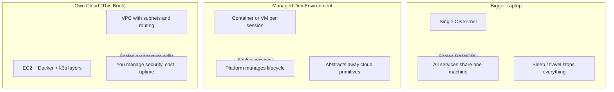
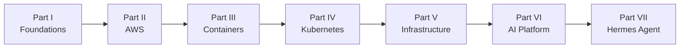

# Chapter 1: Introduction

> Why build a cloud environment instead of buying a bigger laptop or using GitHub Codespaces?

---

> *"The cloud is just someone else's computer."*

You've probably heard this phrase before. It's catchy, memorable, and technically correct—but it leaves out almost everything that matters.

The cloud isn't magic. It isn't a single computer. It isn't even a single data center.

It's an enormous collection of computers, networks, storage systems, and software that work together to provide computing resources on demand. Companies like Amazon, Microsoft, and Google have spent decades building infrastructure so reliable that millions of developers can treat computing power as something they request instead of purchasing, assembling, and maintaining themselves.

This book isn't about learning AWS.

It's about understanding **why** cloud infrastructure exists and **how** to use it as a software engineer.

By the end of this book, you'll have built your own production-inspired cloud development environment—one you understand from the hardware up to AI agents.

---

## Learning Objectives

After completing this chapter, you will be able to:

- [ ] Explain why a remote cloud environment solves problems a laptop cannot
- [ ] Compare three realistic options—bigger laptop, managed dev environment, own cloud—and articulate why this book chooses the third
- [ ] Describe the end-state architecture of your personal platform
- [ ] Map the major technologies in this book to the engineering problems they solve
- [ ] Identify prerequisites and prepare your local toolchain for the labs ahead

---

## Prerequisites

None. This is the starting point.

You will need the following before **Chapter 7 (Provisioning Your AWS Account)**, when you begin provisioning cloud resources:

- Basic programming experience
- Familiarity with a terminal
- A GitHub account
- An AWS account (we create and secure one together in Part II—after [Chapter 6: Designing the Hermes Platform](06-designing-the-hermes-platform.md))
- A laptop capable of running SSH and a code editor

No previous cloud, Linux, or Kubernetes experience is required.

---

## Estimated Time

**60 minutes** — 30 minutes reading, 30 minutes for Lab 1.

---

## Background

### Why This Book Exists

Software development has changed dramatically over the last decade.

A modern engineer is expected to understand far more than programming languages. Today's engineers regularly interact with:

- Linux servers
- Docker containers
- Kubernetes clusters
- Cloud networking
- Identity and access management
- Infrastructure as Code
- CI/CD pipelines
- Observability
- AI services
- Distributed systems

Many excellent resources exist for each of these subjects individually. Very few explain how they fit together into a cohesive system. Even fewer walk you through building one yourself.

This book attempts to bridge that gap.

Rather than teaching isolated technologies, we assemble them into a complete working platform—**your** platform. At the center is **Hermes**, an AI agent that runs on the infrastructure you build: messaging, tool use, local models, PostgreSQL, Redis, and the cloud foundation underneath. Nothing is a throwaway exercise. Every lab adds to an environment you keep.

### The Problem We're Solving

Like many developers, you work from a laptop.

Laptops are excellent for writing code. They are not ideal for:

- Running multiple databases simultaneously
- Hosting APIs that must stay reachable
- Running Kubernetes clusters
- Executing background workers around the clock
- Serving AI models with large memory footprints
- Long-running automation and scheduled jobs
- Persistent development environments that survive a reboot

As projects grow, your laptop becomes both your workstation and your server. Those responsibilities compete for CPU, memory, storage, battery life, and thermal headroom. Eventually, development becomes constrained by hardware instead of ideas.

At that point, most engineers reach for one of three solutions.

### Option 1: Buy a Bigger Laptop

A more powerful machine removes some immediate limits. More RAM means PostgreSQL and Redis can coexist with your IDE. More cores mean Docker containers stop feeling sluggish.

But a bigger laptop does not solve the underlying problem: **your development environment is still tied to a single physical device.**

| Advantage | Limitation |
|-----------|------------|
| No monthly cloud bill | Capital expense upfront |
| Works offline | Cannot simulate real cloud networking (VPCs, load balancers, IAM) |
| Familiar workflow | Still competes with daily driver duties (battery, sleep, travel) |
| Fast local iteration | Does not teach operations skills employers expect |

A workstation helps you write code faster. It does not teach you to operate infrastructure—and it cannot run 24/7 without leaving your desk.

### Option 2: Use a Managed Dev Environment (GitHub Codespaces, etc.)

Services like **GitHub Codespaces**, **Gitpod**, and **Cursor Cloud** give you a remote development machine in minutes. You open a repository, get a VS Code session in the browser, and start coding. Someone else manages the hardware.

This is a genuine improvement over a constrained laptop for many workflows.

| Advantage | Limitation |
|-----------|------------|
| Provisions in minutes | Environment is optimized for *editing*, not *operating* |
| No hardware maintenance | Limited control over networking, storage, and OS-level configuration |
| Scales up for compiles | Not designed for long-running production-like services |
| Integrated with GitHub | Teaches vendor workflow, not transferable cloud architecture |

Codespaces excels at **writing code in a remote editor**. It does not excel at **running the platform this book builds**: a VPC with public and private subnets, a Kubernetes cluster that stays up for weeks, PostgreSQL with persistent volumes, CI/CD pipelines that deploy to *your* infrastructure, or AI model serving with GPU options you control.

You learn GitHub's product. You do not learn why a NAT Gateway exists.

### Option 3: Build Your Own Cloud Environment (This Book)

The third option is to provision infrastructure in a public cloud—primarily AWS—and treat it as your personal development and learning platform.

| Advantage | Limitation |
|-----------|------------|
| Full control over architecture | Requires learning curve |
| Production-like topology | Costs money (manageable with alerts and cleanup) |
| Skills transfer directly to industry work | You are responsible for security and cost |
| Persistent services that outlive your laptop | Mistakes can have real consequences (which is how you learn) |
| Can run Kubernetes, databases, AI workloads concurrently | Takes time to build correctly |

**This is the option we choose—and the reason this book exists.**

We are not building a cloud environment because AWS is fashionable. We are building one because the act of building it **is** the education. When you wire a Security Group, you understand firewalls. When you attach an EBS volume, you understand block storage. When you deploy Hermes to k3s, you understand how production SaaS platforms actually run.

### How to Read This Book

This book is intentionally sequential. Later chapters assume you completed earlier labs. If you already know Linux or AWS, skim—but do not skip entirely. Examples build on prior chapters.

Every chapter follows the same structure defined in [STYLE_GUIDE.md](https://github.com/crudnicky/agent-to-aws-guide/blob/main/STYLE_GUIDE.md). Consistency is intentional. You always know where to find objectives, theory, architecture, labs, and troubleshooting.

Labs are mandatory. They are not optional exercises at the end of a lesson—they are the lesson. If you skip a lab, the next chapter assumes resources and knowledge you do not have.

---

## Theory

### What "The Cloud" Actually Is

Strip away the marketing, and a public cloud is three things:

1. **Virtualized compute** — CPU and memory sold in units (instances), not machines
2. **Programmable infrastructure** — Networks, storage, and permissions exposed as APIs
3. **Economies of scale** — Data centers shared across thousands of customers, priced per second

When you launch an EC2 instance, AWS does not hand you a physical server. It allocates capacity from a pool of machines in a specific availability zone, attaches virtual networking, and bills you for the hours you use. The API call triggers a orchestration layer—schedulers, hypervisors, storage backends—that has been refined over nearly two decades.

That is what "someone else's computer" really means: not one computer, but an **automated factory** for producing computers on demand.

### Why Cloud Infrastructure Was Invented

Before cloud computing, running a web application meant:

1. Spec hardware months in advance
2. Wait for delivery and rack installation
3. Configure networking manually
4. Over-provision for peak load
5. Pay for idle capacity during quiet periods

Amazon built internal infrastructure to solve this for their own retail operation. In 2006, they productized it: **S3** for object storage, **EC2** for virtual machines. The insight was that software engineers needed **elastic capacity** and **API-driven provisioning** more than they needed to own hardware.

Every service we use in this book descends from that idea:

| Service | Problem it solves |
|---------|-------------------|
| IAM | Who is allowed to call which API |
| VPC | Isolated network topology you design |
| EC2 | Compute without buying servers |
| EBS / S3 | Persistent storage with different tradeoffs |
| Load Balancers | Distribute traffic across instances |
| Kubernetes (on EC2) | Orchestrate containers at scale |

We build on AWS not because it is the only cloud, but because it is the most documented, the most widely used in industry, and the best environment for learning concepts that transfer to Azure, GCP, and private data centers.

### How the Three Options Compare Internally



The fundamental difference is **where the complexity lives**.

- On a laptop, complexity is hidden in thermal throttling and `docker compose down` when you close the lid.
- In Codespaces, complexity is hidden in GitHub's control plane—you never see the VPC because there isn't one you control.
- In your own cloud, complexity is **visible and yours**. That visibility is the point.

---

## Architecture

By the end of this journey, your secure cloud environment looks like this:

```text
                 Internet
                      │
             AWS Account
                      │
                Virtual Private Cloud
                      │
             ┌─────────────────────┐
             │ Ubuntu EC2 Instance │
             └─────────────────────┘
                      │
                 Docker Engine
                      │
                Kubernetes (k3s)
                      │
      ┌───────────────┼───────────────┐
      │               │               │
   Hermes Agent   PostgreSQL       Redis
      │
 Agent Tools (e.g. weather)
      │
 Local Models (llama.cpp)
      │
 Production Operations
```

Every component serves **Hermes**—the agent you deploy, operate, and extend. Optional data backends (such as ULLR) appear only as integrations the agent calls, not as parallel platforms you build for their own sake.

### What You'll Provision

| Component | Purpose | Chapter |
|-----------|---------|---------|
| AWS account + IAM | Secure identity foundation | 7–8 |
| VPC + subnets | Isolated network topology | 11 |
| EC2 (Ubuntu) | Compute for your platform | 9 |
| EBS + S3 | Block and object storage | 10 |
| Docker + Compose | Container runtime | 16–17 |
| Kubernetes (k3s) | Workload orchestration | 19–27 |
| Terraform | Infrastructure as Code | 28 |
| GitHub Actions | CI/CD automation | 29 |
| Secrets management | Credentials without hardcoding | 30 |
| Monitoring + logging | Observability | 14, 31–32 |
| Hermes agent | AI agent runtime and API | 33–43 |
| Model serving | llama.cpp inference (`llama-server`) | 36–37 |
| Agent tools | Weather, data, external APIs | 39 |

The final result resembles a production SaaS platform more closely than a tutorial project.

### How the Book Parts Fit Together



Each part solves the next layer of the problem. You cannot deploy Hermes to Kubernetes until you understand pods. You cannot configure a pod until you understand Docker. You cannot run Docker on EC2 until you understand Linux and networking.

---

## Walkthrough

*Not applicable to this chapter.*

Chapter 1 is conceptual—it frames the problem before any infrastructure exists. Lab 1 below verifies your **local** toolchain. You will define the Hermes platform in [Chapter 6](06-designing-the-hermes-platform.md) before your first AWS walkthrough in [Chapter 7: Provisioning Your AWS Account](../part-ii-aws/07-provisioning-aws-account.md).

---

## Hands-on Lab

### Lab 1: Prepare Your Development Environment

**Estimated Time:** 30 minutes

**Goal:** Install and verify the local tools you need to work through this book. Your laptop remains your **control plane**—the place you edit code, run `kubectl`, and SSH into cloud resources. The heavy workloads move to AWS in later chapters.

**Prerequisites:** macOS, Linux, or Windows with WSL2

**Steps:**

1. Open a terminal and confirm your shell: `echo $SHELL`
2. Install Git and verify: `git --version`
3. Install AWS CLI v2 and verify: `aws --version`
4. Install Terraform and verify: `terraform --version`
5. Install Docker Desktop (macOS/Windows) or Docker Engine (Linux) and verify: `docker --version`
6. Install `kubectl` and verify: `kubectl version --client`
7. Clone this repository (or pull latest if already cloned):
   ```bash
   git clone <repo-url> && cd agent-to-aws-guide
   ```
8. Run the prerequisites checker:
   ```bash
   ./scripts/setup/check-prerequisites.sh
   ```
9. Create a working directory for lab artifacts:
   ```bash
   mkdir -p labs/local
   ```
10. Optional: install the GitHub CLI for later CI/CD chapters: `gh --version`

**Verification:**

```bash
./scripts/setup/check-prerequisites.sh
```

**Expected output:**

```
Checking prerequisites for Building a Personal AI Cloud...

✓ Git: git version 2.x.x
✓ AWS CLI: aws-cli/2.x.x
✓ Terraform: Terraform v1.x.x
✓ Docker: Docker version 2x.x.x
✓ kubectl: Client Version: v1.x.x

All prerequisites met. Ready for Lab 1.
```

**Troubleshooting:**

| Problem | Cause | Fix |
|---------|-------|-----|
| `command not found: aws` | AWS CLI not installed or not in PATH | Install from [AWS CLI docs](https://docs.aws.amazon.com/cli/latest/userguide/getting-started-install.html) |
| Docker daemon not running | Docker Desktop not started | Launch Docker Desktop; wait for "running" status |
| Permission denied on Docker (Linux) | User not in `docker` group | `sudo usermod -aG docker $USER` then log out and back in |
| `kubectl: command not found` | kubectl not installed | Install via package manager or [kubernetes.io](https://kubernetes.io/docs/tasks/tools/) |
| Prerequisites script not executable | Missing chmod | Run `chmod +x scripts/setup/check-prerequisites.sh` |

**Cleanup:** Nothing to clean up. Keep these tools installed.

---

## Verification

Run `./scripts/setup/check-prerequisites.sh`. All five core tools (Git, AWS CLI, Terraform, Docker, kubectl) must report a version with no errors.

---

## Troubleshooting

See the Lab 1 troubleshooting table above. For issues not covered there, open an issue in the repository with your OS version and the full error output.

---

## Review Questions

1. Why does a more powerful laptop fail to teach cloud infrastructure skills?
2. What is GitHub Codespaces optimized for, and what is it *not* designed to replace?
3. What does "the cloud is someone else's computer" leave out?
4. Name three responsibilities that compete when your laptop is both workstation and server.
5. What are the seven parts of this book, and what order are they read in?
6. Why are labs mandatory rather than optional?
7. What role does Hermes play in the target architecture, and what counts as an "agent tool"?

---

## Key Takeaways

- The cloud is infrastructure, not magic—it is virtualized compute, programmable APIs, and shared data centers priced on demand.
- Modern software engineering requires understanding systems as well as code.
- A bigger laptop scales RAM; a managed dev environment scales editing sessions; **your own cloud scales architectural understanding**.
- GitHub Codespaces solves remote editing. This book solves remote **operation**—networks, clusters, databases, CI/CD, and AI workloads running on infrastructure you design.
- Every technology introduced later exists to solve a specific engineering problem.
- By the end, you will understand not only *how* to build your platform, but *why* it was designed that way.

---

## Glossary Additions

| Term | Definition |
|------|------------|
| **Cloud computing** | Delivery of compute, storage, and networking over the internet on a pay-as-you-go basis, without owning physical hardware. |
| **Control plane** | The tools and environment you use to manage infrastructure (your laptop, terminal, Git, Terraform)—distinct from the **data plane** where workloads run. |
| **Dev environment** | A configured space for writing and testing code; may be local, remote, or cloud-hosted. |
| **Data plane** | Where application workloads actually execute—in this book, EC2 instances, containers, and pods in AWS. |
| **Infrastructure as Code (IaC)** | Defining servers, networks, and services in version-controlled files rather than manual console clicks. |
| **Production-inspired** | Architecture that mirrors real SaaS patterns (VPC isolation, orchestration, observability) without claiming production SLA guarantees. |

---

## Further Reading

- [AWS Well-Architected Framework](https://aws.amazon.com/architecture/well-architected/) — how AWS thinks about reliable systems
- [The Twelve-Factor App](https://12factor.net/) — design principles for modern deployable applications
- [CNCF Cloud Native Trail Map](https://github.com/cncf/trailmap) — how cloud-native technologies relate
- [GitHub Codespaces Documentation](https://docs.github.com/en/codespaces) — understand what managed dev environments provide (and omit)
- [On the Evolution of Cloud Computing](https://aws.amazon.com/what-is-cloud-computing/) — AWS's framing of the problem cloud computing solves

---

[← Preface](../preface/00-preface.md) | [Next: Chapter 2 — How Computers Actually Work →](02-how-computers-work.md)
