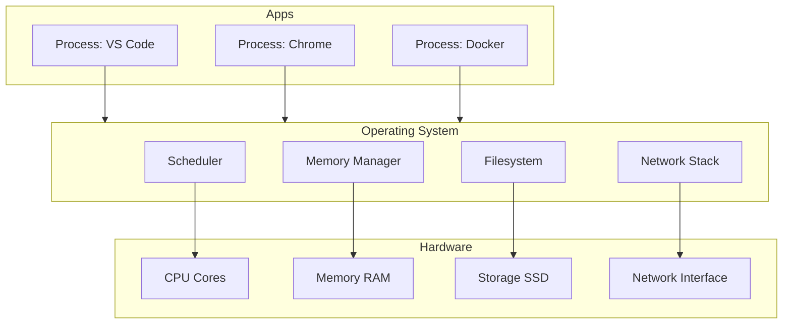

# Chapter 2: How Computers Actually Work

> If you deeply understand this chapter, the cloud becomes obvious.

---

If you skip it, AWS becomes a bunch of services with confusing names.

This chapter builds the mental model everything else relies on—before Docker, before Kubernetes, before EC2. Forget the cloud for now. Forget containers. Imagine your laptop, opened up.

Every service you'll provision later—EC2, EBS, VPC, Kubernetes—is a managed version of something a physical computer already does. Learn the physical computer first.

---

## Learning Objectives

After completing this chapter, you will be able to:

- [ ] Explain how a program on disk becomes a running process
- [ ] Describe how the CPU, memory, storage, and networking interact under load
- [ ] Understand what happens when you launch an application
- [ ] Explain why dedicated servers exist and how they differ from laptops
- [ ] Articulate why virtualization was invented
- [ ] Build a mental model that carries through Linux, containers, and AWS

---

## Prerequisites

- [Chapter 1: Introduction](../part-i-foundations/01-introduction.md) — you understand *why* we're building a cloud environment
- Lab 1 complete — terminal access and basic command-line comfort

No hardware or cloud resources required.

---

## Estimated Time

**75 minutes** — 45 minutes reading, 30 minutes for Lab 2.

---

## Background

### A Computer Is Four Resources

Inside every laptop, phone, and server are the same four major resources:

```text
          +-----------------------+
          |         CPU           |
          +-----------------------+

          +-----------------------+
          |        Memory         |
          |        (RAM)          |
          +-----------------------+

          +-----------------------+
          |        Storage        |
          |       SSD / NVMe      |
          +-----------------------+

          +-----------------------+
          |      Networking       |
          +-----------------------+
```

Everything you do—compiling code, browsing the web, running Docker, training a model—is some combination of these four things. Cloud computing does not invent new resources. It **packages, isolates, and sells** them through APIs.

When AWS offers an `m7i.large` instance, it is quoting you a bundle of CPU cores and RAM. When it offers EBS, it is quoting block storage. When it offers a VPC, it is quoting isolated networking. The names change. The physics do not.

### Why This Mental Model Matters

In [Chapter 1](../part-i-foundations/01-introduction.md), we argued that a laptop becomes both workstation and server—and eventually runs out of capacity. That argument only makes sense if you understand **what** is running out.

It is not abstract "performance." It is specific resources:

- CPU cycles exhausted by too many concurrent workloads
- RAM filled until the OS swaps to disk
- Storage consumed by images, databases, and logs
- Network bandwidth saturated by uploads and API calls

When you later choose an EC2 instance type, size an EBS volume, or debug a pod that was **OOMKilled**, you are making decisions about these same four components—just on someone else's hardware, in a data center, billed by the hour.

---

## Theory

### CPU — The Executor

The CPU does not know JavaScript. It does not know Python. It does not know TypeScript. It only understands **machine instructions**—binary operations loaded into registers and executed in hardware.

When you write:

```javascript
const total = price * quantity;
```

that line passes through a compiler or interpreter, becomes bytecode or native instructions, and eventually executes as billions of operations per second on silicon.

#### CPU Cores

Most modern CPUs have multiple **cores**—independent execution units on the same chip:

```text
              CPU
    ┌─────┬─────┬─────┬─────┐
    │Core1│Core2│Core3│Core4│
    └─────┴─────┴─────┴─────┘
```

Each core can run a different process (or thread) simultaneously. A quad-core machine can do more parallel work than a single-core machine at the same clock speed.

AWS EC2 instance sizes are largely defined by **vCPUs** (virtual CPU cores) and **memory**. When you pick `t3.medium` (2 vCPU, 4 GiB RAM) versus `m7i.large` (2 vCPU, 8 GiB RAM), you are choosing how much of these two resources your workload receives. We'll revisit this in [Chapter 9: Provisioning the Hermes Server](../part-ii-aws/09-provisioning-hermes-server.md).

### Memory (RAM) — The Workspace

RAM is short-term memory—the surface you work on, not the box you store things in.

Imagine building a Lego castle:

- The **table** you're building on is RAM
- The **Lego box** in the closet is storage

While building, pieces live on the table where you can reach them quickly. When you're done, pieces go back in the box. If the table is too small, you spill pieces onto the floor (swap) or stop building (out-of-memory kill).

**Programs execute from RAM, not from disk.** Disk is too slow for instruction fetch at CPU speeds.

#### What Happens When You Open an Application

```text
VS Code on disk
       ↓
OS copies executable + libraries into RAM
       ↓
CPU fetches instructions from RAM
       ↓
VS Code appears on screen
```

This happens in milliseconds. The operating system orchestrates the copy. The CPU never reads your application binary directly from the SSD during normal execution—it reads from memory pages the OS mapped for that process.

### Storage — Long-Term Memory

Storage (SSD, NVMe, hard disk) holds data that **survives reboot**:

- Source code and Git repositories
- Photos and documents
- Database files
- Docker images
- The operating system itself

Storage is orders of magnitude **slower** than RAM but orders of magnitude **cheaper** per gigabyte. Operating systems exploit this by keeping hot data in RAM and cold data on disk—a hierarchy you'll see again with EBS (block storage attached to EC2) and S3 (object storage for backups and artifacts).

### Networking — Communication

Networking is how computers exchange data. Without it, your laptop is an island.

```text
Your Laptop
     ↓
  GitHub
     ↓
   AWS
     ↓
  APIs / CDNs / Databases on other machines
```

Every `git push`, every `curl`, every SSH session to an EC2 instance is networking. **Cloud computing exists because high-speed networking exists.** Data centers are connected by fiber links that make remote machines feel local enough to treat as extensions of your environment—as long as latency and bandwidth are accounted for.

### The Operating System — The Coordinator

Who manages CPU scheduling, memory allocation, file access, network sockets, and user permissions?

The **operating system**—Linux, Windows, or macOS.

The OS sits between hardware and applications:

```text
┌─────────────────────────────────┐
│  Applications (Chrome, VS Code) │
├─────────────────────────────────┤
│  Operating System (Linux, etc.) │
├─────────────────────────────────┤
│  CPU │ RAM │ Storage │ Network   │
└─────────────────────────────────┘
```

Without an OS, applications could not safely share one machine. The OS enforces boundaries: this process gets these memory pages; this user can read these files; this socket may bind to port 443.

In the cloud, **most servers run Linux**. [Chapter 3](03-linux.md) builds directly on this chapter—you'll learn commands that manipulate exactly these abstractions.

### Programs vs Processes

A **program** is passive—a file on disk (`/usr/bin/chrome`, your compiled binary, a Python script).

A **process** is active—a running instance the OS created from that program.

```text
Google Chrome installed on disk     →  still just files
You launch Chrome                   →  OS creates a process
                                      →  CPU begins executing
                                      →  RAM allocated
                                      →  network sockets opened
                                      →  Chrome is alive
```

This distinction becomes critical later:

| Concept | Later analog |
|---------|--------------|
| Program (image on disk) | Docker **image** |
| Process (running instance) | Docker **container** |
| Process with isolated view | Kubernetes **pod** |

You are not learning three unrelated ideas. You are learning the same idea at three levels of abstraction.

### Threads — Workers Inside a Process

A process can contain multiple **threads**—independent execution paths sharing the same memory space.

```text
Restaurant  →  Process
Employees   →  Threads (each doing work in parallel)
```

Chrome might run one thread for the UI, another for network I/O, another for JavaScript execution—all within one process, sharing access to the same tab data. The OS schedules threads on CPU cores.

When a process uses 400% CPU on a four-core machine, it is likely running threads across multiple cores simultaneously.

### When Resources Run Out

Resources are finite. Imagine a laptop with **32 GB RAM** and **6 CPU cores**:

| Workload | RAM |
|----------|-----|
| VS Code | 2 GB |
| Chrome | 6 GB |
| Docker (PostgreSQL + Redis + app) | 12 GB |
| Local AI model | 18 GB |
| **Total needed** | **38 GB** |

You have 32 GB. Something gives.

The operating system **swaps** memory pages to disk—using storage as overflow for RAM. Applications slow to a crawl. Disks thrash. The fan spins. This is the concrete mechanism behind the constraint described in Chapter 1.

Moving heavy workloads to a remote server with 64 GB or 128 GB RAM is not magic—it is buying more table space for the Lego castle.

### Why Servers Exist

A server is not a different *kind* of computer. It is a computer **optimized for a different job**:

| Laptop optimized for… | Server optimized for… |
|-----------------------|------------------------|
| Portability, battery, display | Running 24/7 without a lid closing |
| Quiet, cool operation at desk | Sustained load in a data center |
| One user | Many concurrent connections |
| 16–32 GB RAM typical | 64–512+ GB RAM common |
| Consumer SSD | Redundant storage, ECC memory |

The cloud is built from **vast numbers of servers** in racks, connected by high-speed networking, powered and cooled by infrastructure you never see. EC2 gives you a slice of one.

### Why Virtualization Was Invented

Before virtualization, one physical server ran one operating system. If the machine had 64 GB RAM but your application needed 8 GB, 56 GB sat idle. If you needed a second environment, you bought a second server.

**Virtualization** solves this by running multiple isolated operating systems on one physical machine:

```text
┌─────────────── Physical Server ───────────────┐
│  Hypervisor (VMware, KVM, AWS Nitro)          │
│  ┌──────────┐  ┌──────────┐  ┌──────────┐     │
│  │  VM / EC2 │  │  VM / EC2 │  │  VM / EC2 │     │
│  │  8 GB RAM │  │  8 GB RAM │  │  8 GB RAM │     │
│  └──────────┘  └──────────┘  └──────────┘     │
└────────────────────────────────────────────────┘
```

Each virtual machine believes it has its own CPU, RAM, storage, and network. The hypervisor maps those resources to real hardware.

Virtualization was invented to:

1. **Increase utilization** — one server serves many workloads
2. **Isolate failures** — one VM crashing does not take down neighbors
3. **Provision faster** — launch a new VM in minutes, not hardware lead times

AWS EC2 instances are virtual machines. Docker containers are a lighter-weight isolation layer on top (same kernel, separate process trees—[Part III: Containers](../part-iii-containers/16-docker.md)). Kubernetes schedules containers across virtual machines across data centers.

The stack builds upward. The four resources stay the same.

---

## Architecture

### One Machine, Four Resources



### From Laptop to Cloud — Same Resources, New Names

| Physical concept | Your laptop | AWS service (later) |
|------------------|-------------|---------------------|
| CPU cores | `sysctl` / `lscpu` | EC2 vCPUs |
| RAM | `free -h` | Instance memory (GiB) |
| Storage | Internal SSD | EBS volumes, S3 buckets |
| Networking | Wi-Fi / Ethernet | VPC, subnets, Security Groups |
| OS coordination | macOS / Linux | Amazon Linux / Ubuntu on EC2 |
| Running program | Process | Container → Pod |

When you understand the left column, the right column stops being arbitrary product names.

---

## Walkthrough

This chapter's walkthrough is integrated into Lab 2—you inspect your own machine and interpret the output. Each command maps to a resource from the Theory section.

| Command | Resource | What you learn |
|---------|----------|----------------|
| `uname -a` | OS | Kernel and architecture |
| `lscpu` / `sysctl` | CPU | Core count, architecture |
| `free -h` / `vm_stat` | RAM | Total, used, available memory |
| `df -h` | Storage | Mounted filesystems and capacity |
| `ps aux` | Processes | What's running right now |

Detailed steps, expected output, and platform-specific alternatives are in the lab below.

---

## Hands-on Lab

### Lab 2: Inspect Your Machine

**Estimated Time:** 30 minutes

**Goal:** Measure the four resources on your own computer and connect the numbers to the theory in this chapter.

**Prerequisites:** Terminal access (macOS, Linux, or WSL2)

**Steps:**

1. Identify your operating system and kernel:

   ```bash
   uname -a
   ```

2. Display CPU information:

   **Linux / WSL2:**

   ```bash
   lscpu
   ```

   **macOS:**

   ```bash
   sysctl -n machdep.cpu.brand_string
   sysctl -n hw.ncpu
   ```

3. Display memory usage:

   **Linux / WSL2:**

   ```bash
   free -h
   ```

   **macOS:**

   ```bash
   vm_stat | head -10
   ```

   Note: macOS reports in pages. Divide by 4096 for approximate GB, or use Activity Monitor for a visual summary.

4. Display mounted storage:

   ```bash
   df -h
   ```

5. List running processes (first 20 lines):

   ```bash
   ps aux | head -20
   ```

6. Count total running processes:

   ```bash
   ps aux | wc -l
   ```

7. Answer the following in `labs/ch02/machine-profile.md`:

   - How many CPU cores do you have?
   - How much RAM is installed? How much is currently in use?
   - Which filesystem is your home directory on? How much free space?
   - How many processes are running?
   - Which three processes use the most RAM? (Hint: `ps aux --sort=-%mem | head -5` on Linux)

8. Optional — estimate your Chapter 1 constraint: list the RAM your typical dev stack uses (IDE, browser, Docker, any local models). Does it exceed available memory?

**Verification:**

Your `labs/ch02/machine-profile.md` file exists and answers all five questions with numbers from your machine.

**Expected output (examples — yours will differ):**

```bash
$ uname -a
Linux hostname 6.x.x #1 SMP x86_64 GNU/Linux

$ free -h
               total        used        free
Mem:            31Gi        12Gi        18Gi

$ df -h ~
Filesystem      Size  Used Avail Use% Mounted on
/dev/nvme0n1p2  460G  180G  258G  42% /
```

**Troubleshooting:**

| Problem | Cause | Fix |
|---------|-------|-----|
| `lscpu: command not found` | macOS — tool is Linux-specific | Use `sysctl` commands above |
| `free: command not found` | macOS — tool is Linux-specific | Use `vm_stat` or Activity Monitor |
| `ps aux --sort=-%mem` fails on macOS | BSD `ps` syntax differs | Use `ps aux -m \| head -5` on macOS |
| `wc -l` count seems high | Includes header line | Subtract 1, or use `ps aux \| tail -n +2 \| wc -l` |
| Permission errors | Unlikely for read-only commands | Run without `sudo`; these commands don't require it |

**Cleanup:** Nothing to clean up. Keep `labs/ch02/machine-profile.md`—you may reference it when choosing EC2 instance sizes in Part II.

---

## Verification

Confirm your lab answers with live commands. You should be able to state, without looking at notes:

- Your core count and total RAM
- Available disk space on your home filesystem
- The difference between a program and a process on your running system

---

## Troubleshooting

See the Lab 2 troubleshooting table above.

If your machine is heavily loaded during the lab, memory numbers will fluctuate. Close unnecessary applications and re-run `free -h` or check Activity Monitor for a stable reading.

---

## Review Questions

1. What is the difference between a program and a process?
2. Why can't programs execute directly from storage during normal operation?
3. What role does RAM play in application performance?
4. Why does the operating system exist?
5. Why do servers typically have much more RAM than laptops?
6. What happens when available memory is exhausted?
7. Why was virtualization invented, and how does EC2 relate to it?
8. Name the AWS services (from the Architecture table) that correspond to CPU, RAM, storage, and networking.

---

## Key Takeaways

- Everything in the cloud is ultimately composed of **CPU, memory, storage, and networking**—the same four resources inside your laptop.
- Programs are files; **processes** are running instances the OS creates from those files.
- RAM is the workspace; storage is the archive. When RAM fills, performance collapses.
- The **operating system** coordinates hardware so multiple applications can share one machine safely.
- **Servers** are computers optimized for uptime, throughput, and capacity—not portability.
- **Virtualization** lets one physical machine host many isolated environments—the foundation of EC2 and everything built on it.
- Cloud services don't create new kinds of computers—they **package and manage** these resources so you can provision them through an API.

---

## Glossary Additions

| Term | Definition |
|------|------------|
| **CPU core** | An independent execution unit on a processor; can run one thread at a time per core. |
| **Hypervisor** | Software that creates and runs virtual machines on physical hardware. |
| **Machine instruction** | The lowest-level command a CPU executes; all programming languages compile or interpret down to these. |
| **Process** | A running instance of a program, with its own memory space and OS-managed resources. |
| **RAM** | Random Access Memory; fast, volatile storage where running programs execute. |
| **Swap** | Using disk space as overflow when RAM is full; dramatically slower than RAM. |
| **Thread** | A lightweight execution path within a process; threads share the process's memory. |
| **Virtualization** | Running multiple isolated operating systems on one physical machine via a hypervisor. |
| **vCPU** | Virtual CPU—a core (or portion of a core) allocated to a virtual machine such as an EC2 instance. |

---

## Further Reading

- [Computer Systems: A Programmer's Perspective — Bryant & O'Hallaron](https://csapp.cs.cmu.edu/) — deep dive into programs, memory, and processors
- [Operating Systems: Three Easy Pieces — Arpaci-Dusseau](https://pages.cs.wisc.edu/~remzi/OSTEP/) — free textbook on OS concepts (processes, memory, virtualization)
- [AWS EC2 Instance Types](https://aws.amazon.com/ec2/instance-types/) — preview of how AWS packages CPU and RAM (Chapter 9)
- [What is Cloud Computing? — AWS](https://aws.amazon.com/what-is-cloud-computing/) — connects data-center scale back to these fundamentals

---

## What's Next

[Chapter 3: Linux](03-linux.md) builds directly on this mental model. Once you understand hardware and the OS's role, Linux commands become intuitive—you'll know *what* they interact with and *why* those abstractions exist.

From there: virtualization ([Chapter 5](05-virtualization.md)), platform design ([Chapter 6](06-designing-the-hermes-platform.md)), then AWS ([Chapter 7](../part-ii-aws/07-provisioning-aws-account.md))—where EC2, EBS, and VPCs expose these same resources in a controlled, programmable way for Hermes.

---

[← Chapter 1: Introduction](../part-i-foundations/01-introduction.md) | [Next: Chapter 3 — Linux →](03-linux.md)
