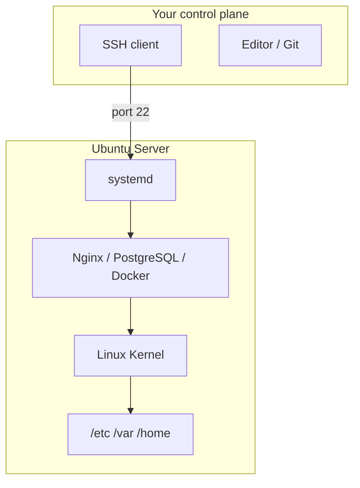

# Chapter 3: Linux — The Operating System of the Cloud

> What is Linux actually doing, and why does it power most of the cloud?

---

Most books teach Linux by listing commands: `ls`, `cd`, `pwd`, `cat`…

That produces memorization without understanding.

This chapter answers a different question: **what is the operating system doing when you run a command—and why will you need these skills on the Ubuntu server that runs Hermes?**

### Just-in-Time Linux

You do not need to finish every section of this chapter before building the Hermes platform. Sections **3.1–3.3** establish the mental model (filesystem, permissions, processes). Sections **3.4–3.7** remain as reference material—you will encounter `apt`, `journalctl`, `systemctl`, and SSH hardening **when Part II requires them**:

| Topic | Taught when needed in |
|-------|------------------------|
| `apt` package installs | [Chapter 12](../part-ii-aws/12-building-the-application-platform.md) (Docker), [Chapter 13](../part-ii-aws/13-the-first-control-plane.md) (k3s) |
| `journalctl`, `systemctl` | [Chapter 12](../part-ii-aws/12-building-the-application-platform.md), [Chapter 13](../part-ii-aws/13-the-first-control-plane.md) (k3s service) |
| SSH hardening, `ufw` | [Chapter 10](../part-ii-aws/10-establishing-trust.md) |

After Section 3.3, you may proceed to [Chapter 6](06-designing-the-hermes-platform.md) and [Chapter 7](../part-ii-aws/07-provisioning-aws-account.md) if you are comfortable with a terminal. Return here when a lab or chapter points you to a specific section.

### Server-First Approach

You are not learning Linux in the abstract. Every mechanism below maps to operating the **Hermes platform** defined in [Chapter 6](06-designing-the-hermes-platform.md):

| Linux skill | Hermes server use |
|-------------|-------------------|
| Filesystem layout (`/opt`, `/var`) | Model files, logs, k3s state |
| Users and permissions | `ubuntu` user, SSH keys, service accounts |
| Processes and systemd | Docker, k3s, llama.cpp, PostgreSQL as services |
| Package management (`apt`) | Install Docker, k3s, monitoring agents |
| Networking tools | Debug Traefik → Hermes → llama.cpp paths |
| SSH and hardening | Remote admin to your EC2 instance |

Labs use a local Ubuntu environment (VM, Multipass, WSL2) **as practice for the same Ubuntu Server 24.04 LTS** you will provision in [Chapter 9](../part-ii-aws/09-provisioning-hermes-server.md). Container fundamentals move to [Part III](../part-iii-containers/17-docker.md)—after you know why the server exists.

Every command below is tied to a mechanism: the kernel, the filesystem, a process, a permission check, a network socket, a log entry. When you SSH into your Hermes EC2 instance, deploy a container in [Chapter 17](../part-iii-containers/17-docker.md), or debug a crashing pod in [Chapter 21](../part-iv-kubernetes/21-pods.md), you are using the skills from this chapter.

### Chapter 3 Roadmap

Sections **3.1–3.3** are enough to start [Chapter 6](06-designing-the-hermes-platform.md) and [Chapter 7](../part-ii-aws/07-provisioning-aws-account.md). Sections **3.4–3.7** remain in this chapter as reference—you will be directed back when the platform needs those skills (see [Just-in-Time Linux](#just-in-time-linux) above).

| Section | Topic | Lab |
|---------|-------|-----|
| **3.1** | Filesystem and navigation | Lab 3.1 |
| **3.2** | Users, groups, and permissions | Lab 3.2 |
| **3.3** | Processes, signals, and systemd | Lab 3.3 |
| **3.4** | Package management (`apt`) | (Walkthrough — Ch 12) |
| **3.5** | Networking tools and logs | Lab 3.4 (Ch 8–10) |
| **3.6** | SSH and remote administration | Lab 3.5 (Ch 10) |
| **3.7** | Capstone: harden an Ubuntu server | Lab 3.6 (Ch 10) |

---

## Learning Objectives

After completing this chapter, you will be able to:

- [ ] Explain what an operating system and the Linux kernel do
- [ ] Describe why Linux dominates cloud computing and why we use Ubuntu Server LTS
- [ ] Navigate the Linux filesystem hierarchy and explain the purpose of key directories
- [ ] Manage users, groups, and file permissions (`rwx`, `chmod`, `chown`)
- [ ] Inspect and control processes, signals, and `systemd` services
- [ ] Install and update software with `apt`
- [ ] Diagnose connectivity with `ip`, `ss`, `ping`, `curl`, and `dig`
- [ ] Read logs with `journalctl` and know where files live under `/var/log`
- [ ] Connect to a remote Ubuntu server over SSH and apply baseline hardening

---

## Prerequisites

- [Chapter 2: How Computers Actually Work](02-how-computers-work.md) — CPU, RAM, storage, networking, processes
- Lab 2 complete — comfortable running terminal commands
- An **Ubuntu environment** for labs: Ubuntu Server VM, Multipass, WSL2 with Ubuntu, or an existing EC2 instance

No AWS account required yet. Full EC2 provisioning is [Chapter 9](../part-ii-aws/09-provisioning-hermes-server.md); this chapter teaches the OS skills you'll apply there.

---

## Estimated Time

**3–4 hours** — 90 minutes reading, 2–3 hours for labs (including capstone hardening).

---

## Background

### Linux Under Everything

Every cloud provider offers hundreds of services. Underneath nearly all of them is Linux.

When you launch an Ubuntu EC2 instance, deploy a Kubernetes node, run a Docker container, or start a PostgreSQL server, you are interacting with Linux. It is not just another operating system—it is the **foundation of modern cloud infrastructure**.

Understanding Linux means understanding the language spoken by nearly every server you will operate.

### What Is an Operating System?

In [Chapter 2](02-how-computers-work.md), we learned that a computer consists of four fundamental resources: CPU, memory, storage, and networking.

Applications cannot safely access those resources directly. If every program could write anywhere in memory, talk directly to disks, or reconfigure the network interface, one buggy program could crash the entire machine or corrupt another program's data.

An operating system exists to **coordinate access to shared resources**. Its responsibilities include:

- Scheduling CPU time among processes
- Managing memory allocation and isolation
- Reading and writing files on storage devices
- Managing users and permissions
- Configuring networking
- Starting and stopping processes
- Providing a consistent interface for applications

Linux performs these tasks through a component called the **kernel**.

### Why Linux Dominates the Cloud

Linux became the dominant server operating system because it provides:

| Property | Why it matters in the cloud |
|----------|----------------------------|
| **Stability** | Servers run for months without reboot |
| **Performance** | Low overhead; tunable for throughput |
| **Security** | Mature permission model; rapid patch cycle |
| **Flexibility** | Runs on bare metal, VMs, containers, embedded |
| **Automation** | Designed for scripting and remote administration |
| **Open development** | No license cost per instance at scale |

Cloud infrastructure depends on automation—provisioning thousands of machines from scripts, APIs, and pipelines. Linux was built for exactly this: headless servers, SSH remote access, package managers, and text-based configuration.

Today, Linux powers AWS EC2 instances, Kubernetes nodes, Docker containers, most web servers, most databases, and most AI training and inference infrastructure.

Understanding Linux is one of the highest-leverage skills a cloud engineer can develop.

### Distributions — Linux Is More Than the Kernel

Linux itself is just the kernel. Everything you interact with day to day comes from a **distribution**—kernel plus package manager, default tools, and configuration conventions.

| Distribution | Common use |
|--------------|------------|
| **Ubuntu** | General-purpose servers, development, cloud defaults |
| **Debian** | Stable server environments; Ubuntu is Debian-based |
| **Red Hat Enterprise Linux (RHEL)** | Enterprise support contracts |
| **Rocky Linux** | Community RHEL-compatible distribution |
| **Alpine Linux** | Minimal images for containers |

Throughout this book, we use **Ubuntu Server LTS** because it offers long-term support, extensive package repositories, a large community, and excellent compatibility with Docker and Kubernetes.

When we provision EC2 in [Chapter 9](../part-ii-aws/09-provisioning-hermes-server.md), we will choose Ubuntu for the same reasons—not because AWS requires it, but because it is the best fit for the platform we are building.

---

## Theory

### The Linux Kernel — Manager of the Machine

The kernel is the core of the operating system—the manager every hardware request passes through.

```text
+--------------------------------------+
| Applications                         |
| Nginx, PostgreSQL, Docker, your app  |
+--------------------------------------+
| System Libraries (glibc, etc.)       |
+--------------------------------------+
| Linux Kernel                         |
+--------------------------------------+
| CPU | Memory | Storage | Networking  |
+--------------------------------------+
```

Applications do not talk directly to hardware. They make **system calls** to the kernel. The kernel decides:

- Is this operation allowed?
- Which process gets the next slice of CPU time?
- Where in RAM should this allocation live?
- Does this user have permission to read this file?
- Which network port may this socket bind to?

Without the kernel, there is no operating system—only uncoordinated hardware.

When you run `ls`, a small program asks the kernel to read a directory. When PostgreSQL writes a row, the kernel maps that to blocks on disk. When Docker starts a container, the kernel creates new process namespaces and cgroup limits. **Every command is a question; the kernel is the authority that answers.**

### Section 3.1 — The Filesystem Hierarchy

Unlike Windows, Linux organizes everything beneath a single root directory: `/`.

```text
/
├── bin      → essential user commands
├── boot     → kernel and bootloader files
├── dev      → device files (disks, terminals)
├── etc      → system configuration
├── home     → user home directories
├── lib      → shared libraries
├── opt      → optional third-party software
├── proc     → virtual view of running processes
├── root     → home directory for the root user
├── run      → runtime state (PID files, sockets)
├── srv      → data for services (web, git, etc.)
├── sys      → virtual view of kernel/subsystems
├── tmp      → temporary files
├── usr      → user programs and read-only data
└── var      → variable data (logs, databases, cache)
```

There are no `C:` or `D:` drives. Every path starts at `/`. A file at `/home/chris/projects/app` is an absolute path from the root.

This hierarchy is standardized as the **Filesystem Hierarchy Standard (FHS)**. Once you learn it, you can administer any Linux server—laptop, EC2 instance, or Kubernetes node—and know where to look.

| Directory | Purpose | Troubleshooting question |
|-----------|---------|--------------------------|
| `/` | Root of the entire tree | — |
| `/home` | Per-user files (`/home/chris`) | Where is the developer's code? |
| `/etc` | Configuration files | **Which config controls this behavior?** |
| `/var` | Logs, databases, spool, cache | **What does the log say?** |
| `/usr` | Installed application binaries | Where is the program I installed? |
| `/tmp` | Short-lived temporary files | Safe scratch space; often cleared on reboot |
| `/proc` | Live process and kernel info | What is PID 1234 doing right now? |

Memorizing paths is less valuable than knowing **what kind of data lives where** and **which question each directory answers**.

---

### Section 3.2 — Users, Groups, and Permissions

> **Question:** How can hundreds of people safely share the same Linux server without accidentally (or intentionally) breaking each other's work?

This section answers that.

#### Section 3.2 Learning Objectives

After completing this section and Lab 3.2, you will be able to:

- [ ] Explain the difference between users and groups
- [ ] Understand why Linux permissions exist
- [ ] Read permission strings like `drwxr-xr-x` and `-rw-r--r--`
- [ ] Use `chmod`, `chown`, and `chgrp` confidently
- [ ] Understand when and why to use `sudo`
- [ ] Diagnose common permission-related errors

#### Why Users Exist

Imagine AWS ran every customer's workloads as the same user. Customer A could read Customer B's files. Customer C could delete Customer D's applications. That would be unacceptable.

Linux solves this with **user accounts**. Every process on the system runs as a user:

```text
ubuntu      ← human login on EC2
postgres    ← database service account
www-data    ← web server service account
redis       ← cache service account
root        ← superuser (special case)
```

Not all users are humans. Many are **service accounts** created for applications. When Nginx serves a page, its worker processes run as `www-data`. When PostgreSQL stores rows, its process runs as `postgres`. The kernel uses the UID attached to each process to decide which files that process may read or write.

#### The Root User

One account is special:

```text
root  (UID 0)
```

Root can do almost anything: read any file, modify system configuration, install software, create or delete users, change networking, shut down the machine.

Think of `root` as the system administrator. Because it is so powerful, **avoid logging in as root directly**. On Ubuntu EC2, you log in as `ubuntu` and use `sudo` for administrative tasks. That leaves an audit trail in `/var/log/auth.log` and reduces the risk of catastrophic typos.

#### sudo — Temporary Elevation

When you type:

```bash
sudo apt update
```

you are telling Linux: *"Run this command with administrative privileges."*

The system checks `/etc/sudoers` (and files in `/etc/sudoers.d/`) to verify your user is allowed to use `sudo`. If authorized, the command runs as root for that invocation only. Your shell afterward is still your normal user.

`sudo` is not a workaround—it is the **designed interface** for administration on Ubuntu cloud images.

#### File Ownership — What `ls -l` Shows

Every file and directory has:

- An **owner** (user)
- A **group**
- A set of **permissions**

Run:

```bash
ls -l notes.txt
```

Example output:

```text
-rw-r--r-- 1 ubuntu ubuntu 1048 Jun 27 10:00 notes.txt
```

Break it down:

```text
-rw-r--r--     permissions (type + rwx triples)
1              number of hard links
ubuntu         owner (user)
ubuntu         group
1048           size in bytes
...            modification time
notes.txt      filename
```

The first character is the **file type**:

| Character | Meaning |
|-----------|---------|
| `-` | Regular file |
| `d` | Directory |
| `l` | Symbolic link |

So `drwxr-xr-x` is a **directory** with permissions `rwxr-xr-x`.

#### Three Permission Types

Linux has only three permission types. Everything else is built from these:

| Symbol | Name | On a file | On a directory |
|--------|------|-----------|----------------|
| **r** | Read | Read contents | List filenames (`ls`) |
| **w** | Write | Modify contents | Create/delete/rename files inside |
| **x** | Execute | Run as program | Enter directory (`cd`) |

A common mistake: forgetting that **execute on a directory means "enter"**, not "run." Without `x` on a directory, you cannot `cd` into it even if you have `r` (you could list names with `ls` from outside, but not traverse in).

#### Three Permission Categories

Permissions apply to three audiences:

```text
Owner  |  Group  |  Others
```

Example: `-rwxr-xr--`

```text
rwx   owner (ubuntu) — read, write, execute
r-x   group (ubuntu) — read, execute, no write
r--   others         — read only
```

The kernel checks permissions in order: if you are the owner, owner bits apply. Else if you are in the file's group, group bits apply. Else others bits apply.

#### Octal Notation — Why 644 and 755 Appear Everywhere

Each `rwx` triple can be expressed as a three-bit binary number:

| Symbol | Binary | Value |
|--------|--------|-------|
| r | 100 | 4 |
| w | 010 | 2 |
| x | 001 | 1 |

Add the values:

```text
rwx = 4 + 2 + 1 = 7
r-x = 4 + 0 + 1 = 5
r-- = 4 + 0 + 0 = 4
```

So `chmod 755 script.sh` means:

```text
755  →  owner: rwx (7)  |  group: r-x (5)  |  others: r-x (5)
```

Common patterns you'll see constantly:

| Octal | Symbolic | Typical use |
|-------|----------|-------------|
| **644** | `rw-r--r--` | Config files, web content |
| **755** | `rwxr-xr-x` | Executable scripts, directories |
| **600** | `rw-------` | SSH private keys, secrets |
| **700** | `rwx------` | `~/.ssh` directory |

#### Changing Permissions — chmod

Symbolic mode (human-readable):

```bash
chmod +x deploy.sh      # add execute for all categories
chmod -w file.txt       # remove write for all
chmod u+x deploy.sh     # add execute for owner only
chmod go-rwx secret.txt # remove all access for group and others
```

Numeric mode (precise):

```bash
chmod 755 script.sh
chmod 644 config.yml
chmod 600 ~/.ssh/personal-ai-cloud
```

The kernel applies the new mode bits immediately. Open file descriptors in running programs may behave differently, but the next open attempt uses the new permissions.

#### Changing Ownership — chown and chgrp

Transfer ownership:

```bash
sudo chown ubuntu app.log
```

Change owner and group together:

```bash
sudo chown ubuntu:developers app.log
```

Change group only:

```bash
sudo chgrp developers app.log
```

This matters when a service creates files your user cannot edit. Example: Nginx running as `www-data` writes `/var/www/html/index.html`. You may need `sudo chown ubuntu:ubuntu` on a deployment directory—or configure the service to write to a path your user owns.

Only root (or sudo) can change ownership. Regular users can `chmod` files they own, but not give themselves someone else's file.

#### Common Permission Errors

**Permission denied**

Possible causes:

- You are not the owner and lack group/other permissions
- The execute bit is missing on a script or directory you need to enter
- You are trying to write to a system path (e.g. `/etc`) without `sudo`
- The file belongs to another service user

Diagnostic habit: `ls -l` the file **and** the parent directory. Missing `x` on a parent directory blocks access even if the file itself is world-readable.

**Command not found**

Often confused with permission errors, but different:

- The executable is not installed
- It is not in your `$PATH`
- You typed the wrong command name
- A script lacks the execute bit (try `bash script.sh` vs `./script.sh`)

Learning to distinguish these messages saves hours of misdirected troubleshooting.

#### Why This Matters for AWS

When you SSH into an EC2 instance, you typically log in as a non-root user—for Ubuntu AMIs, that is **`ubuntu`**.

Administrative tasks—installing packages, editing `/etc/ssh/sshd_config`, starting services—use `sudo`. Application data may be owned by service users like `postgres` or `www-data`.

Understanding ownership and permissions prevents:

- "Permission denied" when deploying code to `/var/www`
- SSH failures when `~/.ssh` or `authorized_keys` have wrong modes (must be `700` and `600`)
- Docker volume mounts where container UID does not match host file owner
- Kubernetes pods that cannot write to persistent volumes

This section is prerequisite material for Docker, Kubernetes, SSH hardening, and every EC2 lab in Part II.

#### Section 3.2 Key Takeaways

- Linux uses users and groups to isolate work and improve security on shared machines.
- Every file has an owner, a group, and permissions enforced by the kernel on every access.
- Root has unrestricted power—use `sudo` for admin tasks instead of daily root login.
- Read `ls -l` left to right: type, permissions, owner, group, size, name.
- Octal modes (`644`, `755`, `600`) encode the same `rwx` triples—learn both symbolic and numeric forms.

**Looking ahead:** [Section 3.3](#section-33--processes-services-and-systemd) covers processes and services—how programs run, how Linux manages them, and how `systemd` keeps services alive. Complete Lab 3.2 before continuing.

---

### Section 3.3 — Processes, Services, and systemd

> **Question:** What actually happens after you type `npm start` or `python app.py`—and where is your application actually running?

When you launch an application, Linux does not simply "run the program." The kernel creates a **process**—a live instance with its own memory, CPU time, file handles, network sockets, and user identity.

Understanding processes is one of the most important skills you will develop as a Linux administrator. It is also the bridge to Docker and Kubernetes: a **container** is a isolated process (or tree of processes). A **pod** is a group of processes scheduled together. When you ask "where is my app running?", you are always asking about processes.

#### Section 3.3 Learning Objectives

After completing this section and Lab 3.3, you will be able to:

- [ ] Explain the difference between a program and a process
- [ ] Inspect running processes with `ps` and `htop`
- [ ] Monitor CPU and memory usage for a process
- [ ] Understand process IDs (PIDs) and the special role of PID 1
- [ ] Stop and restart processes safely with signals
- [ ] Explain what a daemon is
- [ ] Use `systemctl` to manage long-running services

#### Programs vs Processes

A **program** is a file on disk—executable code waiting to be launched:

```text
/usr/bin/python3
```

Nothing is happening yet. When you run:

```bash
python3 app.py
```

Linux creates a **process**. That process receives:

- A unique **Process ID (PID)**
- Memory allocated by the kernel
- CPU scheduling time
- Open files and network sockets
- Environment variables
- A user account (from [Section 3.2](#section-32--users-groups-and-permissions))

```text
Program on disk
      │
      ▼
Operating System (kernel creates process)
      │
      ▼
Process (running instance)
```

One program can spawn many processes. You can run several Python scripts simultaneously—each gets its own PID, memory space, and resource limits.

| Concept | Chapter 2 | This section | Later in book |
|---------|-----------|--------------|---------------|
| Program (file) | Introduced | On disk, passive | Docker **image** |
| Process (running) | Introduced | Active instance | Docker **container**, K8s **pod** |

#### Process IDs (PIDs)

Every process has a unique numeric identifier for the lifetime of that process.

Display your current shell's PID:

```bash
echo $$
```

List running processes:

```bash
ps aux
```

Example output:

```text
USER       PID %CPU %MEM    VSZ   RSS TTY      STAT START   TIME COMMAND
ubuntu    1245  0.1  0.4  12345  4321 ?        Ss   10:00   0:01 sshd
ubuntu    1382  1.3  2.1  98765 21000 pts/0    Sl+  10:05   0:12 node
postgres  2017  0.4  3.8  55555 38000 ?        Ss   09:00   0:45 postgres
root         1  0.0  0.2   8901  2100 ?        Ss   Jan01   0:30 systemd
```

Every row shows:

- **USER** — which account the process runs as (permissions from Section 3.2)
- **PID** — process identifier
- **%CPU / %MEM** — resource consumption
- **COMMAND** — program name

Useful variants:

```bash
ps -ef                    # full-format listing
ps aux | grep node        # find Node.js processes
ps aux | grep postgres    # find database processes
ps aux | grep docker      # find Docker-related processes
```

Learning to search `ps` output is one of the fastest ways to answer: *"Is my application actually running?"*

#### PID 1 — systemd

One process is special: **PID 1**.

On modern Ubuntu, PID 1 is **systemd**. Every other process is a descendant of PID 1—either directly or through a chain of parent/child relationships.

```text
systemd (PID 1)
  ├── sshd
  │     └── ssh session → bash → your commands
  ├── dockerd
  └── nginx
        └── nginx worker processes
```

If PID 1 dies, the kernel panics—the operating system cannot function. systemd's job is to bootstrap the system at boot, start services in dependency order, supervise them, and restart failed units.

#### Real-Time Monitoring — htop

`ps` is a snapshot. **htop** updates continuously:

```bash
sudo apt install -y htop
htop
```

You will see:

- Per-CPU usage bars
- Memory and swap consumption
- Load average
- Sortable process list
- Process tree (press `F5` or `t` depending on version)

When a server feels slow, htop answers: *which process is consuming CPU or memory?*

#### Signals — Stopping Processes Safely

Sometimes an application freezes or must be stopped. Linux sends **signals**—async notifications to processes.

| Command | Signal | Behavior |
|---------|--------|----------|
| `kill 1234` | SIGTERM (15) | Polite shutdown; process can clean up |
| `kill -9 1234` | SIGKILL (9) | Immediate kill; no cleanup |
| `Ctrl+C` | SIGINT (2) | Interrupt foreground process |

Use `kill -9` only when SIGTERM fails. SIGKILL cannot be caught—open files, database connections, and temp data may be left inconsistent.

```bash
kill 1234           # try graceful first
sleep 2
kill -9 1234        # force only if still running
```

#### Foreground vs Background

Foreground — terminal is blocked:

```bash
python3 app.py      # occupies terminal until exit
# Ctrl+C sends SIGINT and stops it
```

Background — shell returns immediately:

```bash
python3 app.py &
jobs                # list background jobs
fg %1               # bring job 1 to foreground
```

Long-running servers (databases, web apps) are not started with `&` in production—they are managed by **systemd** as daemons.

#### What Is a Daemon?

A **daemon** is a process that runs in the background, typically without a controlling terminal, often started at boot.

Examples you will use in this book:

- **sshd** — SSH server
- **dockerd** — Docker Engine
- **postgres** — PostgreSQL
- **redis-server** — Redis
- **nginx** — web server
- **kubelet** — Kubernetes node agent (later)

Daemons are the backbone of server infrastructure. When you `systemctl start nginx`, you are asking systemd to launch and supervise the nginx daemon.

#### Managing Services with systemd

Instead of manually starting programs after every reboot, Linux uses **systemd** to manage **units**. A **service unit** (`.service`) describes a long-running daemon.

| Command | Purpose |
|---------|---------|
| `systemctl status ssh` | Is the service running? Recent log lines |
| `sudo systemctl start nginx` | Start now |
| `sudo systemctl stop nginx` | Stop now |
| `sudo systemctl restart nginx` | Stop then start |
| `sudo systemctl enable nginx` | Start automatically at boot |
| `sudo systemctl disable nginx` | Do not start at boot |

Check which services exist:

```bash
systemctl list-unit-files --type=service | head -20
systemctl list-units --type=service --state=running
```

When a service fails:

```bash
sudo journalctl -u nginx -n 30 --no-pager
```

Logs tell you *why* the process exited—permissions, port in use, missing config. Full logging coverage is in Section 3.5 below.

#### Why systemd Matters After a Reboot

Imagine your server reboots after a power outage. Without a service manager:

- Docker would not start
- PostgreSQL would not start
- Your API would not start
- SSH might not start

With systemd, enabled services start automatically in dependency order and are monitored for crashes. This is **production behavior on a single machine**—Kubernetes extends the same idea across a cluster.

#### Where Is My Application Running?

When you ask that question, work through this checklist:

1. **`ps aux | grep <name>`** — is the process running? What PID? What user?
2. **`ss -tlnp | grep <port>`** — is it listening on the expected port? (Section 3.5)
3. **`systemctl status <service>`** — if managed by systemd, what state is the unit in?
4. **`journalctl -u <service>`** — what did it log on startup or crash?

This sequence resolves most "I started it but nothing works" incidents before you touch AWS, Docker, or Kubernetes.

#### Section 3.3 Key Takeaways

- A **process** is a running instance of a program; the kernel assigns a PID and resources.
- **PID 1 (systemd)** is the ancestor of all processes and manages boot-time services.
- Use **`ps`** for snapshots, **`htop`** for live monitoring, **`kill`** for signals.
- **Daemons** are background services; **systemd** starts, enables, and supervises them.
- Docker containers and Kubernetes pods are process isolation and scheduling built on these same ideas.

**Looking ahead:** [Section 3.4 — Package Management (`apt`)](#section-34--package-management-apt) covers how software gets onto the system in the first place. Complete Lab 3.3 before continuing.

---

Ubuntu uses **APT** (Advanced Package Tool) to install software from configured repositories.

```bash
sudo apt update              # refresh package index
sudo apt install nginx       # install package
sudo apt upgrade             # upgrade installed packages
apt search postgres          # search available packages
apt show nginx               # metadata for a package
```

Installed binaries usually land in `/usr/bin`. Configuration lands in `/etc`. Logs land in `/var/log`. The package manager ties these together so you do not install software by manually copying files.

### Section 3.5 — Networking Tools

The kernel's network stack exposes **interfaces** (e.g. `eth0`, `ens5`) with IP addresses. Tools to inspect it:

| Command | What it shows |
|---------|---------------|
| `ip addr` (or `ip a`) | Interfaces and IP addresses |
| `ip route` | Routing table—where packets go |
| `ss -tlnp` | Listening TCP ports and owning processes |
| `ping` | ICMP reachability (is host alive?) |
| `curl` | HTTP request/response (is service responding?) |
| `dig` | DNS resolution (name → IP) |

When you cannot reach a server, you work through layers: DNS resolves? Interface up? Route correct? Port listening? Firewall allowing traffic? These tools answer each question.

### Logs — journalctl and /var/log

When something fails, the server usually recorded why—in **logs**.

| Location | Contents |
|----------|----------|
| `/var/log/syslog` | General system messages (Ubuntu) |
| `/var/log/auth.log` | SSH login attempts, sudo usage |
| `journalctl` | systemd journal—all services, queryable |

```bash
sudo journalctl -xe              # recent entries, with explanations
sudo journalctl -u ssh -f        # follow SSH service logs live
sudo tail -f /var/log/auth.log   # classic auth log tail
```

Logs are how you close the loop between "it broke" and "the kernel refused permission" or "connection refused on port 443."

### Section 3.6 — SSH and Remote Administration

**SSH (Secure Shell)** encrypts a remote terminal session over the network. It is how you administer cloud servers without a physical keyboard attached.

Authentication methods:

1. **Password** — convenient, weaker; disable on production servers
2. **Public key** — you prove possession of a private key; standard for cloud

Flow:

```text
Your laptop                          Ubuntu server
~/.ssh/personal-ai-cloud      →      /home/ubuntu/.ssh/authorized_keys
(private key, chmod 600)             (public keys, one per line)
```

The server's `sshd` service (managed by systemd) listens on port 22, verifies the key, and spawns a shell process running as your user.

This is the primary interface between your **control plane** (laptop) and **data plane** (cloud server) for the rest of the book.

---

## Architecture

### Your Laptop → Ubuntu Server

```text
┌─────────────────────────────────────────┐
│              Your Laptop                 │
│  ~/.ssh/personal-ai-cloud  (private)    │
│  ~/.ssh/config              (Host aliases)│
└──────────────────┬──────────────────────┘
                   │ SSH :22 (encrypted)
                   ▼
┌─────────────────────────────────────────┐
│         Ubuntu Server (EC2 or VM)          │
│  /home/ubuntu/.ssh/authorized_keys       │
│  systemd → ssh.service                   │
│  /etc/ssh/sshd_config                    │
│  /var/log/auth.log                       │
│  apt → installed packages (Docker, etc.) │
└─────────────────────────────────────────┘
```

### Where Linux Sits in Your Platform



Everything you build in Parts II–VII runs on this stack. AWS wraps it in EC2; Docker adds process isolation; Kubernetes schedules across many such nodes—but Ubuntu and the kernel remain.

---

## Walkthrough

The walkthrough below explains **what the OS is doing** for each task. Run commands on your Ubuntu environment as you read.

### Filesystem and Navigation

When you run `pwd` (print working directory), the shell asks the kernel: "what is my current directory inode?" When you run `ls -lah`, the kernel reads directory entries and returns file metadata (size, permissions, modification time).

```bash
pwd                    # where am I?
ls                     # names in current directory
ls -lah                # long format, all files, human sizes
cd /                   # change to root
cd ~                   # change to home directory
cd /etc && ls          # explore configuration
cat /etc/os-release    # confirm Ubuntu version
```

Ask at each step: *what kind of files live here, and would they change often?*

### Section 3.2 — Users, Groups, and Permissions

When you run `whoami`, the kernel returns the UID mapped to your username. When you run `ls -l`, the kernel returns inode metadata including mode bits—the permissions it will enforce on the next open.

#### Identity

```bash
whoami                 # current username
id                     # UID, GID, and all groups
cat /etc/passwd | tail -5   # user account definitions
groups                 # groups for current user
```

#### Read and interpret permissions

```bash
cd ~/labs/ch03
touch hello.txt
ls -l hello.txt
# Expected: -rw-r--r-- 1 <user> <group> ... hello.txt
```

Create a directory and compare the type character:

```bash
mkdir demo-dir
ls -ld demo-dir
# Expected: drwxr-xr-x ... demo-dir
```

The leading `d` means directory. Without `x` on a directory, you cannot `cd` into it:

```bash
chmod -x demo-dir
cd demo-dir          # Permission denied
chmod +x demo-dir    # restore enter permission
```

#### chmod — symbolic and numeric

```bash
chmod +x hello.txt
ls -l hello.txt      # now -rwxr-xr-x (execute added for all)

chmod 644 hello.txt  # back to rw-r--r--
chmod 600 hello.txt  # rw------- (owner only)
```

#### Make and run a script

The execute bit is what makes `./script.sh` work:

```bash
echo 'echo "Hello, Linux!"' > hello.sh
ls -l hello.sh       # no x yet — -rw-r--r--
./hello.sh           # Permission denied (or cannot execute)
chmod +x hello.sh
./hello.sh           # Hello, Linux!
```

Alternatively, `bash hello.sh` runs the script through the interpreter without execute bit—but `./hello.sh` requires `x`.

#### chown and sudo

```bash
sudo touch /root/root-only.txt
ls -l /root/root-only.txt    # Permission denied without sudo
sudo ls -l /root/root-only.txt

sudo chown $USER:$USER /root/root-only.txt   # now you own it (example only)
```

`sudo` temporarily elevates to root. Every use is logged. Prefer fixing permissions over habitual `sudo` for files in your home directory.

### Section 3.3 — Processes, Services, and systemd

#### Find your shell and list processes

```bash
echo $$              # PID of current shell
ps aux | head -5     # header + first processes
ps aux | grep ssh    # find SSH-related processes
```

When you run `ps`, the kernel returns a snapshot of the process table—each row is a live process with a PID, owner, and resource usage.

#### Monitor live with htop

```bash
sudo apt install -y htop
htop                 # q to quit; F6 to sort by column
```

Open a heavy application while htop runs. Watch `%MEM` and `%CPU` change—that is the kernel scheduling real work.

#### Foreground, background, and signals

```bash
sleep 60             # blocks terminal — Ctrl+C to stop
sleep 300 &          # runs in background; note [1] and PID
jobs
ps aux | grep sleep
kill <PID>           # SIGTERM — polite stop
```

If a process ignores SIGTERM:

```bash
kill -9 <PID>        # SIGKILL — last resort
```

#### systemd — inspect and control services

```bash
ps aux | grep systemd | head -3    # PID 1
systemctl status ssh               # Ubuntu: unit name is often 'ssh'
systemctl list-units --type=service --state=running | head -10
```

Install and manage nginx as a practice daemon:

```bash
sudo apt update
sudo apt install -y nginx
sudo systemctl enable --now nginx
systemctl status nginx
curl -s -o /dev/null -w "%{http_code}\n" localhost    # expect 200
sudo systemctl stop nginx
curl -s -o /dev/null -w "%{http_code}\n" localhost    # connection refused
sudo systemctl start nginx
```

Restart SSH (save work first—may briefly drop remote sessions):

```bash
sudo systemctl restart ssh
```

Inspect logs when a service misbehaves:

```bash
sudo journalctl -u nginx -n 15 --no-pager
```

#### Connect processes to listening ports

A process may run but not accept traffic if it is not listening on a port:

```bash
ss -tlnp | grep nginx
# or after starting nginx:
ss -tlnp | grep :80
```

This links "process is running" to "process is reachable"—critical for web apps and APIs.

### Section 3.4 — Package Management (apt)

```bash
sudo apt update
apt search "linux-headers"
apt show curl
sudo apt install -y curl jq
dpkg -l | grep nginx    # is nginx package installed?
```

### Networking Tools

```bash
ip addr show
ip route show
ss -tlnp | head
ping -c 3 8.8.8.8
curl -s https://checkip.amazonaws.com
dig +short ubuntu.com
```

If `ss` is unavailable: `sudo apt install -y iproute2`.

### Logs

```bash
sudo journalctl -n 20 --no-pager
sudo journalctl -u nginx --no-pager | tail -5
sudo tail -5 /var/log/auth.log
```

### SSH Keys and Remote Connection

On your **laptop** (not the server):

```bash
ssh-keygen -t ed25519 -C "personal-ai-cloud" -f ~/.ssh/personal-ai-cloud
chmod 600 ~/.ssh/personal-ai-cloud
cat ~/.ssh/personal-ai-cloud.pub
```

Add to `~/.ssh/config` on your laptop:

```text
Host ubuntu-dev
  HostName <SERVER_IP>
  User ubuntu
  IdentityFile ~/.ssh/personal-ai-cloud
```

On the **server**, add your public key:

```bash
mkdir -p ~/.ssh
chmod 700 ~/.ssh
echo "<paste-public-key>" >> ~/.ssh/authorized_keys
chmod 600 ~/.ssh/authorized_keys
```

Connect from laptop:

```bash
ssh ubuntu-dev
```

---

## Hands-on Lab

Complete these labs in order on an Ubuntu system. WSL2, Multipass, or a local VM all work. If you already have an EC2 instance, use it for Lab 3.6; otherwise complete locally and repeat hardening on EC2 in [Chapter 9](../part-ii-aws/09-provisioning-hermes-server.md).

---

### Lab 3.1 — Explore the Filesystem

**Estimated Time:** 20 minutes

**Goal:** Navigate the directory tree and explain what lives where.

**Steps:**

1. Create a lab directory: `mkdir -p ~/labs/ch03`
2. Run `pwd`, then `cd /`, then `ls`
3. Visit `/etc`, `/var/log`, `/home`, `/tmp` — run `ls` in each
4. Return home: `cd ~ && pwd`
5. In `~/labs/ch03/filesystem-notes.md`, write one sentence each for: `/`, `/home`, `/etc`, `/var`, `/usr`, `/tmp`

**Verification:** You can explain what `/` represents and the purpose of `/etc` and `/var` without looking at notes.

---

### Lab 3.2 — Users, Groups, and Permissions

**Estimated Time:** 30 minutes

**Goal:** Read permission strings, change modes and ownership, run a script, and trigger (then fix) permission errors.

**Prerequisites:** Lab 3.1 complete

**Steps:**

1. Create lab directory: `mkdir -p ~/labs/ch03 && cd ~/labs/ch03`

2. Create a file and inspect default permissions:
   ```bash
   touch hello.txt
   ls -l hello.txt
   ```
   Record the owner, group, and mode in your notes.

3. Change permissions numerically:
   ```bash
   chmod 600 hello.txt
   ls -l hello.txt    # -rw-------
   chmod 644 hello.txt
   ls -l hello.txt    # -rw-r--r--
   ```

4. Create and run a script:
   ```bash
   echo 'echo "Hello, Linux!"' > hello.sh
   ls -l hello.sh
   ./hello.sh         # fails until executable
   chmod +x hello.sh
   ./hello.sh         # Hello, Linux!
   ```

5. Practice directory permissions:
   ```bash
   mkdir restricted
   chmod 700 restricted    # rwx------ : only owner enters
   cd restricted && pwd
   ```

6. Test `sudo` (Ubuntu/WSL with sudo configured):
   ```bash
   sudo whoami    # root
   whoami         # your normal user
   ```

7. Optional — simulate another user (if available):
   ```bash
   chmod 600 hello.txt
   sudo -u nobody cat hello.txt 2>&1   # Permission denied
   ```

8. Optional — change ownership:
   ```bash
   sudo chown root:root hello.txt
   ls -l hello.txt
   cat hello.txt                 # Permission denied as normal user
   sudo chown $USER:$USER hello.txt
   ```

**Verification:**

```bash
ls -l ~/labs/ch03/hello.sh
~/labs/ch03/hello.sh
```

**Expected:**

- `hello.sh` shows `-rwxr-xr-x` (or similar with execute bits set)
- Script prints `Hello, Linux!`
- You can explain every column of `ls -l` output for `hello.txt`

**Troubleshooting:**

| Problem | Cause | Fix |
|---------|-------|-----|
| `./hello.sh: Permission denied` | Missing execute bit | `chmod +x hello.sh` |
| `./hello.sh: command not found` | Wrong shebang or path | Use `bash hello.sh`; check file exists |
| `sudo: command not found` | WSL/user not in sudoers | Configure sudo or skip sudo steps |
| `Operation not permitted` on chown | Not root | Use `sudo chown` |

**Cleanup:** Keep files in `~/labs/ch03` for reference.

---

### Lab 3.3 — Processes, Services, and systemd

**Estimated Time:** 35 minutes

**Goal:** Answer "where is my application running?" using `ps`, `htop`, signals, and `systemctl`.

**Prerequisites:** Lab 3.2 complete

**Steps:**

1. **Identify your shell PID:**
   ```bash
   echo $$
   ps aux | grep $$
   ```

2. **List and search processes:**
   ```bash
   ps aux | head -10
   ps aux | grep ssh
   ps aux | grep systemd | head -3
   ```
   Confirm PID 1 is `systemd`.

3. **Install and run htop:**
   ```bash
   sudo apt install -y htop
   htop
   ```
   Note the top 3 processes by memory. Quit with `q`.

4. **Background job and kill:**
   ```bash
   sleep 600 &
   jobs
   ps aux | grep sleep
   kill %1              # or kill <PID>
   ```

5. **Inspect SSH service:**
   ```bash
   systemctl status ssh
   ```

6. **Install and manage nginx:**
   ```bash
   sudo apt update
   sudo apt install -y nginx
   sudo systemctl enable --now nginx
   systemctl status nginx
   curl -s -o /dev/null -w "%{http_code}\n" localhost
   ss -tlnp | grep :80
   ```

7. **Restart SSH** (optional on remote server—save work first):
   ```bash
   sudo systemctl restart ssh
   ```

8. **Stop nginx and read logs:**
   ```bash
   sudo systemctl stop nginx
   sudo journalctl -u nginx -n 10 --no-pager
   ```

9. Record answers in `~/labs/ch03/process-notes.md`:
   - What is PID 1 on your system?
   - What PID and user own the nginx master process when running?
   - What HTTP status code does `curl localhost` return when nginx is stopped vs running?

**Verification:**

```bash
systemctl is-enabled nginx
ps aux | grep nginx | grep -v grep
```

**Expected:**

- nginx enabled at boot
- When started: process listed, port 80 listening, curl returns `200`
- When stopped: no nginx process, curl fails

**Troubleshooting:**

| Problem | Cause | Fix |
|---------|-------|-----|
| `Service not found` | Wrong unit name | `systemctl list-unit-files \| grep ssh` — try `ssh` or `sshd` |
| `Permission denied` on systemctl | Needs root | Prefix with `sudo` for start/stop/enable |
| Process keeps crashing | Config or port conflict | `sudo journalctl -u nginx -n 30 --no-pager` |
| `kill: no such process` | Already exited | Re-run `ps aux \| grep sleep` |
| SSH dropped on restart | Expected briefly | Reconnect; use console access if locked out |
| curl returns `000` | Service stopped or not listening | `sudo systemctl start nginx`; check `ss -tlnp` |

**Cleanup:** Leave nginx installed and enabled—you will reuse it in later sections.

---

### Lab 3.4 — Networking and Logs

**Estimated Time:** 20 minutes

**Goal:** Inspect network state and find evidence in logs.

**Steps:**

1. Record your IP addresses: `ip addr show`
2. Record default route: `ip route show`
3. List listening ports: `ss -tlnp`
4. Test external connectivity: `curl -s https://checkip.amazonaws.com`
5. Test DNS: `dig +short github.com`
6. Generate a log entry: `sudo systemctl restart nginx` (if installed)
7. View it: `sudo journalctl -u nginx -n 5 --no-pager`

**Verification:** You can state your server's private IP, one public IP (from curl), and one listening port from `ss`.

---

### Lab 3.5 — SSH Key Authentication

**Estimated Time:** 25 minutes

**Goal:** Configure key-based SSH from laptop to Ubuntu server.

**Steps:**

1. On laptop: generate key (if not done in walkthrough):
   ```bash
   ssh-keygen -t ed25519 -C "personal-ai-cloud" -f ~/.ssh/personal-ai-cloud
   chmod 600 ~/.ssh/personal-ai-cloud
   ```
2. Copy public key to server: `ssh-copy-id -i ~/.ssh/personal-ai-cloud.pub ubuntu@<SERVER_IP>`
   - Or manually append to `~/.ssh/authorized_keys` on server
3. Add `Host` block to `~/.ssh/config` (see Walkthrough)
4. Connect: `ssh ubuntu-dev` (or `ssh -i ~/.ssh/personal-ai-cloud ubuntu@<SERVER_IP>`)
5. Confirm password not required for login

**Verification:**

```bash
ssh -i ~/.ssh/personal-ai-cloud ubuntu@<SERVER_IP> "whoami && hostname"
# Expected: ubuntu and hostname of server
```

---

### Lab 3.6 — Capstone: Harden an Ubuntu Server

**Estimated Time:** 45–60 minutes

**Goal:** Apply baseline security and hygiene to a fresh Ubuntu server—the same steps you will use on every EC2 instance in this book.

**Prerequisites:** Labs 3.1–3.5 complete; SSH key access working

**Steps:**

1. **Update the system:**
   ```bash
   sudo apt update && sudo apt upgrade -y
   ```

2. **Create a non-default sudo user** (skip if already using `ubuntu` on EC2 with key-only access):
   ```bash
   sudo adduser deploy
   sudo usermod -aG sudo deploy
   sudo mkdir -p /home/deploy/.ssh
   sudo cp ~/.ssh/authorized_keys /home/deploy/.ssh/
   sudo chown -R deploy:deploy /home/deploy/.ssh
   sudo chmod 700 /home/deploy/.ssh
   sudo chmod 600 /home/deploy/.ssh/authorized_keys
   ```

3. **Harden SSH** — edit `/etc/ssh/sshd_config` (use `sudo nano` or `sudo vim`):
   ```text
   PasswordAuthentication no
   PubkeyAuthentication yes
   PermitRootLogin no
   ```
   Apply: `sudo systemctl restart ssh`

   > **Warning:** Before closing your session, open a **second** terminal and confirm key login still works. Locking yourself out is a common mistake.

4. **Configure firewall (UFW):**
   ```bash
   sudo ufw default deny incoming
   sudo ufw default allow outgoing
   sudo ufw allow OpenSSH
   sudo ufw allow 80/tcp      # HTTP — for later web services
   sudo ufw enable
   sudo ufw status verbose
   ```

5. **Install baseline tools:**
   ```bash
   sudo apt install -y curl jq unzip htop
   ```

6. **Verify services and logs:**
   ```bash
   systemctl is-active ssh
   sudo journalctl -u ssh -n 5 --no-pager
   sudo tail -5 /var/log/auth.log
   ```

7. Document in `~/labs/ch03/hardening-checklist.md`:
   - Date hardened
   - Ubuntu version (`cat /etc/os-release`)
   - UFW rules enabled
   - Confirm password auth disabled

**Verification:**

```bash
grep ^PasswordAuthentication /etc/ssh/sshd_config
sudo ufw status
whoami
uname -a
```

**Expected:**

- `PasswordAuthentication no`
- UFW active with OpenSSH allowed
- System updated; SSH key login works from laptop

**Cleanup:** Do not tear down the server—this becomes your development host through Part II. On WSL, skip UFW steps (not applicable the same way) but complete SSH and package steps where relevant.

---

## Verification

After all labs, confirm you can:

- [ ] Navigate to `/etc` and `/var/log` and explain their purpose
- [ ] Read `ls -l` output and explain owner, group, and `rwx`
- [ ] Start, stop, and check status of an nginx service with systemd
- [ ] Find listening ports with `ss -tlnp`
- [ ] SSH into Ubuntu with a key (no password)
- [ ] Show UFW status and disabled password authentication (on a full VM/EC2)

---

## Troubleshooting

| Problem | Cause | Fix |
|---------|-------|-----|
| `Permission denied` | Insufficient file or directory permissions | `ls -l` the file **and parent dirs**; check execute on directories; use `chmod`/`chown` or `sudo` deliberately |
| `./script.sh: Permission denied` | Script missing execute bit | `chmod +x script.sh` or run `bash script.sh` |
| `Permission denied` vs `Command not found` | Different failures | Permission = access blocked; not found = binary missing or not in PATH |
| `Permission denied (publickey)` | Wrong key, wrong user, or bad `authorized_keys` | Verify `~/.ssh/authorized_keys` on server; `chmod 600` key and `700` `.ssh` dir on client |
| `No such file or directory` | Wrong path or typo | `pwd`; use tab completion; prefer absolute paths when unsure |
| `Failed to restart ssh.service` | Syntax error in `sshd_config` | `sudo sshd -t` to test config before restart |
| Locked out after SSH hardening | Disabled passwords before keys worked | Use cloud console serial/access (EC2 Instance Connect) to fix `sshd_config` |
| Process keeps crashing | Bad config, port in use, permissions | `sudo journalctl -u <service> -n 50 --no-pager`; check `ss -tlnp` for port conflicts |
| `Service not found` | Wrong unit name | `systemctl list-unit-files --type=service \| grep <name>` |
| `kill: (PID) - No such process` | Process already exited | Refresh with `ps aux \| grep <name>` |
| `dig: command not found` | DNS utils missing | `sudo apt install -y dnsutils` |
| UFW blocks your SSH | Rule missing before `ufw enable` | Always `ufw allow OpenSSH` first; use provider console if locked out |
| WSL networking differs | NAT through Windows host | Use `ip addr` on WSL; external IP from `curl checkip.amazonaws.com` |

---

## Review Questions

1. What is the Linux kernel, and why don't applications access hardware directly?
2. Why does Linux dominate cloud computing instead of Windows Server alone?
3. Why do we choose Ubuntu Server LTS for this book?
4. What do `644`, `755`, and `600` mean in octal notation?
5. Why cannot you `cd` into a directory that lacks the execute bit?
6. When should you use `sudo` instead of changing file permissions?
7. What kinds of files live in `/etc` versus `/var`?
8. Explain `drwxr-xr-x` — what is the leading `d`?
9. What is the difference between SIGTERM and SIGKILL?
10. What does systemd do that a manually started process does not?
11. What command shows which process is listening on port 22?
12. Where would you look after a failed SSH login attempt?
13. Why disable password authentication on a cloud server?

---

## Key Takeaways

- Linux is the operating system underneath most cloud infrastructure—not a separate skill from "AWS."
- The **kernel** mediates every access to CPU, memory, storage, and network; commands are requests the kernel accepts or denies.
- The filesystem is a single tree from `/`; knowing **where** configuration, logs, and data live beats memorizing commands.
- **Users, groups, and permissions** enforce isolation between processes and files on a shared machine.
- **systemd** starts, supervises, and logs long-running services—the same role Kubernetes plays at cluster scale.
- **SSH with keys** is your primary remote interface to cloud servers; harden it before exposing instances to the internet.
- Every tool in this chapter—`apt`, `journalctl`, `ss`, `curl`—answers a specific question about what the OS is doing.

---

## Glossary Additions

| Term | Definition |
|------|------------|
| **Distribution (distro)** | A packaged Linux OS—kernel plus tools, package manager, and defaults (e.g. Ubuntu). |
| **FHS** | Filesystem Hierarchy Standard—convention for directory layout on Linux systems. |
| **Kernel** | Core of the OS; manages hardware and enforces permissions via system calls. |
| **Package manager** | Tool (`apt` on Ubuntu) to install, update, and remove software from repositories. |
| **Daemon** | Background process without a controlling terminal, often started at boot. |
| **PID** | Process ID—unique numeric identifier for a running process. |
| **Signal** | Async notification to a process (e.g. SIGTERM to stop gracefully). |
| **Unit (systemd)** | Resource systemd manages—most often a `.service` file for a daemon. |
| **SSH** | Secure Shell—encrypted remote login and command execution, typically on port 22. |
| **system call** | Request from user-space program to the kernel (read file, allocate memory, etc.). |
| **systemd** | Init system and service manager; PID 1 on modern Ubuntu; controls boot and services. |
| **UFW** | Uncomplicated Firewall—frontend for `iptables` rules on Ubuntu. |
| **sudo** | Command to run a single command as root (or another user) after authorization check. |
| **Service account** | Non-human user (e.g. `www-data`, `postgres`) under which daemons run. |
| **Octal mode** | Three-digit chmod notation (e.g. 755) encoding owner/group/other rwx bits. |
| **UID** | User ID—numeric identifier the kernel uses for permission checks. |

---

## Further Reading

- [The Linux Command Line — William Shotts](http://linuxcommand.org/tlcl.php)
- [How Linux Works — Brian Ward](https://www.nostarch.com/howlinuxworks3)
- [Ubuntu Server Guide](https://ubuntu.com/server/docs)
- [Filesystem Hierarchy Standard](https://refspecs.linuxfoundation.org/FHS_3.0/fhs/index.html)
- [systemd for Administrators — Lennart Poettering](https://0pointer.de/blog/projects/systemd-for-admins-1.html)
- [SSH Mastery — Michael W. Lucas](https://www.tiltedwindmillpress.com/?p=ssh-mastery)

---

## What's Next

**Path A (recommended):** Proceed to [Chapter 6: Designing the Hermes Platform](06-designing-the-hermes-platform.md), then [Chapter 7: Provisioning Your AWS Account](../part-ii-aws/07-provisioning-aws-account.md). Return to Sections 3.4–3.7 when Chapters 10 or 12 reference them.

**Path B:** Continue with [Chapter 4: Networking](04-networking.md) for deeper TCP/IP and VPC concepts before AWS—useful if networking is unfamiliar.

If you are mid-chapter, complete **Lab 3.3**, then choose your path.

---

[← Chapter 2: How Computers Actually Work](02-how-computers-work.md) | [Next: Chapter 4 — Networking →](04-networking.md)
