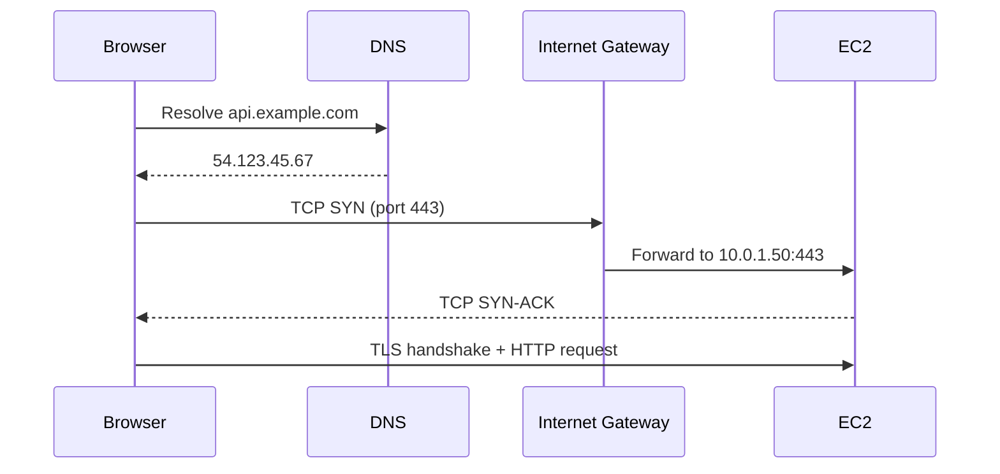

# Chapter 4: Networking Fundamentals

> *How packets move—and why AWS networking looks the way it does.*

---

In [Chapter 2](02-how-computers-work.md), networking was one of four fundamental computer resources. In [Chapter 3](03-linux.md), you met the tools that inspect it—`ip addr`, `ss`, `dig`, `curl`. This chapter explains **what those tools are showing you**.

When you later send HTTPS to Hermes from your laptop, a chain of events crosses DNS, routing tables, TCP handshakes, and firewalls before a single byte reaches the agent. When something fails—`connection refused`, `timeout`, `could not resolve host`—you debug that chain layer by layer.

You do not need to become a network engineer. You need a **working mental model** so [Chapter 8](../part-ii-aws/08-creating-network-for-hermes.md) (VPCs, subnets, route tables) and [Chapter 10](../part-ii-aws/10-establishing-trust.md) (security groups, UFW) feel like natural extensions—not magic AWS vocabulary.

---

## Learning Objectives

After completing this chapter, you will be able to:

- [ ] Explain the OSI model at a practical level and where TCP/IP fits
- [ ] Describe how IP addresses, subnets, and CIDR notation work
- [ ] Differentiate TCP and UDP and know when each is used
- [ ] Explain DNS resolution from browser to IP address
- [ ] Understand NAT, routing, and why private subnets exist
- [ ] Use local diagnostic tools to trace connectivity problems
- [ ] Map these concepts directly to AWS VPC components (preview of Chapter 8)

---

## Prerequisites

- [Chapter 2: How Computers Actually Work](02-how-computers-work.md) — the four resources model; networking as a shared resource
- [Chapter 3: Linux](03-linux.md) — Sections 3.1–3.3 complete; Section 3.5 (networking tools) is helpful but taught here in depth

No cloud account required. Lab 4 runs entirely on your laptop.

---

## Estimated Time

**90 minutes** — 60 minutes reading, 30 minutes for Lab 4.

---

## Background

### From ARPANET to the Internet

Modern networking did not appear fully formed. In the late 1960s, **ARPANET** connected a handful of research computers so they could share resources. The breakthrough was not speed—it was a **packet-switched** design: break data into small **packets**, route each independently, reassemble at the destination.

That design scaled. TCP/IP became the standard protocol suite. The internet is now billions of devices speaking a common language: IP addresses for location, routing for direction, TCP/UDP for delivery semantics, DNS for human-readable names.

Cloud platforms—including AWS—do not replace this model. They **virtualize** it. A VPC is a private internet inside the public internet.

### Public vs Private IP Addresses

Every device on a network needs an **IP address**—a numeric identifier so other devices know where to send packets.

**IPv4** addresses look like `203.0.113.42`—four numbers (0–255) separated by dots. There are roughly 4.3 billion possible IPv4 addresses. That sounded like plenty in the 1980s. It is not enough today.

Two responses shaped the modern internet:

1. **NAT (Network Address Translation)** — many devices share one public IP
2. **Private address ranges (RFC 1918)** — addresses used only inside local networks, never routed on the public internet

RFC 1918 defines three private ranges:

| Range | CIDR | Typical use |
|-------|------|-------------|
| `10.0.0.0` – `10.255.255.255` | `10.0.0.0/8` | Large corporate and cloud VPCs |
| `172.16.0.0` – `172.31.255.255` | `172.16.0.0/12` | Docker default bridges, some VPCs |
| `192.168.0.0` – `192.168.255.255` | `192.168.0.0/16` | Home routers, small office networks |

Your home Wi-Fi probably assigns `192.168.1.x` addresses. Your Hermes EC2 instance will get a `10.0.x.x` address inside your VPC. Neither is directly reachable from the public internet—which is intentional.

:::note[Why this matters for Hermes]

Hermes runs PostgreSQL, Redis, and llama.cpp on the same server, but the **principle** still applies: internal services should not be exposed to the internet unless you deliberately open them. Private IP ranges and firewalls exist so you can run many services on one machine and expose only HTTPS (443) and SSH (22). When you build the VPC in Chapter 8, you are choosing which addresses live inside your isolated network—and which paths lead to the outside world.

:::

### How AWS Abstracts Networking

AWS wraps the same concepts in named resources:

| Concept (this chapter) | AWS resource (Chapter 8+) |
|------------------------|----------------------------|
| Isolated network | VPC |
| Address range slice | Subnet (CIDR block) |
| Connection to the internet | Internet Gateway |
| "Where should this packet go?" | Route table |
| Inbound/outbound traffic filter | Security Group |
| Public-facing address mapping | Elastic IP (Chapter 9) |

You will create these resources hands-on in [Chapter 8](../part-ii-aws/08-creating-network-for-hermes.md). This chapter builds the vocabulary so those steps make sense.

---

## Theory

### The OSI Model — A Practical Subset

The **OSI model** divides networking into seven layers. Network engineers memorize all seven. Cloud engineers need a **practical subset**—enough to know where a problem lives when debugging.

```text
Layer   Name            What it does                    Example
─────   ─────────────   ─────────────────────────────   ─────────────────────
  7     Application     Meaning of the data             HTTP, HTTPS, SSH
  4     Transport       Reliable/unreliable delivery    TCP, UDP
  3     Network         Routing between networks        IP, ICMP
  2     Data Link       Frames on one physical link     Ethernet, Wi-Fi
  1     Physical        Wires, radio, photons           Cable, fiber
```

When you `curl https://aws.amazon.com`, you touch at least:

- **Layer 7** — HTTP request inside TLS
- **Layer 4** — TCP connection on port 443
- **Layer 3** — IP packets routed across the internet
- **Layers 1–2** — handled by your NIC, router, and ISP

**Debugging by layer** is the core skill:

| Symptom | Likely layer | First tool |
|---------|--------------|------------|
| `Could not resolve host` | 7 (name resolution / DNS) | `dig` |
| `Connection timed out` | 3–4 (routing or firewall) | `traceroute`, check SG/UFW |
| `Connection refused` | 4 (host reachable, nothing listening) | `ss -tlnp` |
| TLS certificate error | 7 (HTTPS) | `curl -v`, check cert hostname |

You do not need to identify the exact OSI layer every time. The table gives you a **search order**.

### IP Addressing and CIDR

An IPv4 address is 32 bits, written as four decimal octets. A **subnet** is a contiguous range of addresses sharing a network prefix.

**CIDR** (Classless Inter-Domain Routing) writes that prefix compactly:

```text
10.0.1.0/24
│        │
│        └── /24 = first 24 bits fixed (network portion)
└─────────── Network address
```

For `10.0.1.0/24`:

- Network addresses: `10.0.1.0` through `10.0.1.255` (256 addresses)
- Usable host addresses: typically 254 (first address = network ID, last = broadcast—though AWS handles this slightly differently)

Quick reference:

| CIDR | Addresses | Usable hosts (classic) |
|------|-----------|------------------------|
| `/32` | 1 | 1 (single host) |
| `/28` | 16 | 14 |
| `/24` | 256 | 254 |
| `/16` | 65,536 | 65,534 |
| `/8` | 16,777,216 | — |

**Subnet mask** expresses the same idea in dotted decimal: `/24` = `255.255.255.0` (first 24 bits are 1s).

When you create `hermes-vpc` with `10.0.0.0/16` in Chapter 8, you are claiming 65,536 addresses for your platform. A `/24` subnet like `10.0.1.0/24` takes one slice for your EC2 instance.

### TCP vs UDP

Both ride on IP. They differ in **delivery guarantees**.

**TCP (Transmission Control Protocol)** — connection-oriented, reliable, ordered:

1. **SYN** — client initiates
2. **SYN-ACK** — server acknowledges
3. **ACK** — client confirms

This **three-way handshake** establishes a connection before data flows. TCP retransmits lost packets and preserves order. Use TCP when correctness matters: HTTPS, SSH, PostgreSQL, Redis.

**UDP (User Datagram Protocol)** — connectionless, no guarantees:

- Sends datagrams without handshake
- Faster, lower overhead
- Packets may arrive out of order or not at all

Use UDP when speed beats reliability: DNS queries (usually), video streaming, some monitoring protocols.

For Hermes, almost everything you operate daily is **TCP on a known port**:

| Service | Port | Protocol |
|---------|------|----------|
| HTTPS | 443 | TCP |
| SSH | 22 | TCP |
| PostgreSQL | 5432 | TCP |
| Redis | 6379 | TCP |
| llama.cpp HTTP | 8080 (typical) | TCP |

### DNS — Names to Numbers

Humans remember `ec2.us-west-2.amazonaws.com`. Routers need `54.x.x.x`. **DNS (Domain Name System)** translates names to IP addresses.

Resolution steps (simplified):

```text
Browser: "What is the IP for api.example.com?"
    │
    ▼
OS resolver (checks local cache)
    │
    ▼
Recursive resolver (often your ISP or 8.8.8.8)
    │
    ▼
Root → TLD (.com) → Authoritative nameserver for example.com
    │
    ▼
Returns A record: 203.0.113.10
```

Key terms:

- **A record** — name → IPv4 address
- **TTL (Time To Live)** — how long resolvers cache the answer
- **Authoritative nameserver** — the source of truth for a domain

When DNS fails, nothing else matters—you cannot connect to an IP you do not have. That is why `dig` is step one in many debug flows.

### Routing and Default Gateways

Every device maintains a **routing table**: rules that answer "given this destination IP, which interface do I send the packet out?"

```bash
# Linux
ip route

# macOS
netstat -rn
```

Typical home laptop entry:

```text
default via 192.168.1.1 dev wlan0
```

**Default route** (`0.0.0.0/0`) means "everything not matching a more specific rule goes here"—usually your router. The router then forwards toward the internet.

In AWS, a **route table** attached to a subnet plays the same role. A public subnet's default route points to an **Internet Gateway**. A private subnet's default route might point to a **NAT Gateway** for outbound-only internet access.

### NAT — Sharing Public Addresses

**NAT (Network Address Translation)** rewrites addresses as packets pass through a gateway.

- **SNAT (Source NAT)** — private IP → public IP on outbound traffic (your laptop behind home router)
- **DNAT (Destination NAT)** — public IP → private IP on inbound traffic (Elastic IP → EC2 private IP)

Why private subnets need NAT for outbound access: instances with only private IPs cannot be **return destinations** on the public internet. NAT gives them a shared public identity for outbound connections while blocking unsolicited inbound traffic.

Hermes's initial design uses a **public subnet** with an Elastic IP—simpler for learning. Production hardening often moves databases to private subnets with NAT for package updates.

### Firewalls vs Security Groups

A **firewall** filters traffic based on rules: source IP, destination IP, port, protocol, allow/deny.

Linux **UFW** (Uncomplicated Firewall) on your EC2 instance is a host firewall—it runs on the server itself. AWS **Security Groups** are a virtual firewall attached to ENIs (network interfaces)—they filter before traffic reaches the instance.

Important distinction for later chapters:

| | Traditional stateful firewall | AWS Security Group |
|---|------------------------------|-------------------|
| Default stance | Often deny-all, explicit allows | Deny-all inbound; allow outbound by default |
| Stateful | Usually yes | **Yes** — return traffic for allowed connections is automatically permitted |
| Scope | One machine | Attached to instance ENI |

You will configure both in [Chapter 10](../part-ii-aws/10-establishing-trust.md). The conceptual model is the same: **expose minimum ports, from minimum sources**.

---

## Architecture

### VPC Topology (Preview)

This diagram previews what you build in Chapter 8—not something you create today:

```text
Internet (0.0.0.0/0)
        │
   ┌────▼────┐
   │   IGW   │  Internet Gateway
   └────┬────┘
        │
 ┌──────▼──────────────────────────┐
 │  VPC 10.0.0.0/16                │
 │  ┌─────────────────────────┐    │
 │  │ Public Subnet 10.0.1.0/24│    │
 │  │  EC2: 10.0.1.50          │    │
 │  │  Route: 0.0.0.0/0 → IGW  │    │
 │  └─────────────────────────┘    │
 │  ┌─────────────────────────┐    │
 │  │ Private Subnet 10.0.2.0/24│   │
 │  │  RDS: 10.0.2.100         │    │
 │  │  Route: 0.0.0.0/0 → NAT  │    │
 │  └─────────────────────────┘    │
 └─────────────────────────────────┘
```

### Request Path to Hermes (End State)

When the platform is complete, a request from your browser follows a path like this:



Each hop depends on concepts from this chapter: DNS resolution, public routing, TCP connection establishment, and firewall rules allowing port 443.

---

## Walkthrough

This chapter's walkthrough uses **local diagnostic tools** on your laptop—the same tools you will use on your Hermes server in Part II. AWS console steps are deferred to [Chapter 8](../part-ii-aws/08-creating-network-for-hermes.md).

### Your Public IP

```bash
curl -s https://checkip.amazonaws.com
```

Returns the public IPv4 address your traffic presents to the internet—what AWS Security Groups and SSH allow-lists will reference.

### Routing Table

See where packets go by default:

```bash
# Linux
ip route

# macOS
netstat -rn
```

Look for a `default` or `0.0.0.0/0` entry—that is your default gateway (usually your router).

### DNS Resolution

```bash
dig ec2.us-west-2.amazonaws.com +short
```

The `+short` flag prints only IP addresses. If this fails, the problem is DNS or upstream connectivity—not AWS.

Query a specific resolver if your default fails:

```bash
dig @8.8.8.8 github.com +short
```

### Path Tracing

```bash
# macOS / most Linux
traceroute ec2.us-west-2.amazonaws.com

# Linux alternative if traceroute missing
tracepath ec2.us-west-2.amazonaws.com
```

Each line is a **hop**—a router along the path. Timeouts (`* * *`) often mean ICMP is blocked; that is common and not always a problem.

### TCP Connectivity and HTTP

```bash
curl -v https://aws.amazon.com 2>&1 | head -30
```

`-v` (verbose) shows DNS resolution, TCP connection, TLS handshake, and HTTP headers. This is Layer 7 debugging in one command.

### Local Listening Ports

```bash
# Linux
ss -tlnp

# macOS
netstat -an | grep LISTEN
```

Shows which processes are waiting for inbound TCP connections—equivalent to checking whether a service is actually running on the port you expect.

---

## Lab

### Lab 4: Network Diagnostics

**Estimated Time:** 30 minutes

**Goal:** Use command-line tools to inspect network connectivity and DNS; document findings that will help when debugging Hermes connectivity later.

**Prerequisites:** Internet access, terminal

**Steps:**

1. Find your public IP: `curl -s https://checkip.amazonaws.com`
2. Inspect your local routing table:
   - macOS: `netstat -rn`
   - Linux: `ip route`
3. Trace the route to AWS: `traceroute ec2.us-west-2.amazonaws.com`
4. Resolve DNS: `dig ec2.us-west-2.amazonaws.com +short`
5. Test TCP connectivity: `curl -v https://aws.amazon.com 2>&1 | head -30`
6. Check open ports locally: `ss -tlnp` (Linux) or `netstat -an | grep LISTEN` (macOS)
7. Calculate a subnet: how many hosts in a `/24`? A `/28`?
8. Document your answers in `resources/labs/ch04/network-notes.md` (template provided in the repo)

**Verification:**

```bash
curl -s https://checkip.amazonaws.com
dig ec2.us-west-2.amazonaws.com +short
```

**Expected output:** Your public IP address and one or more AWS IP addresses.

**Troubleshooting:**

| Problem | Cause | Fix |
|---------|-------|-----|
| `traceroute: command not found` | Not installed | `brew install traceroute` or use `tracepath` |
| DNS timeout | Network or DNS issue | Try `dig @8.8.8.8 domain.com` |
| `curl: (6) Could not resolve host` | DNS failure | Check `/etc/resolv.conf` or network connection |
| `ss: command not found` | iproute2 missing | `sudo apt install -y iproute2` on Ubuntu |

**Cleanup:** Nothing to clean up. Keep `resources/labs/ch04/network-notes.md` for reference when configuring Security Groups in Chapter 10.

---

## Verification

Confirm you can answer these without notes:

- Your public IP and default gateway
- The IP address `dig` returns for an AWS hostname
- How many usable addresses a `/24` contains
- The difference between TCP and UDP for Hermes services (all TCP)

Re-run the verification commands from Lab 4 if any answer is uncertain.

---

## Troubleshooting

See Lab 4 troubleshooting table above.

**General debug order** (memorize this—it applies on your laptop and on EC2):

1. **DNS** — does the name resolve? (`dig`)
2. **Routing** — is there a path? (`traceroute`, `ip route`)
3. **Reachability** — does the host respond? (`ping`—may be blocked; do not rely on it alone)
4. **Port** — is anything listening? (`ss -tlnp` on the server)
5. **Firewall** — is traffic allowed? (Security Group, UFW—Chapters 8 and 10)

Work top to bottom. Skipping DNS to tweak firewall rules wastes time when the real problem is a typo in the hostname.

---

## Review Questions

1. How many usable host addresses are in a `/24` subnet?
2. What is the difference between a public and private IP address?
3. Why do instances in a private subnet need a NAT Gateway to reach the internet?
4. What layer of the OSI model does DNS operate at? (Hint: DNS is often described as an application-layer protocol that uses UDP for transport.)
5. How does a Security Group differ from a traditional stateful firewall?
6. Why does Hermes use TCP for PostgreSQL and HTTPS rather than UDP?
7. What does a default route (`0.0.0.0/0`) in a route table mean?

---

## Key Takeaways

- The internet is **packet-switched**: data travels in labeled chunks routed hop by hop.
- **IP addresses** identify endpoints; **CIDR** describes ranges; **RFC 1918** private ranges are not routable on the public internet.
- **TCP** is reliable and connection-oriented (HTTPS, SSH, databases); **UDP** is fast and best-effort (DNS queries, streaming).
- **DNS** translates names to IPs—always verify resolution before debugging connectivity.
- **Routing tables** decide the next hop; **NAT** lets private networks share public addresses.
- **Firewalls** (UFW, Security Groups) enforce least privilege—expose only the ports Hermes needs.
- AWS VPC components map directly to these concepts; Chapter 8 implements what this chapter explains.

---

## Glossary Additions

| Term | Definition |
|------|------------|
| **CIDR** | Classless Inter-Domain Routing—notation for IP ranges (e.g., `10.0.0.0/16`). |
| **DNS** | Domain Name System—hierarchical name-to-IP resolution. |
| **Default route** | Catch-all routing rule (`0.0.0.0/0`) for destinations not matching other entries. |
| **Elastic IP** | Static public IPv4 address assigned to an AWS account; maps to instance private IP. |
| **Internet Gateway** | AWS VPC component allowing bidirectional traffic between VPC and the internet. |
| **NAT** | Network Address Translation—rewrites IP addresses at a network boundary. |
| **Packet** | A unit of data with source/destination headers, routed independently across networks. |
| **Port** | A 16-bit number identifying a specific service on a host (e.g., 443 for HTTPS). |
| **Route table** | Set of rules determining where packets are sent next. |
| **Security Group** | AWS stateful virtual firewall attached to instance network interfaces. |
| **Subnet** | A subdivision of a VPC CIDR block, tied to one Availability Zone. |
| **TCP** | Transmission Control Protocol—reliable, connection-oriented transport. |
| **UDP** | User Datagram Protocol—connectionless, unreliable transport. |
| **VPC** | Virtual Private Cloud—isolated virtual network in AWS. |

---

## Further Reading

- [TCP/IP Illustrated — W. Richard Stevens](https://www.pearson.com/en-us/subject-catalog/p/tcp-ip-illustrated-volume-1/P200000003380)
- [Computer Networking: A Top-Down Approach — Kurose & Ross](https://www.pearson.com/en-us/subject-catalog/p/computer-networking/P200000003339)
- [AWS VPC documentation](https://docs.aws.amazon.com/vpc/latest/userguide/what-is-amazon-vpc.html)
- [RFC 1918 — Address Allocation for Private Internets](https://www.rfc-editor.org/rfc/rfc1918)

---

## What's Next

[Chapter 5: Virtualization](05-virtualization.md) explains how hypervisors turn one physical machine into many isolated environments—the foundation of EC2.

If you are eager to build: [Chapter 6](06-designing-the-hermes-platform.md) maps the Hermes platform design, then [Chapter 7](../part-ii-aws/07-provisioning-aws-account.md) opens your AWS account. [Chapter 8](../part-ii-aws/08-creating-network-for-hermes.md) implements the VPC diagram from this chapter.

**Reading paths:**

- **Path A (recommended):** Ch 4 → Ch 6 (design) → Part II (build)—networking concepts fresh when you create the VPC.
- **Path B:** Ch 4 → Ch 5 → Ch 6 → Part II—full foundations before any AWS work.

---

[← Chapter 3: Linux](03-linux.md) | [Next: Chapter 5 — Virtualization →](05-virtualization.md)
