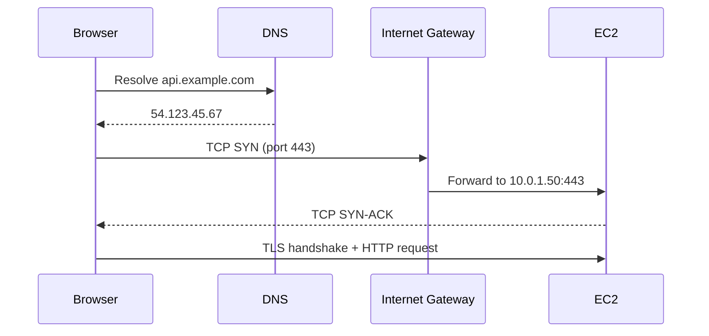

# Chapter 4: Networking Fundamentals

> *How packets move—and why AWS networking looks the way it does.*

---

## Learning Objectives

After completing this chapter, you will be able to:

- [ ] Explain the OSI model and where TCP/IP fits
- [ ] Describe how IP addresses, subnets, and CIDR notation work
- [ ] Differentiate TCP and UDP and know when each is used
- [ ] Explain DNS resolution from browser to IP address
- [ ] Understand NAT, routing, and why private subnets exist
- [ ] Map these concepts directly to AWS VPC components (preview of Chapter 8)

---

## Background

<!-- TODO: ARPANET to the modern internet -->
<!-- TODO: Why RFC 1918 private address spaces exist -->
<!-- TODO: How AWS abstracts networking into VPCs -->

*Content coming soon.*

---

## Theory

<!-- TODO: OSI 7-layer model (practical subset) -->
<!-- TODO: IP addressing — IPv4, CIDR, subnet masks -->
<!-- TODO: TCP three-way handshake, UDP use cases -->
<!-- TODO: DNS — recursive vs authoritative, TTL -->
<!-- TODO: NAT — SNAT, DNAT, why instances in private subnets need it -->
<!-- TODO: Routing tables and default gateways -->
<!-- TODO: Firewalls vs Security Groups (conceptual preview) -->

*Content coming soon.*

---

## Architecture

```
Internet (0.0.0.0/0)
        │
   ┌────▼────┐
   │   IGW   │  Internet Gateway
   └────┬────┘
        │
 ┌──────▼──────────────────────────┐
 │  VPC 10.0.0.0/16                │
 │  ┌─────────────────────────┐    │
 │  │ Public Subnet 10.0.1.0/24│    │
 │  │  EC2: 10.0.1.50          │    │
 │  │  Route: 0.0.0.0/0 → IGW  │    │
 │  └─────────────────────────┘    │
 │  ┌─────────────────────────┐    │
 │  │ Private Subnet 10.0.2.0/24│   │
 │  │  RDS: 10.0.2.100         │    │
 │  │  Route: 0.0.0.0/0 → NAT  │    │
 │  └─────────────────────────┘    │
 └─────────────────────────────────┘
```



---

## AWS Console Walkthrough

*Deferred to [Chapter 8: Creating the Network for Hermes](../part-ii-aws/08-creating-network-for-hermes.md).*

This chapter builds the conceptual foundation. You will create these resources hands-on in Chapter 8.

---

## CLI Walkthrough

<!-- TODO: Local networking diagnostics -->
<!-- TODO: ping, traceroute, dig, nslookup, curl -->
<!-- TODO: ss / netstat for open ports -->
<!-- TODO: ip addr, ip route (Linux) -->

*Content coming soon.*

---

## Terraform Walkthrough

*Deferred to [Chapter 8: Creating the Network for Hermes](../part-ii-aws/08-creating-network-for-hermes.md).*

---

## Lab

### Lab 4: Network Diagnostics

**Estimated Time:** 30 minutes

**Goal:** Use command-line tools to inspect network connectivity and DNS.

**Prerequisites:** Internet access, terminal

**Steps:**

1. Find your public IP: `curl -s https://checkip.amazonaws.com`
2. Inspect your local routing table:
   - macOS: `netstat -rn`
   - Linux: `ip route`
3. Trace the route to AWS: `traceroute ec2.us-east-1.amazonaws.com`
4. Resolve DNS: `dig ec2.us-east-1.amazonaws.com +short`
5. Test TCP connectivity: `curl -v https://aws.amazon.com 2>&1 | head -30`
6. Check open ports locally: `ss -tlnp` (Linux) or `netstat -an | grep LISTEN` (macOS)
7. Calculate a subnet: how many hosts in a `/24`? A `/28`?
8. Document your answers in `labs/ch04-network-notes.md`

**Verification:**

```bash
curl -s https://checkip.amazonaws.com
dig ec2.us-east-1.amazonaws.com +short
```

**Expected output:** Your public IP address and one or more AWS IP addresses.

**Troubleshooting:**

| Problem | Cause | Fix |
|---------|-------|-----|
| `traceroute: command not found` | Not installed | `brew install traceroute` or use `tracepath` |
| DNS timeout | Network or DNS issue | Try `dig @8.8.8.8 domain.com` |
| `curl: (6) Could not resolve host` | DNS failure | Check `/etc/resolv.conf` or network connection |

**Cleanup:** Nothing to clean up.

---

## Verification

You can resolve DNS, trace routes, and identify your public IP from the command line.

---

## Troubleshooting

See Lab 4 troubleshooting table above.

---

## Review Questions

1. How many usable host addresses are in a `/24` subnet?
2. What is the difference between a public and private IP address?
3. Why do instances in a private subnet need a NAT Gateway to reach the internet?
4. What layer of the OSI model does DNS operate at?
5. How does a Security Group differ from a traditional stateful firewall?

---

## Further Reading

- [TCP/IP Illustrated — W. Richard Stevens](https://www.pearson.com/en-us/subject-catalog/p/tcp-ip-illustrated-volume-1/P200000003380)
- [Computer Networking: A Top-Down Approach — Kurose & Ross](https://www.pearson.com/en-us/subject-catalog/p/computer-networking/P200000003339)
- [AWS VPC documentation](https://docs.aws.amazon.com/vpc/latest/userguide/what-is-amazon-vpc.html)

---

## References

*To be added as content is written.*

---

[← Chapter 3](03-linux.md) | [Next: Chapter 5 — Virtualization →](05-virtualization.md)
