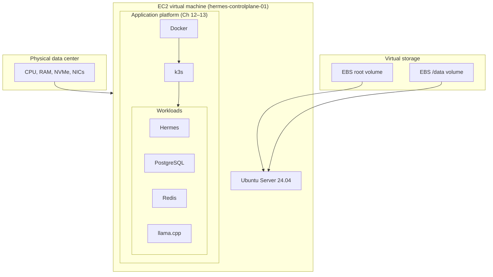

# Chapter 5: Virtualization

> *How one physical server becomes many isolated machines—and why the cloud is possible.*

---

In [Chapter 2](02-how-computers-work.md), virtualization appeared as the reason EC2 can exist: a hypervisor maps real CPU, RAM, storage, and network to virtual machines. In [Chapter 4](04-networking.md), you saw AWS **virtualize networking**—a VPC is a private internet inside the public internet.

This chapter completes the foundation. When you launch `hermes-controlplane-01` in [Chapter 9](../part-ii-aws/09-provisioning-hermes-server.md), you are not renting a physical server in a rack. You are renting a **virtual machine**—an isolated environment that behaves like its own computer, carved from hardware you will never touch.

Understanding that layer matters when you pick instance sizes, attach EBS volumes, debug performance, or later wonder why Docker containers are not the same thing as EC2 instances.

---

## Learning Objectives

After completing this chapter, you will be able to:

- [ ] Explain why virtualization was invented and what problem it solves
- [ ] Differentiate Type 1 and Type 2 hypervisors
- [ ] Describe what a virtual machine includes (virtual CPU, RAM, disk, NIC)
- [ ] Compare VMs and containers at a conceptual level
- [ ] Map EC2, EBS, and AMI to the virtualization stack
- [ ] Explain oversubscription and why instance sizing is a tradeoff
- [ ] Trace the full Hermes stack from physical hardware to agent process

---

## Prerequisites

- [Chapter 2: How Computers Actually Work](02-how-computers-work.md) — the four resources model; brief introduction to hypervisors and EC2
- [Chapter 4: Networking](04-networking.md) — helpful for understanding virtual NICs and VPC isolation; not required if you skimmed networking

No cloud account required. Lab 5 runs on your laptop.

---

## Estimated Time

**75 minutes** — 45 minutes reading, 30 minutes for Lab 5.

---

## Background

### Before Virtualization — One Server, One OS

For decades, data centers worked like this: buy a physical server, install one operating system, run one application stack. If the server had 64 GB of RAM and your database needed 8 GB, the rest sat idle. If you needed a staging environment, you bought another server—or waited weeks for procurement.

Three problems followed:

1. **Low utilization** — most servers ran at 10–15% average CPU; capital sat wasted
2. **Slow provisioning** — new environments meant hardware lead times, racking, cabling
3. **Weak isolation** — multiple apps on one OS shared fate; one crash could destabilize neighbors

Virtualization addresses all three by inserting a **hypervisor** between physical hardware and guest operating systems.

### What the Cloud Sells

AWS does not sell you a specific physical machine. It sells **capacity units** backed by a massive pool of virtualized resources:

| What you think you are buying | What AWS actually provides |
|-------------------------------|----------------------------|
| A server | A VM slot on a host, sized by vCPU and GiB |
| A hard drive | A virtual block device (EBS) mapped over the network |
| A network card | A virtual NIC in a software-defined VPC |
| An IP address | A routing and NAT abstraction on shared infrastructure |

The contract is **behavioral**: your instance behaves like a dedicated machine. The implementation is **shared**: thousands of customers' VMs may run on the same physical racks.

:::note[Why this matters for Hermes]

Hermes, PostgreSQL, Redis, and llama.cpp will all run on **one EC2 instance** in your initial design—a single VM with multiple services inside it. Later chapters add Docker and k3s, which add another isolation layer *inside* that VM. Knowing where the VM boundary sits helps you reason about failure domains: reboot the instance and everything inside it stops; restart a container and only that workload restarts.

:::

---

## Theory

### Hypervisors — The Control Layer

A **hypervisor** (virtual machine monitor) creates and runs virtual machines. It:

- Allocates slices of physical CPU, RAM, and I/O to each guest
- Traps privileged instructions so guests cannot escape isolation
- Presents **virtual devices**—disks, NICs, keyboards—that guests treat as real hardware

Two categories matter:

| Type | Runs on | Examples | Typical use |
|------|---------|----------|-------------|
| **Type 1 (bare-metal)** | Hardware directly | KVM, Xen, VMware ESXi, **AWS Nitro** | Data centers, EC2 |
| **Type 2 (hosted)** | Inside a host OS | VirtualBox, VMware Fusion, Parallels, UTM | Laptops, developer VMs |

```text
Type 1 (data center / EC2):
┌─────────────────────────────────────┐
│  Guest OS   Guest OS   Guest OS     │  ← your EC2 instances
├─────────────────────────────────────┤
│           Hypervisor (Nitro/KVM)    │
├─────────────────────────────────────┤
│         Physical hardware           │
└─────────────────────────────────────┘

Type 2 (your laptop):
┌─────────────────────────────────────┐
│           Guest OS (Ubuntu VM)      │
├─────────────────────────────────────┤
│  Hypervisor (VirtualBox / UTM)      │
├─────────────────────────────────────┤
│     Host OS (macOS / Windows)       │
├─────────────────────────────────────┤
│         Physical hardware           │
└─────────────────────────────────────┘
```

EC2 uses a **Type 1** hypervisor stack. When you launch an instance, AWS places your VM on a host you never see. That is why EC2 feels like "a remote computer"—each guest runs a full operating system with its own kernel.

### Anatomy of a Virtual Machine

Each VM includes:

| Virtual component | Physical backing | What the guest sees |
|-------------------|------------------|---------------------|
| **vCPU** | Time slices on real CPU cores | One or more CPU cores |
| **Memory** | Reserved or ballooned RAM pages | Fixed RAM size (e.g., 8 GiB) |
| **Virtual disk** | Local NVMe, network-attached EBS, or file on SAN | Block device (`/dev/nvme0n1`) |
| **Virtual NIC** | Software bridge to physical network | `eth0` with MAC and IP |
| **Firmware / BIOS** | Emulated or paravirtualized | Boot sequence, ACPI tables |

The guest OS—Ubuntu Server on your Hermes instance—runs **unmodified** (or with lightweight paravirtual drivers for performance). It schedules processes, manages memory, and mounts filesystems exactly as it would on bare metal.

**Paravirtualization** is an optimization: the guest uses hypervisor-aware drivers (for example, AWS's ENA network driver) instead of emulating legacy hardware. Faster I/O, same isolation guarantee.

### EC2, AMI, and EBS — AWS Names for VM Concepts

| Concept | AWS artifact | Chapter |
|---------|--------------|---------|
| Virtual machine | **EC2 instance** | [Chapter 9](../part-ii-aws/09-provisioning-hermes-server.md) |
| VM template (OS + disk image) | **AMI** (Amazon Machine Image) | Chapter 9 |
| Virtual block storage | **EBS volume** | [Chapter 11](../part-ii-aws/11-persistent-storage.md) |
| Virtual network interface | **ENI** in a VPC subnet | [Chapter 8](../part-ii-aws/08-creating-network-for-hermes.md) |
| Instance metadata | `169.254.169.254` (link-local HTTP API) | Chapter 9 |

When you pick **Ubuntu Server 24.04 LTS** as an AMI and attach a 100 GB **gp3** EBS volume for `/data`, you are defining a VM's boot disk and an additional virtual hard drive. Snapshots of EBS volumes are point-in-time copies of that virtual disk—critical for model and database backups in Chapter 11.

### AWS Nitro — Modern Hypervisor Design

Early EC2 ran on Xen. Modern EC2 uses the **Nitro System**: a combination of lightweight hypervisor, custom hardware cards, and a separate Nitro security chip that handles storage and network I/O.

Benefits relevant to Hermes:

- **Near bare-metal performance** — less emulation overhead for network and disk
- **Stronger isolation** — I/O offloaded from the main CPU; smaller attack surface
- **Faster provisioning** — new instance types ship without rewriting the entire stack

You do not configure Nitro. Knowing it exists explains why `m7i` instances feel snappier than legacy generations and why EBS latency is predictable enough for PostgreSQL.

### Oversubscription and Instance Sizing

Cloud providers **oversubscribe** physical resources: they sell more vCPUs and memory than any single host physically possesses, betting that not every VM peaks simultaneously.

For you, that means:

- **Burstable instances** (`t3`, `t4g`) accumulate CPU credits; fine for intermittent Hermes traffic, risky for sustained llama.cpp inference
- **Memory is harder to oversubscribe** — if PostgreSQL and llama.cpp need 16 GiB, do not pick an 8 GiB instance hoping the hypervisor will compensate
- **Noisy neighbors** — another customer's VM on the same host can occasionally affect latency; dedicated hosts and larger instance sizes reduce this (at cost)

When you choose `t3.medium` versus `m7i.large` in Chapter 9, you are choosing how much **real** hardware backs your virtual machine—and how much burst behavior you accept.

### Virtual Machines vs Containers

Both provide isolation. They differ in **what** is isolated:

```text
Virtual Machine                    Container (preview)
┌─────────────────────┐           ┌─────────────────────┐
│  App A    App B     │           │  App A    App B     │
├─────────────────────┤           ├─────────────────────┤
│  Guest OS (Ubuntu)  │           │  Shared host kernel │
├─────────────────────┤           ├─────────────────────┤
│     Hypervisor      │           │  Container runtime  │
├─────────────────────┤           │  (Docker — Part III)│
│  Physical hardware  │           ├─────────────────────┤
└─────────────────────┘           │  Host OS / VM       │
                                  ├─────────────────────┤
                                  │  Physical hardware  │
                                  └─────────────────────┘
```

| | Virtual machine | Container |
|---|-----------------|-----------|
| **Kernel** | One per VM | Shared with host |
| **Boot time** | Minutes (full OS boot) | Seconds (process start) |
| **Isolation strength** | Strong (hardware-assisted) | Good (namespaces, cgroups) |
| **Density** | Lower (full OS each) | Higher (many per host) |
| **Typical unit in this book** | EC2 instance | Docker container → k3s Pod |

**The stack for Hermes:**

```text
Physical server (AWS data center)
  └── EC2 VM (Ubuntu)           ← this chapter
        └── Docker engine       ← Chapter 12
              └── k3s cluster   ← Chapter 13
                    └── Hermes Pod, PostgreSQL, Redis, llama.cpp
```

Containers are not a replacement for VMs—they usually **run inside** VMs. Kubernetes (k3s) schedules containers across nodes; each node is an EC2 instance. Chapter 5 explains the VM layer; [Part III](../part-iii-containers/17-docker.md) explains containers.

---

## Architecture

### The Hermes Virtualization Stack



Each box is a **boundary you can reboot, snapshot, or resize independently**—at least in theory. In practice, your first deployment colocates everything on one VM for cost and simplicity; the diagram shows the layers you will unbundle as the platform matures.

### Resource Mapping — Laptop to EC2

| Inspect locally | On Hermes EC2 (later) | Virtualization layer |
|-----------------|----------------------|----------------------|
| `lscpu` / `sysctl -n hw.ncpu` | Instance type vCPU count | Hypervisor CPU scheduling |
| `free -h` / Activity Monitor | Instance memory (GiB) | Memory balloon / reservation |
| Disk utility / `df -h` | EBS volume size and type | Virtual block device |
| `ip addr` | ENI private IP in VPC | Virtual NIC |

The commands change names; the mental model does not.

---

## Walkthrough

This chapter's walkthrough inspects **your laptop's resources** and optionally launches a **local VM**—the same pattern as running Ubuntu in Multipass before SSH-ing to EC2 in Part II.

### Inspect CPU and Memory

```bash
# Linux
lscpu | head -20
free -h

# macOS
sysctl -n hw.ncpu hw.physicalcpu hw.logicalcpu
sysctl hw.memsize
```

Note **physical vs logical CPUs**. Hyper-threading exposes two logical CPUs per physical core. EC2 **vCPUs** map to logical processors on the host—`2 vCPU` usually means two hyper-threads or cores allocated to your VM.

### Inspect Block Devices

```bash
# Linux
lsblk
df -h /

# macOS (APFS containers — different naming, same idea)
diskutil list
df -h /
```

Your root filesystem sits on a partition backed by physical storage. On EC2, `lsblk` will show `nvme0n1` (root) and additional `nvme1n1` volumes for `/data`—virtual disks presented by the Nitro stack.

### Optional — Launch a Local Ubuntu VM

If you want hands-on practice with a Type 2 hypervisor, install **Multipass** (free, cross-platform):

```bash
# macOS (Homebrew)
brew install multipass

# Launch Ubuntu 24.04 with 2 GB RAM, 10 GB disk
multipass launch 24.04 --name hermes-practice --memory 2G --disk 10G

# Shell into the VM
multipass shell hermes-practice

# Inside the VM — compare to your host
lscpu | grep "CPU(s)"
free -h
lsblk
exit

# Stop and delete when done
multipass stop hermes-practice
multipass delete hermes-practice
```

Inside the VM, `lscpu` reports fewer CPUs and `free -h` shows only the RAM you allocated—exactly how EC2 presents a subset of host resources. This is optional; Lab 5 works without it.

---

## Lab

### Lab 5: Map the Virtualization Stack

**Estimated Time:** 30 minutes

**Goal:** Document your machine's resources and draw the virtualization layers Hermes will use—from physical hardware to agent process.

**Prerequisites:** Terminal access; internet optional (Multipass install only)

**Steps:**

1. Record CPU and memory from your laptop:
   - Linux: `lscpu | head -15` and `free -h`
   - macOS: `sysctl -n hw.ncpu hw.memsize` and convert bytes to GiB
2. Record disk layout: `lsblk` (Linux) or `diskutil list` (macOS)
3. **Optional:** Launch `hermes-practice` in Multipass (see Walkthrough) and compare `lscpu` / `free -h` inside vs outside the VM
4. Complete the stack diagram in `resources/labs/ch05/virtualization-notes.md`
5. Answer: if Hermes needs 8 GiB RAM for llama.cpp and 4 GiB for PostgreSQL/Redis/Hermes, what is the **minimum** EC2 memory you should consider? (Hint: leave headroom for the OS and k3s.)
6. Answer: why is a container **not** a substitute for an EC2 instance in this architecture?

**Verification:**

You can explain each layer in this chain without notes:

```text
Physical host → EC2 VM → Ubuntu → Docker → k3s → Hermes Pod
```

**Expected output:** Completed worksheet with host resource numbers and stack diagram filled in.

**Troubleshooting:**

| Problem | Cause | Fix |
|---------|-------|-----|
| `multipass: command not found` | Not installed | Skip optional step, or `brew install multipass` |
| Multipass launch fails on Apple Silicon | Virtualization framework disabled | System Settings → Privacy & Security → enable for Multipass |
| `lsblk: command not found` | macOS | Use `diskutil list` instead |
| VM feels slower than host | Normal — nested virtualization overhead | Expected; EC2 Type 1 hypervisors are faster than laptop Type 2 |

**Cleanup:** If you created a Multipass VM, run `multipass delete hermes-practice --purge`. Keep `resources/labs/ch05/virtualization-notes.md` for reference when sizing your EC2 instance in Chapter 9.

---

## Verification

Confirm you can answer without notes:

- The difference between Type 1 and Type 2 hypervisors
- What EC2, AMI, and EBS each represent in VM terms
- Where containers sit relative to VMs in the Hermes stack
- Why 12 GiB of workloads needs more than a 12 GiB instance

Re-read the **Virtual Machines vs Containers** section if any answer is uncertain.

---

## Troubleshooting

See Lab 5 troubleshooting table above.

**Conceptual confusion — common mix-ups:**

| Mistake | Correction |
|---------|------------|
| "Docker replaces EC2" | Docker runs *on* EC2; the VM is still the isolation boundary for the whole platform |
| "EBS is a physical disk in my rack" | EBS is network-attached **virtual** block storage; latency and IOPS are configurable |
| "vCPU = physical core" | vCPU is a hypervisor allocation unit; compare instance specs, not socket counts |
| "More containers = need more VMs automatically" | One VM can run many containers until CPU, RAM, or disk saturate—then scale vertically (bigger instance) or horizontally (more nodes) |

---

## Review Questions

1. Why did data centers adopt virtualization instead of one OS per physical server?
2. What is the difference between a Type 1 and Type 2 hypervisor?
3. Name four virtual components every VM receives.
4. How does an AMI relate to a virtual machine?
5. Why does Hermes run containers *inside* an EC2 instance rather than replacing EC2 with containers alone?
6. What is oversubscription, and how might it affect a latency-sensitive llama.cpp workload?
7. What AWS technology offloads network and storage I/O from the main CPU on modern instances?

---

## Key Takeaways

- **Virtualization** inserts a hypervisor between hardware and guest OSes—raising utilization, speeding provisioning, and isolating failures.
- **EC2 instances are VMs**; **EBS volumes are virtual disks**; **AMIs are VM templates**—the same four resources from Chapter 2, sold as managed units.
- **Type 1 hypervisors** (Nitro/KVM) run data centers; **Type 2** (VirtualBox, Multipass) helps you practice on a laptop.
- **Containers share a kernel**; **VMs each have their own kernel**—containers add density inside a VM; they do not replace it in the Hermes architecture.
- **Instance sizing** is a real tradeoff: memory for llama.cpp and PostgreSQL must fit inside the VM with OS overhead; burstable CPU has limits.
- The Hermes stack layers: **physical → EC2 → Ubuntu → Docker → k3s → Pods**—each chapter in Part II–IV activates the next layer.

---

## Glossary Additions

| Term | Definition |
|------|------------|
| **AMI** | Amazon Machine Image—a template defining the OS and boot disk for an EC2 instance. |
| **Bare metal** | Physical server hardware with no hypervisor guest layer; contrast with virtualized EC2. |
| **EBS** | Elastic Block Store—network-attached virtual block storage for EC2 instances. |
| **ENI** | Elastic Network Interface—a virtual NIC attached to an EC2 instance in a VPC. |
| **Guest OS** | The operating system running inside a virtual machine (e.g., Ubuntu on EC2). |
| **Nitro** | AWS hypervisor and hardware offload system powering modern EC2 instances. |
| **Oversubscription** | Allocating more virtual resources than physical capacity, relying on average usage patterns. |
| **Paravirtualization** | Guest OS using hypervisor-aware drivers for faster I/O instead of emulating legacy devices. |
| **Type 1 hypervisor** | Runs directly on hardware (KVM, Nitro, ESXi); used in data centers and EC2. |
| **Type 2 hypervisor** | Runs as an application on a host OS (VirtualBox, Multipass); used for local development VMs. |

Terms **Hypervisor**, **Virtualization**, and **vCPU** were introduced in [Chapter 2](02-how-computers-work.md).

---

## Further Reading

- [Operating Systems: Three Easy Pieces — Virtualization chapters](https://pages.cs.wisc.edu/~remzi/OSTEP/) — free textbook; CPU, memory, and I/O virtualization
- [AWS Nitro System](https://aws.amazon.com/ec2/nitro/) — official overview of EC2's hypervisor architecture
- [Amazon EC2 Instance Types](https://aws.amazon.com/ec2/instance-types/) — how AWS packages vCPU and memory (Chapter 9)
- [Multipass documentation](https://multipass.run/docs) — local Ubuntu VMs for practice

---

## What's Next

[Chapter 6: Designing the Hermes Platform](06-designing-the-hermes-platform.md) defines **what** you will build on top of this virtualization layer—every component mapped to AWS resources before you open the console.

If you skipped ahead earlier, return here before Part II so EC2, EBS, and AMI vocabulary feel grounded—not arbitrary AWS product names.

**Reading paths:**

- **Path A (recommended in Chapter 4):** Ch 4 → Ch 6 (design) → Part II (build)
- **Path B (full foundations):** Ch 4 → Ch 5 → Ch 6 → Part II

Both paths converge at [Chapter 7](../part-ii-aws/07-provisioning-aws-account.md), where you create the AWS account that will host your first VM.

---

[← Chapter 4: Networking](04-networking.md) | [Next: Chapter 6 — Designing the Hermes Platform →](06-designing-the-hermes-platform.md)
