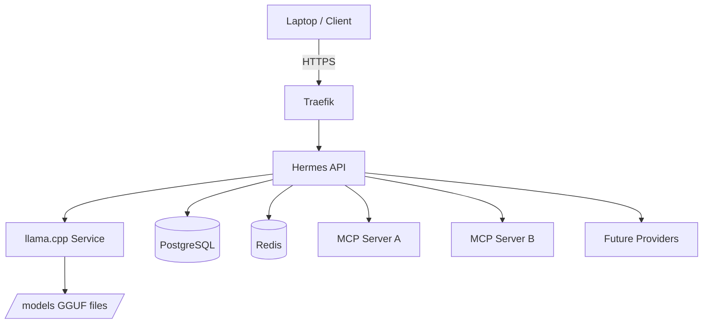

# Chapter 6: Designing the Hermes Platform

> What infrastructure do I actually need to run Hermes?

---

Most cloud projects begin by creating infrastructure. This book intentionally does the opposite.

Before you create a single AWS resource, you need to understand **what you are building and why each component exists**. Every EC2 instance, subnet, Kubernetes deployment, and storage volume should exist because it solves a specific problem for the **Hermes agent**.

Our goal is not simply to "run Hermes." Our goal is to build an AI platform that is:

- Secure
- Inexpensive
- Easy to understand
- Easy to rebuild
- Easy to scale
- Easy to debug

---

## Learning Objectives

After completing this chapter, you will be able to:

- [ ] Explain every major component of the Hermes platform and its role
- [ ] Map each component to the AWS resources you will provision in Part II
- [ ] Trace the request lifecycle from your laptop through Hermes to llama.cpp and back
- [ ] Estimate baseline infrastructure costs for a single-node deployment
- [ ] Describe how the architecture can evolve without redesigning from scratch

---

## Prerequisites

- [Chapter 1: Introduction](../part-i-foundations/01-introduction.md) — why you are building a cloud environment
- [Chapter 2: How Computers Actually Work](../part-i-foundations/02-how-computers-work.md) — CPU, memory, storage, networking
- [Chapter 3: Linux](03-linux.md), [Chapter 4: Networking](04-networking.md), and [Chapter 5: Virtualization](05-virtualization.md) — **skim if experienced**; you need enough context to administer an Ubuntu server and understand EC2 as a VM, not encyclopedic knowledge of every section

No AWS account required yet. **Do not provision infrastructure until you finish this chapter.**

---

## Estimated Time

**90 minutes** — 60 minutes reading, 30 minutes for Lab 6 (platform design worksheet).

---

## Background

### Design Before ClickOps

AWS consoles tempt you to create resources immediately. EC2 launch wizards, default VPCs, and one-click databases make it easy to accumulate infrastructure you do not understand.

That approach produces two failures:

1. **You learn products, not systems** — you know where buttons are, not why a NAT Gateway exists
2. **You optimize for demos, not operations** — the stack works until reboot, backup, or cost review

This book uses **purpose-driven provisioning**. Chapter 6 defines the destination. [Chapter 7](../part-ii-aws/07-provisioning-aws-account.md) onward implements it—one resource at a time, each tied to a row in the architecture diagram below.

### Hermes and llama.cpp Are Separate Services

A common mistake is treating **llama.cpp** as "the model inside Hermes" and Hermes as "the whole application."

Production AI platforms separate them from day one:

```text
Laptop / Client
      │
      ▼
 Hermes API          ← orchestration, tools, auth, routing
      │
      ├── llama.cpp  ← inference engine (GGUF models)
      ├── PostgreSQL ← durable agent state
      ├── Redis      ← queues, cache, pub/sub
      ├── MCP Server A
      ├── MCP Server B
      └── Future model providers (GPU, API, etc.)
```

**Why separate:**

| Benefit | Explanation |
|---------|-------------|
| **Swap models** | Change GGUF files or inference engine without redeploying Hermes |
| **Scale independently** | Add GPU node for llama.cpp while Hermes stays on smaller compute |
| **Debug clearly** | Latency in inference vs orchestration shows up in different logs |
| **Match production patterns** | Same shape as vLLM, TGI, or hosted API behind an agent gateway |

ULLR or other data backends may appear later as **tools Hermes calls**—never as parallel platforms you build for their own sake.

---

## Theory

### Functional Requirements

The platform must support:

| Requirement | Component | Why Hermes needs it |
|-------------|-----------|---------------------|
| Run Hermes agent API | Hermes deployment on k3s | Core orchestration layer |
| Serve local GGUF models | **llama.cpp** (separate service) | Inference without per-token cloud API cost |
| Host MCP servers | MCP pods / sidecars | Tool protocol for agents |
| Run PostgreSQL | PostgreSQL StatefulSet or managed DB | Conversations, config, tool state |
| Run Redis | Redis deployment | Job queues, rate limits, cache |
| Execute background jobs | Worker processes + Redis/k8s Jobs | Async tool runs, ingestion |
| Host future internal APIs | k3s Services + Traefik | Extend agent capabilities |
| Store model files | EBS volume (`/models` on `hermes-models`) | Large GGUF artifacts |
| Persist databases | EBS volumes / snapshots | Survive pod restarts |
| HTTPS | Traefik + TLS (cert-manager or ACM) | Secure client access |
| Remote administration | SSH + SSM (optional) | Operator access without console |

### Non-Functional Requirements

| Quality | How we satisfy it | When introduced |
|---------|-------------------|-----------------|
| Recoverable | EBS snapshots, DB backups, documented restore | Ch 43 |
| Reproducible | Terraform + Git | Ch 29 |
| Observable | Prometheus, Grafana, CloudWatch, logs | Ch 15, 33–34 |
| Cost-effective | Single node, right-sized instance, alerts | Ch 6, 16 |
| Upgradeable | Rolling k3s/Hermes deploys, separate llama.cpp | Part IV–VI |

These qualities determine whether the platform is practical to run continuously—not just for a weekend demo.

### Why Not Amazon EKS?

AWS offers **Amazon EKS**—managed Kubernetes with AWS operating the control plane.

We use **k3s on EC2** instead because this book is about **learning**:

| EKS | k3s on EC2 |
|-----|------------|
| AWS manages control plane | You install and see every component |
| Abstracted troubleshooting | kubectl logs on *your* node |
| Higher baseline cost | One instance, minimal overhead |
| Faster to "production" | Faster to **understanding** |

Once you operate k3s on a single node, EKS becomes a managed version of concepts you already own.

### Why One EC2 Instance (Initially)

Early simplicity has enormous value:

- Minimize AWS cost while learning
- Reduce VPC/NAT complexity (one node, one public or simple private layout)
- Simplify backups and disaster recovery drills
- Recover quickly when something breaks

Split responsibilities across instances—or migrate to managed services—when measurement proves you need to, not before.

---

## Architecture

### High-Level Platform Diagram

```text
                           Internet
                               │
                        Route 53 (optional)
                               │
                           HTTPS (443)
                               │
                        Elastic IP Address
                               │
                         EC2 Ubuntu Server
                               │
                         Docker Engine
                               │
                             k3s
                               │
         ┌─────────────┬──────────────┬─────────────┐
         │             │              │             │
      Traefik       Hermes        llama.cpp     PostgreSQL
         │             │              │             │
         └─────────────┴──────────────┴─────────────┘
                               │
                             Redis
                               │
                        MCP Servers
                               │
                    Future Internal APIs
```

### Service Separation (logical view)



### AWS Resource Mapping (preview)

Every row connects this design to Part II provisioning:

| Platform component | AWS resource(s) | Chapter |
|--------------------|-----------------|---------|
| Compute for k3s + workloads | EC2 (`m7i.2xlarge` or similar) | 9 |
| Network isolation | VPC, subnets, IGW, route tables | 8 |
| Static inbound IP | Elastic IP | 9, 8 |
| HTTPS DNS | Route 53 + Let's Encrypt (Traefik) | 14 |
| Host metrics and logs | CloudWatch Agent, dashboards, alarms | 15 |
| Block storage | EBS gp3 — `hermes-root` 100 GB, `hermes-models` 300 GB → `/models`, `hermes-data` 100 GB → `/data` | 9, 11 |
| Object storage (backups, artifacts) | S3 `hermes-platform-backups-ACCOUNT_ID` | 11 |
| Identity for operators | IAM users, roles, MFA | 7 |
| SSH access | Security Group (22 from your IP) | 9, 10 |
| HTTPS access | Security Group (443; opened in Ch 14) | 10, 14 |
| Billing guardrails | CloudWatch billing alarm, budgets, tags | 7, 16 |

You are not creating these yet—you are **naming why they will exist**.

### Compute Sizing (initial recommendation)

Hermes orchestrates; **llama.cpp** consumes the most CPU and RAM.

| Resource | Recommended | Rationale |
|----------|-------------|-----------|
| Instance type | `m7i.2xlarge` (8 vCPU, 32 GiB) | Headroom for 7B–13B GGUF Q4 + k3s overhead |
| Root/data volume | 100 GB + 300 GB + 100 GB gp3 (three tiers) | OS, `/models`, `/data` |
| OS | Ubuntu Server 24.04 LTS | Book standard; Hermes/k3s compatible |

Resize when metrics justify it— not on day one.

### Storage Layout on the Node

Organize from the start—backups and debugging depend on it:

```text
/
├── opt/
│   ├── hermes/          # configs, compose overrides, env templates
│   ├── models/          # GGUF files for llama.cpp
│   ├── data/            # app data not in PostgreSQL
│   └── backups/         # local backup staging before S3
├── var/
│   ├── log/             # host and container logs
│   └── lib/             # docker/containerd, k3s state
└── home/
    └── ubuntu/          # operator SSH home, kubectl config
```

### Request Lifecycle

A typical chat request:

1. Your laptop sends **HTTPS** to the Elastic IP
2. **Traefik** terminates TLS and routes to Hermes
3. **Hermes** parses the request, loads session context from **PostgreSQL**
4. Hermes decides whether to call **tools** (MCP servers) or **llama.cpp**
5. Hermes sends an inference request to the **llama.cpp service** (HTTP/gRPC)
6. llama.cpp loads weights from `/models`, runs inference, returns tokens
7. Hermes assembles the response, may write to PostgreSQL/Redis
8. Response returns through Traefik to your client

When latency spikes, this sequence tells you **which hop to inspect**—network, Hermes, queue, or inference.

### Security Principles (design-level)

- Never expose unnecessary ports (SSH from your IP only; 443 for clients)
- SSH keys only—no password auth on the server
- MFA on AWS root and operator IAM users
- Least-privilege IAM for Terraform and humans
- Encrypt EBS and S3 where practical
- Patch OS and images on a schedule

Security is part of design—not a late hardening chapter.

### Cost Expectations (order of magnitude)

Single-node `m7i.2xlarge` in `us-west-2` (approximate, verify current pricing):

| Item | Rough monthly |
|------|----------------|
| EC2 on-demand | $250–290 |
| 200 GB gp3 | $16–20 |
| Elastic IP (attached) | $0 |
| S3 (backups, modest) | $1–5 |
| Data transfer | Varies |

**Mitigations:** Reserved Instances/Savings Plans later, stop instance when not learning, billing alarms in [Chapter 7](../part-ii-aws/07-provisioning-aws-account.md).

---

## Walkthrough

*Not applicable to this chapter.*

This is a design chapter—no AWS console or CLI steps. Implementation begins in [Chapter 7](../part-ii-aws/07-provisioning-aws-account.md).

Use the walkthrough in Lab 6 to produce your own platform worksheet.

---

## Hands-on Lab

### Lab 6: Platform Design Worksheet

**Estimated Time:** 30 minutes

**Goal:** Document your Hermes platform design and map each component to a future AWS resource and chapter.

**Prerequisites:** None beyond this chapter

**Steps:**

1. Copy the template: `labs/ch06/platform-design.md` (or create it from the tables in this chapter)
2. For each box in the architecture diagram, write:
   - **Purpose** (one sentence)
   - **AWS resource** (or "on-node only")
   - **Chapter** where you will implement it
3. Draw the **request lifecycle** from memory—8 steps from laptop to llama.cpp and back
4. Record your initial instance type choice and why (`m7i.2xlarge` default or your variant)
5. List **three Security Group rules** you will need on day one (port, source, why)
6. Estimate monthly cost using [AWS Pricing Calculator](https://calculator.aws/) for your instance + 200 GB gp3
7. Optional: note one future scaling trigger (e.g., "add GPU when inference p95 > 10s")

**Verification:**

Your worksheet lists Hermes and llama.cpp as **separate services** with separate rows in the component table.

**Expected output:**

A completed `labs/ch06/platform-design.md` you can reference when provisioning in Part II.

**Troubleshooting:**

| Problem | Cause | Fix |
|---------|-------|-----|
| Cannot estimate cost | Unfamiliar with Pricing Calculator | Use EC2 + EBS entries only; skip optional services |
| Unsure of instance size | No workload yet | Start with `m7i.2xlarge`; downsize after metrics |
| Merged Hermes + llama.cpp | Treating model as embedded | Split into two rows—different deploy, scale, debug |

**Cleanup:** Keep the worksheet—reference it through Part II.

---

## Verification

You can explain without notes:

- [ ] Why Hermes and llama.cpp are separate services
- [ ] Why k3s on EC2 instead of EKS for this book
- [ ] The eight-step request lifecycle
- [ ] Which AWS resources map to VPC, compute, storage, and identity
- [ ] Your baseline monthly cost estimate

---

## Troubleshooting

| Problem | Cause | Fix |
|---------|-------|-----|
| Architecture feels over-engineered | Accustomed to "just run Docker" | Start with one node; complexity is logical separation, not many servers |
| Want EKS immediately | Production habit | Complete k3s path first; EKS is an upgrade path, not a prerequisite |
| Cost too high for budget | 8 vCPU / 32 GiB on-demand | Use smaller instance for non-inference labs; stop instance when idle; revisit Savings Plans |

---

## Review Questions

1. What problem does each layer solve: EC2, Docker, k3s, Traefik, Hermes, llama.cpp?
2. Why should llama.cpp be a separate service from Hermes?
3. Why does this book use k3s instead of EKS?
4. What happens at each step of the HTTPS request lifecycle?
5. Which functional requirement does Redis satisfy?
6. What AWS resources will you create to satisfy networking for HTTPS?
7. What is stored under `/models` vs PostgreSQL?
8. What are three success criteria for the finished platform?

---

## Key Takeaways

- **Design before provisioning** — every AWS resource in Part II maps to a platform need defined here
- **Hermes orchestrates; llama.cpp infers** — separate services enable swap, scale, and debug
- **Single-node k3s** — learn Kubernetes without EKS abstraction tax
- **Request lifecycle** — laptop → Traefik → Hermes → llama.cpp/PostgreSQL/Redis/MCP → response
- **Initial sizing** — ~8 vCPU, 32 GiB RAM, 200 GB gp3 for a capable dev platform
- **Security and cost** are design constraints, not afterthoughts

---

## Glossary Additions

| Term | Definition |
|------|------------|
| **GGUF** | File format for quantized LLM weights, commonly served by llama.cpp. |
| **Hermes API** | Agent orchestration surface—routing, tools, session state—not the inference engine. In production this is [Hermes Agent](https://github.com/NousResearch/hermes-agent). |
| **llama.cpp** | Inference service for running GGUF models; called by Hermes over the network. |
| **MCP** | Model Context Protocol—standard for exposing tools to AI agents. |
| **Purpose-driven provisioning** | Creating cloud resources only after naming the platform problem they solve. |
| **Traefik** | Ingress controller on k3s; terminates TLS and routes HTTP to services. |

---

## Further Reading

- [AWS Well-Architected Framework](https://aws.amazon.com/architecture/well-architected/)
- [k3s documentation](https://docs.k3s.io/) — what you will install on EC2
- [llama.cpp server mode](https://github.com/ggerganov/llama.cpp/blob/master/examples/server/README.md)
- [Model Context Protocol](https://modelcontextprotocol.io/)
- [Hermes Agent](https://github.com/NousResearch/hermes-agent) — the agent this platform runs ([docs](https://hermes-agent.nousresearch.com/docs))
- [Appendix: Hermes Cookbook](../appendices/hermes-cookbook.md) — real-world usage scenarios

---

## What's Next

[Chapter 7: Provisioning Your AWS Account](../part-ii-aws/07-provisioning-aws-account.md) begins implementation—secure AWS account, MFA, billing alarms, and the IAM administrator every resource in this design depends on.

You defined **what** to build. Part II covers **how** to provision it—with no resource created without a purpose.

---

[← Chapter 5: Virtualization](05-virtualization.md) | [Next: Chapter 7 — Provisioning Your AWS Account →](../part-ii-aws/07-provisioning-aws-account.md)
