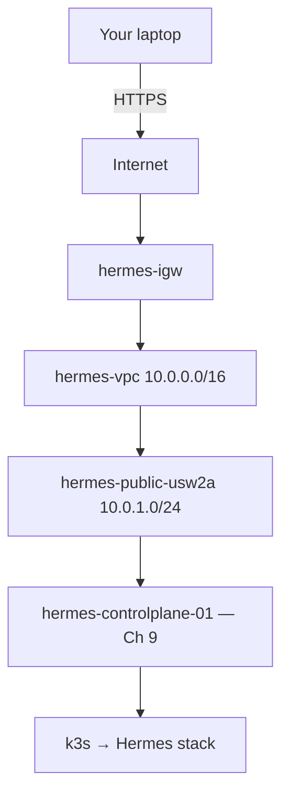

# Chapter 8: Creating the Network for Hermes

> How do requests get from my laptop to Hermes securely?

---

Your AWS account is secured ([Chapter 7](07-provisioning-aws-account.md)). The Hermes platform design is documented ([Chapter 6](../part-i-foundations/06-designing-the-hermes-platform.md)). Now you build the **network**—the isolated environment where your server will live and where traffic from your laptop will arrive.

This chapter follows the **guided build** model used throughout Part II:

| Layer | This chapter |
|-------|----------------|
| **Concept** | Background, Theory — *why* VPCs, subnets, and routing exist |
| **Design** | Architecture — *what* we build for Hermes (single public subnet) |
| **Implementation** | Walkthrough, Lab — *exact* AWS steps, only after layers 1–2 |

You will not be asked to click a console button until you understand what that button accomplishes.

:::note[Why this matters for Hermes]

Every HTTPS request to Hermes crosses the public internet before it reaches Traefik on your server. The VPC, subnet, Internet Gateway, and route table you create here define **that path**—and what is *not* reachable. A well-designed network exposes only the ports Hermes needs (443, SSH from your IP) and keeps PostgreSQL, Redis, and llama.cpp off the public internet. Network mistakes are among the hardest production issues to debug; building the mental model now saves weeks later.

:::

---

## Learning Objectives

After completing this chapter, you will be able to:

- [ ] Explain why AWS uses VPCs to isolate customer networks
- [ ] Describe why subnets partition a VPC and how public vs private subnets differ
- [ ] Explain CIDR notation at an intuitive level and choose a reasonable VPC size
- [ ] Describe route tables as "where should this packet go next?"
- [ ] Explain why an Internet Gateway is required for inbound traffic from your laptop
- [ ] Explain why Security Groups are stateful and why we expose minimum ports only
- [ ] Create and verify a VPC, public subnet, IGW, and route table using the AWS CLI
- [ ] Apply the `hermes-*` resource naming convention

---

## Prerequisites

- [Chapter 7: Provisioning Your AWS Account](07-provisioning-aws-account.md) — `hermes-admin`, MFA, CLI profile `hermes`, home region `us-west-2`
- Lab 6 platform design worksheet completed
- AWS CLI profile working: `aws sts get-caller-identity --profile hermes`

No EC2 instance yet—that is [Chapter 9](09-provisioning-hermes-server.md).

---

## Estimated Time

**90 minutes** — 50 minutes concept and design (reading), 40 minutes implementation and verification.

---

## Background

### Concept — The Problem

Imagine AWS launched every EC2 instance into one giant global network where every customer could see every other customer's servers.

Obviously impossible. Your Hermes API keys, PostgreSQL data, and GGUF models must never be reachable by another AWS customer—or by the entire internet except where you explicitly allow access.

AWS solves isolation by giving every account its own virtual network: a **Virtual Private Cloud (VPC)**. Your VPC is a logically separate network. You choose IP ranges, subnets, and routing rules. Resources in your VPC use **private IP addresses** that mean nothing outside your network until you connect them to the internet through controlled gateways.

When your laptop sends HTTPS to Hermes, the path looks like this at a high level:

```text
Your laptop
    │
    │  HTTPS (public internet)
    ▼
Elastic IP (Chapter 9)
    │
    │  lands in your VPC
    ▼
EC2 instance → Traefik → Hermes → llama.cpp / PostgreSQL / Redis
```

Chapter 8 builds the **VPC layer** of that path—the container everything else sits inside.

### Why Networking Comes Before the Server

In [Chapter 6](../part-i-foundations/06-designing-the-hermes-platform.md), you mapped platform components to AWS resources. The network is a **dependency**: you cannot launch an EC2 instance without a subnet. You cannot receive traffic from your laptop without a route to an Internet Gateway.

Order matters in a guided build. Account → **network** → server → storage → security hardening.

---

## Theory

### CIDR and Private IP Ranges

When you create a VPC, AWS asks for a **CIDR block**—for example, `10.0.0.0/16`.

**CIDR** (Classless Inter-Domain Routing) describes a range of IP addresses in compact notation:

```text
10.0.0.0/16
│         │
│         └── Prefix length: /16 means the first 16 bits are fixed
└────────────── Network address
```

For `10.0.0.0/16`:

- The network covers `10.0.0.0` through `10.0.255.255`
- That is 65,536 addresses—far more than you need for a single-node Hermes platform
- `/16` is a common default: roomy enough to grow, simple to reason about

**Why private ranges?** RFC 1918 defines addresses that are **not routable on the public internet**—including `10.0.0.0/8`, `172.16.0.0/12`, and `192.168.0.0/16`. Your EC2 instance gets a private IP like `10.0.1.50`. The public internet never sees that address directly; it sees your **Elastic IP** (Chapter 9), which AWS maps to the instance.

You do not need to memorize CIDR math yet. The intuition that matters:

- A VPC is an address space you own inside AWS
- Subnets take slices of that space (e.g., `10.0.1.0/24` = 256 addresses)
- One Hermes server uses one private IP from a subnet

### Subnets — Public vs Private

A **subnet** is a subdivision of your VPC tied to one Availability Zone (AZ). Subnets let you place resources in specific data centers and apply different routing rules.

| | Public subnet | Private subnet |
|---|---------------|----------------|
| **Default route to internet** | Yes (via Internet Gateway) | No direct route; uses NAT Gateway for outbound |
| **Inbound from internet** | Possible (with Elastic IP + security group) | Blocked by default |
| **Complexity** | Lower | Higher (NAT Gateway, extra route tables) |
| **Cost** | Lower | NAT Gateway adds ~$32+/month |
| **Best for** | Learning, single-node platforms | Production databases, multi-tier apps |

**Design decision for Hermes:** This book starts with a **single public subnet**. Your one EC2 instance will live there with an Elastic IP. Hermes, llama.cpp, PostgreSQL, and Redis communicate on the **same host** over localhost and Kubernetes networking—not across public subnet boundaries.

Later, you can evolve to private subnets for databases and NAT for outbound-only access. That is a production hardening step—not a prerequisite for understanding the platform.

:::note[Why this matters for Hermes]

A personal Hermes platform on one node does not need a three-tier VPC on day one. Starting simple keeps cost down and makes every component visible. You still learn VPC concepts that transfer directly when you add a private subnet for RDS or a second node for GPU inference.

:::

### Route Tables — Where Packets Go Next

Do not treat route tables as an obscure AWS feature. A route table answers one question:

> **Where should this packet go next?**

Each subnet associates with a route table. Example routes in a **public** subnet:

| Destination | Target | Meaning |
|-------------|--------|---------|
| `10.0.0.0/16` | `local` | Traffic to other addresses in this VPC stays inside |
| `0.0.0.0/0` | `igw-xxxxxxxx` | Everything else goes to the Internet Gateway |

Without the `0.0.0.0/0 → IGW` route, your subnet is not **public**—packets cannot reach the internet, and the internet cannot reach you (even with an Elastic IP).

That mental model transfers to every cloud and on-premises router you will ever configure.

### Internet Gateway

An **Internet Gateway (IGW)** is a horizontally scaled, redundant AWS component attached to your VPC. It enables:

- Inbound traffic from the internet to resources with public IPs
- Outbound traffic from those resources to the internet

Without an IGW:

```text
Laptop ──► Internet ──X──► VPC (Hermes unreachable)
```

With an IGW and correct routes:

```text
Laptop ──► Internet ──► Internet Gateway ──► VPC ──► EC2 (Hermes)
```

The IGW is not a single physical box you SSH into—it is a VPC attachment you create once and reference in route tables.

### Security Groups — Stateful Firewalls (Concept)

A **Security Group** acts as a virtual firewall on an EC2 instance's elastic network interface. Key properties:

- **Stateful:** If you allow inbound SSH and reply traffic is automatically allowed out, AWS tracks connection state
- **Default deny:** All inbound blocked until you add rules
- **Allow rules only:** You cannot write "deny" rules—only permits

For Hermes, you will eventually allow:

| Port | Source | Purpose |
|------|--------|---------|
| 443 | Your IP or `0.0.0.0/0` (tighten later) | HTTPS to Traefik/Hermes |
| 22 | Your laptop's public IP | SSH administration |

You will **not** expose 5432 (PostgreSQL) or 6379 (Redis) to the internet.

Chapter 9 creates `hermes-controlplane-sg` with SSH from your IP. [Chapter 10: Establishing Trust](10-establishing-trust.md) turns that into a deliberate trust model with host-level controls.

---

## Architecture

### Design — Hermes Network (Iteration 1)

Single public subnet in one AZ. Minimal cost, minimal moving parts, full visibility.

```text
Internet
    │
Internet Gateway (hermes-igw)
    │
VPC 10.0.0.0/16 (hermes-vpc)
    │
Public Subnet 10.0.1.0/24 (hermes-public-usw2a)  ← us-west-2a
    │
    └── EC2 (Chapter 9) — hermes-controlplane-01
            │
            Docker → k3s → Hermes / llama.cpp / PostgreSQL / Redis
```



### Resource Naming (This Chapter)

| Resource | Name | Notes |
|----------|------|-------|
| VPC | `hermes-vpc` | CIDR `10.0.0.0/16` |
| Internet Gateway | `hermes-igw` | Attached to `hermes-vpc` |
| Public subnet | `hermes-public-usw2a` | `10.0.1.0/24` in `us-west-2a` |
| Route table | `hermes-public-rt` | `0.0.0.0/0` → `hermes-igw` |

### What This Design Deliberately Omits (For Now)

- Private subnets and NAT Gateway
- Multiple AZs for high availability
- VPC peering or VPN
- Network ACLs (subnet-level firewall—we rely on Security Groups first)

Each omission is a future evolution path—not a gap in your learning.

---

## Walkthrough

### Implementation — Build the Network

You understand **why** each resource exists. Now create them.

Set your region and profile for every command:

```bash
export AWS_PROFILE=hermes
export AWS_REGION=us-west-2
```

### AWS Console (Optional Reference)

If you prefer the console for visualization, the order is:

1. **VPC** → Create VPC → name `hermes-vpc`, IPv4 CIDR `10.0.0.0/16`, enable DNS hostnames and DNS resolution
2. **Internet Gateway** → Create → name `hermes-igw` → Attach to `hermes-vpc`
3. **Subnet** → Create → name `hermes-public-usw2a`, VPC `hermes-vpc`, AZ `us-west-2a`, CIDR `10.0.1.0/24`, enable auto-assign public IPv4
4. **Route table** → Create → name `hermes-public-rt`, VPC `hermes-vpc` → Add route `0.0.0.0/0` → target `hermes-igw` → Associate with `hermes-public-usw2a`

The CLI walkthrough below is the **canonical** path—copy-paste reproducible and identical to what Terraform will express in Part V.

### CLI — Step 1: Create the VPC

```bash
VPC_ID=$(aws ec2 create-vpc \
  --cidr-block 10.0.0.0/16 \
  --tag-specifications 'ResourceType=vpc,Tags=[{Key=Name,Value=hermes-vpc}]' \
  --query 'Vpc.VpcId' \
  --output text)

echo "VPC_ID=$VPC_ID"
```

Enable DNS support (required for many AWS features and sensible hostname behavior):

```bash
aws ec2 modify-vpc-attribute --vpc-id "$VPC_ID" --enable-dns-hostnames '{"Value":true}'
aws ec2 modify-vpc-attribute --vpc-id "$VPC_ID" --enable-dns-support '{"Value":true}'
```

### CLI — Step 2: Create and Attach the Internet Gateway

```bash
IGW_ID=$(aws ec2 create-internet-gateway \
  --tag-specifications 'ResourceType=internet-gateway,Tags=[{Key=Name,Value=hermes-igw}]' \
  --query 'InternetGateway.InternetGatewayId' \
  --output text)

aws ec2 attach-internet-gateway \
  --internet-gateway-id "$IGW_ID" \
  --vpc-id "$VPC_ID"

echo "IGW_ID=$IGW_ID"
```

### CLI — Step 3: Create the Public Subnet

```bash
SUBNET_ID=$(aws ec2 create-subnet \
  --vpc-id "$VPC_ID" \
  --cidr-block 10.0.1.0/24 \
  --availability-zone us-west-2a \
  --tag-specifications 'ResourceType=subnet,Tags=[{Key=Name,Value=hermes-public-usw2a}]' \
  --query 'Subnet.SubnetId' \
  --output text)

aws ec2 modify-subnet-attribute \
  --subnet-id "$SUBNET_ID" \
  --map-public-ip-on-launch

echo "SUBNET_ID=$SUBNET_ID"
```

### CLI — Step 4: Create the Route Table and Default Route

```bash
RT_ID=$(aws ec2 create-route-table \
  --vpc-id "$VPC_ID" \
  --tag-specifications 'ResourceType=route-table,Tags=[{Key=Name,Value=hermes-public-rt}]' \
  --query 'RouteTable.RouteTableId' \
  --output text)

aws ec2 create-route \
  --route-table-id "$RT_ID" \
  --destination-cidr-block 0.0.0.0/0 \
  --gateway-id "$IGW_ID"

aws ec2 associate-route-table \
  --route-table-id "$RT_ID" \
  --subnet-id "$SUBNET_ID"

echo "RT_ID=$RT_ID"
```

### CLI — Step 5: Save Resource IDs

```bash
mkdir -p ~/hermes-platform/notes
cat > ~/hermes-platform/notes/network-resources.env <<EOF
# Hermes network — created $(date +%Y-%m-%d)
export AWS_REGION=us-west-2
export HERMES_VPC_ID=$VPC_ID
export HERMES_IGW_ID=$IGW_ID
export HERMES_PUBLIC_SUBNET_ID=$SUBNET_ID
export HERMES_PUBLIC_RT_ID=$RT_ID
EOF

echo "Saved to ~/hermes-platform/notes/network-resources.env"
```

Source this file in later chapters: `source ~/hermes-platform/notes/network-resources.env`

---

## Hands-on Lab

### Lab 8: Create the Hermes Network

**Estimated Time:** 40 minutes

**Goal:** Build `hermes-vpc`, `hermes-igw`, `hermes-public-usw2a`, and `hermes-public-rt`—then verify with the CLI that the design matches reality.

**Prerequisites:** Chapter 7 complete; `AWS_PROFILE=hermes`

**Steps:**

1. Export `AWS_PROFILE=hermes` and `AWS_REGION=us-west-2`
2. Run Walkthrough Steps 1–5 (CLI)
3. Run every command in [Verification](#verification) below
4. Compare CLI output to the [Architecture](#architecture) diagram—confirm CIDR, IGW attachment, and `0.0.0.0/0` route
5. Open `~/hermes-platform/notes/network-resources.env` and confirm four resource IDs are saved
6. Update your [Chapter 6 platform design worksheet](../part-i-foundations/06-designing-the-hermes-platform.md#hands-on-lab)—mark VPC row as complete

**Verification:** See [Verification](#verification) section.

**Expected output:** One VPC, one subnet, one IGW attached, one custom route table with internet route associated to the subnet.

**Troubleshooting:** See [Troubleshooting](#troubleshooting) section.

**Cleanup:** Do **not** tear down the network—you need it for Chapter 9. If you must abort, delete in order: disassociate route table, delete subnet, detach and delete IGW, delete VPC.

---

## Verification

Do not stop at "the VPC exists." Compare CLI output to your design.

### Describe the VPC

```bash
aws ec2 describe-vpcs \
  --vpc-ids "$VPC_ID" \
  --query 'Vpcs[0].{Name:Tags[?Key==`Name`].Value|[0],Cidr:CidrBlock,State:State}' \
  --output table
```

Expected: `Name=hermes-vpc`, `Cidr=10.0.0.0/16`, `State=available`.

### Describe the Subnet

```bash
aws ec2 describe-subnets \
  --subnet-ids "$SUBNET_ID" \
  --query 'Subnets[0].{Name:Tags[?Key==`Name`].Value|[0],Cidr:CidrBlock,AZ:AvailabilityZone,PublicIP:MapPublicIpOnLaunch}' \
  --output table
```

Expected: `Name=hermes-public-usw2a`, `Cidr=10.0.1.0/24`, `PublicIP=True`.

### Describe the Internet Gateway

```bash
aws ec2 describe-internet-gateways \
  --internet-gateway-ids "$IGW_ID" \
  --query 'InternetGateways[0].{Name:Tags[?Key==`Name`].Value|[0],Attached:VpcAttachments[0].VpcId,State:VpcAttachments[0].State}' \
  --output table
```

Expected: Attached to your `VPC_ID`, `State=available`.

### Describe the Route Table

```bash
aws ec2 describe-route-tables \
  --route-table-ids "$RT_ID" \
  --query 'RouteTables[0].{Name:Tags[?Key==`Name`].Value|[0],Routes:Routes,Associations:Associations}' \
  --output json
```

Confirm in the JSON:

- A route `"DestinationCidrBlock": "0.0.0.0/0"` with `"GatewayId": "igw-..."`
- A route `"DestinationCidrBlock": "10.0.0.0/16"` with `"GatewayId": "local"`
- An association linking the route table to `SUBNET_ID`

### Checklist

- [ ] `hermes-vpc` exists with CIDR `10.0.0.0/16`
- [ ] `hermes-igw` attached to `hermes-vpc`
- [ ] `hermes-public-usw2a` in your chosen AZ with public IP on launch enabled
- [ ] `hermes-public-rt` routes `0.0.0.0/0` to the IGW and is associated with the subnet
- [ ] Resource IDs saved to `~/hermes-platform/notes/network-resources.env`
- [ ] Zero EC2 instances yet (network only)

---

## Troubleshooting

| Problem | Cause | Fix |
|---------|-------|-----|
| `InvalidVpc.Range` | CIDR overlaps existing VPC | Use `10.0.0.0/16` or another RFC 1918 range; delete failed partial resources |
| Subnet AZ error | Wrong AZ for region | Run `aws ec2 describe-availability-zones --query 'AvailabilityZones[*].ZoneName'` and pick one |
| No route to internet | Missing IGW route or association | Verify `create-route` to IGW and `associate-route-table` |
| `DependencyViolation` deleting VPC | Subnet or IGW still attached | Delete subnet, detach/delete IGW, then VPC |
| Wrong account | Missing profile | Prefix commands with `--profile hermes`; verify account ID matches Chapter 7 notes |

---

## Review Questions

1. Why does AWS give each account a VPC instead of one shared global network?
2. What is the difference between a public and private subnet?
3. Why does this book start with a single public subnet for Hermes?
4. What question does a route table answer?
5. What does the `0.0.0.0/0` route do in `hermes-public-rt`?
6. Why is an Internet Gateway required for your laptop to reach Hermes?
7. What does it mean that Security Groups are stateful?
8. Why will PostgreSQL and Redis not be exposed to the internet in this design?
9. What resource names did you create, and why use the `hermes-` prefix?

---

## Key Takeaways

- **Concept:** VPCs isolate your Hermes platform from every other AWS customer
- **Design:** Single public subnet + IGW is the simplest path for a one-node learning platform
- **Implementation:** VPC → IGW → subnet → route table—in that dependency order
- **CIDR intuition:** `10.0.0.0/16` is a roomy private address space; subnets take smaller slices
- **Route tables:** "Where does this packet go next?"—the `0.0.0.0/0 → IGW` route makes a subnet public
- **Naming:** `hermes-vpc`, `hermes-public-usw2a`, etc.—name for the platform you are building, not a disposable lab
- **Verify with CLI:** `describe-vpcs`, `describe-subnets`, `describe-route-tables`—compare output to your design

---

## Glossary Additions

| Term | Definition |
|------|------------|
| **VPC** | Virtual Private Cloud—isolated network in your AWS account. |
| **CIDR** | Notation for an IP address range (e.g., `10.0.0.0/16`). |
| **Subnet** | A segment of a VPC in one Availability Zone. |
| **Availability Zone (AZ)** | Isolated data center within a region (e.g., `us-west-2a`). |
| **Internet Gateway (IGW)** | VPC attachment enabling bidirectional internet routing. |
| **Route table** | Rules that determine where network traffic is directed next. |
| **Security Group** | Stateful virtual firewall attached to an instance's network interface. |
| **RFC 1918** | Private IP ranges not routable on the public internet. |

---

## Further Reading

- [AWS VPC documentation](https://docs.aws.amazon.com/vpc/latest/userguide/what-is-amazon-vpc.html)
- [VPC with a single public subnet](https://docs.aws.amazon.com/vpc/latest/userguide/example-single-public-subnet-vpc.html) — AWS reference architecture closest to this chapter
- [Security groups](https://docs.aws.amazon.com/vpc/latest/userguide/security-groups.html)
- [Chapter 4: Networking Fundamentals](../part-i-foundations/04-networking.md) — TCP/IP and DNS concepts (optional deeper read)

---

## Hermes Platform Status

```text
───────────────────────────────────────────────
        HERMES PLATFORM STATUS

AWS Account            ✓
Billing Alerts         ✓
MFA                    ✓
IAM Administrator      ✓
VPC                    ✓

EC2                    ✗
Docker                 ✗
k3s                    ✗
Hermes                 ✗
llama.cpp              ✗
PostgreSQL             ✗
Redis                  ✗

Overall Progress

███░░░░░░░░░░░░░░░░ 18%
───────────────────────────────────────────────
```

The network exists. Nothing is inside it yet.

---

## What's Next

Our network now exists, but there is nothing inside it.

[Chapter 9: Provisioning the Hermes Server](09-provisioning-hermes-server.md) launches the Ubuntu EC2 instance—`hermes-controlplane-01`—into `hermes-public-usw2a`, the home of k3s, Hermes, and llama.cpp.

---

[← Chapter 7: Provisioning Your AWS Account](07-provisioning-aws-account.md) | [Next: Chapter 9 — Provisioning the Hermes Server →](09-provisioning-hermes-server.md)
