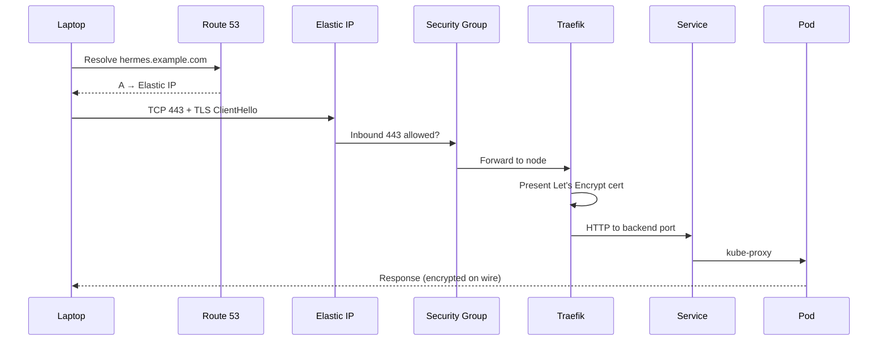

# Chapter 14: Routing Traffic to Hermes

> How does HTTPS traffic from your laptop find the platform?

---

In [Chapter 13](13-the-first-control-plane.md) you lit the control plane. Clients still reach the node by **Elastic IP** and, in [Chapter 24](../part-iv-kubernetes/24-ingress.md), by a fake hostname in `/etc/hosts` over **HTTP**. That is fine for learning Ingress. It is not how you want Hermes authentication tokens or conversation payloads to travel in the open.

This chapter adds the **public name and the padlock**: Route 53 maps a hostname to your Elastic IP; Traefik terminates **TLS** with a Let's Encrypt certificate. You are not inventing a new mental model—only completing the front door [Chapter 6](../part-i-foundations/06-designing-the-hermes-platform.md) drew on paper:

```text
laptop → DNS → Elastic IP:443 → Traefik (TLS) → Service → Hermes
```

:::note[Why this matters for Hermes]

Hermes will exchange API tokens and conversation content with clients. Serving that over plain HTTP or raw IPs trains bad habits and exposes traffic on shared networks. A stable hostname (`hermes.yourdomain.com`) plus TLS means bookmarks, health checks, and agent clients all share one trusted entry point—without memorizing the Elastic IP.

:::

**Execution only** — optional AWS polish after [Chapter 13](13-the-first-control-plane.md). Complete after [Chapter 24](../part-iv-kubernetes/24-ingress.md) (Ingress concepts) or whenever you are ready to expose HTTPS. No ontology shift.

---

## Learning Objectives

After completing this chapter, you will be able to:

- [ ] Explain the HTTPS request path from hostname to Traefik on `hermes-controlplane-01`
- [ ] Create a **Route 53** hosted zone and an **A record** pointing at your Elastic IP
- [ ] Open **port 443** deliberately (Security Group + UFW) without opening the world
- [ ] Install **cert-manager** and obtain a Let's Encrypt certificate for your hostname
- [ ] Apply a TLS-enabled Ingress and verify with `curl https://…`
- [ ] Explain why this lab uses **Let's Encrypt on Traefik**, not ACM on an Application Load Balancer
- [ ] Document the decision in an Engineering Decision Record before leaving 443 open

---

## Prerequisites

- [Chapter 13: The First Control Plane](13-the-first-control-plane.md) — k3s running; Traefik present
- [Chapter 10: Establishing Trust](10-establishing-trust.md) — Security Group and UFW model; 443 deferred until now
- [Chapter 24: Ingress](../part-iv-kubernetes/24-ingress.md) — strongly recommended so host-based routing is familiar
- A **domain you control** (registrar NS can point at Route 53), or willingness to buy one (~$12/year for many TLDs)
- `~/hermes-platform/notes/controlplane.env` sourced; `kubectl` working against the cluster

```bash
export AWS_PROFILE=hermes
export AWS_REGION=us-west-2
export KUBECONFIG=~/.kube/hermes-k3s.yaml
source ~/hermes-platform/notes/controlplane.env

echo "EIP=$HERMES_PUBLIC_IP SG=$HERMES_SG_ID"
kubectl get pods -n kube-system -l app.kubernetes.io/name=traefik
```

:::tip[No domain yet?]

You can read Concept and Design now, then return for Implementation when you own a domain. Do **not** invent a public DNS record you cannot prove control of—Let's Encrypt validation will fail. `/etc/hosts` + HTTP (Chapter 24) remains valid until then.

:::

---

## Estimated Time

**90 minutes** — 20 minutes concept, 55 minutes DNS + TLS lab, 15 minutes verification and notes. Domain NS propagation can add waiting time (often minutes; occasionally hours).

---

## Background

### Concept — Names and Encryption Are Separate Problems

Two different failures look alike to a user:

| Symptom | Layer | Fix lives in |
|---------|-------|--------------|
| `Could not resolve host` | DNS | Route 53 / registrar |
| `Connection timed out` | Network / firewall | SG, UFW, routing |
| `certificate verify failed` | TLS | cert-manager / Ingress TLS |
| `404` from Traefik | HTTP routing | Ingress host/path rules |

Chapter 4 taught DNS and TLS as vocabulary. Chapter 24 taught Ingress as routing. This chapter **wires them to AWS and to a real certificate** on the path Chapter 6 already chose: Elastic IP on a public subnet, Traefik on the node—not a managed load balancer.

### Design — Stay on the Chapter 6 Path

[Chapter 6](../part-i-foundations/06-designing-the-hermes-platform.md) mapped HTTPS to Route 53 plus ACM **or** Let's Encrypt. For a single-node lab with an Elastic IP:

| Approach | Fits this architecture? | Why |
|----------|-------------------------|-----|
| **Route 53 A → EIP + Let's Encrypt on Traefik** | Yes | Certificate terminates where Traefik already listens (80/443) |
| ACM certificate on **ALB** in front of the node | No (for this book) | Adds ALB cost and a second hop; ACM does not attach certificates directly to EC2 ENIs |
| Self-signed cert forever | Only for private labs | Browsers and clients warn; bad habit for Hermes tokens |

**Decision:** Route 53 for DNS; **cert-manager** + Let's Encrypt (HTTP-01) for certificates; Traefik continues as the Ingress controller. Port 443 opens from **your IP first**—same trust discipline as SSH in Chapter 10.

```text
                    You control
              ┌─────────────────────┐
   Client     │  Route 53 A record  │
   resolves   │  hermes.example.com │
              │         ↓           │
              │   Elastic IP        │
              └─────────┬───────────┘
                        │ :443 (TLS)
                        ▼
              Traefik (k3s) — terminates TLS
                        │
                        ▼
              Ingress → Service → Pods
```

---

## Theory

### DNS: Stable Name, Moving Optional

Your Elastic IP already gives a **stable address**. DNS adds a **stable name**. If you ever reassociate the EIP or rebuild the instance and attach the same EIP, the A record stays correct. Clients never learn the IP.

Hosted zone costs are small (~$0.50/month per zone) plus query charges that are negligible at lab traffic. Register the domain at any registrar; point its nameservers at the Route 53 zone NS records AWS assigns.

### TLS: Who Issues the Certificate?

**TLS** encrypts the HTTP conversation. The **certificate** proves the server is allowed to use that hostname.

**Let's Encrypt** issues free, short-lived certificates if you prove you control the name. **HTTP-01** proof: Let's Encrypt fetches `http://hermes.example.com/.well-known/acme-challenge/…` — so port **80** must remain reachable from the public internet during issuance and renewal (or from Let's Encrypt's validators). That is why Chapter 24 left 80 open from your IP for labs; for automated renewal from Let's Encrypt, the challenge path must be reachable from **their** validators, not only from your laptop.

:::warning[Security Group for ACME]

If 80/443 are locked to `${MY_IP}/32` only, Let's Encrypt validation **fails**. For HTTP-01 on a learning lab you have two honest choices: (1) temporarily allow `0.0.0.0/0` on 80 (and optionally 443) while issuing, then tighten again; or (2) allow 80/443 from `0.0.0.0/0` but keep **application auth** and never expose Postgres/Redis/llama ports. This book uses option (2) for the HTTPS lab hostname only—document it in the EDR.

:::

### Why Not ACM Here?

**AWS Certificate Manager (ACM)** shines when a managed AWS front door (ALB, CloudFront, API Gateway) terminates TLS. Your design terminates on **Traefik on the EC2 node**. Exporting ACM certificates to that path is not the lab default. Revisit ACM if Part VII / production hardening introduces an ALB ([Chapter 44](../part-vii-hermes/44-from-development-to-production.md)).

### Trust Boundaries (Updates Chapter 10)

Chapter 10 left 443 closed on purpose. Opening it is a **trust change**:

1. Security Group — authorize 443 (and 80 for ACME + HTTP redirect)
2. UFW — allow 80/443 if enabled
3. Certificate — prove hostname control
4. Ingress — only hosts you intend
5. Application auth — still required later for Hermes; TLS is transport security, not identity of the client

---

## Architecture

### Request Lifecycle (HTTPS)



### State Layers (Where This Chapter Lives)

```text
Human Intent          ← hostname + HTTPS in browser / curl
Kubernetes API        ← Ingress + Certificate / CertificateRequest
Scheduler / Controllers ← cert-manager, Traefik
Containers            ← challenge solver Pods (briefly), app Pods
Linux Kernel          ← binds 80/443 via ServiceLB
AWS edge              ← Route 53 + Security Group + EIP  ← this chapter's AWS surface
```

You are not adding a new control-plane concept—only AWS DNS and transport security on the existing Traefik entry points.

### Resources You Will Create

| Resource | Name / pattern | Purpose |
|----------|----------------|---------|
| Route 53 hosted zone | `example.com` (yours) | Authoritative DNS |
| A record | `hermes.example.com` → `$HERMES_PUBLIC_IP` | Name → EIP |
| SG rules | TCP 80, 443 | Reach Traefik / ACME |
| cert-manager | namespace `cert-manager` | Automate certificates |
| ClusterIssuer | `letsencrypt-prod` | Let's Encrypt production |
| Ingress + TLS | host `hermes.example.com` | Public HTTPS entry |
| Notes file | `~/hermes-platform/notes/routing.env` | Record hostname and zone |

---

## Walkthrough

Replace `example.com` and `hermes.example.com` with **your** domain everywhere.

### Step 1 — Create the Route 53 Hosted Zone

```bash
export HERMES_DOMAIN=example.com
export HERMES_HOSTNAME=hermes.${HERMES_DOMAIN}

aws route53 create-hosted-zone \
  --name "$HERMES_DOMAIN" \
  --caller-reference "hermes-$(date +%s)" \
  --hosted-zone-config Comment="Hermes platform DNS",PrivateZone=false
```

List nameservers (also in the registrar console):

```bash
ZONE_ID=$(aws route53 list-hosted-zones-by-name \
  --dns-name "$HERMES_DOMAIN" \
  --query "HostedZones[0].Id" --output text | sed 's|/hostedzone/||')

aws route53 get-hosted-zone --id "$ZONE_ID" \
  --query "DelegationSet.NameServers" --output table
```

At your **domain registrar**, set the domain’s nameservers to these four `NS` values. Wait until resolution works:

```bash
dig NS "$HERMES_DOMAIN" +short
# Should eventually show the Route 53 nameservers
```

### Step 2 — Point the Hostname at Your Elastic IP

```bash
source ~/hermes-platform/notes/controlplane.env

cat > /tmp/hermes-a-record.json <<EOF
{
  "Comment": "Hermes control plane public hostname",
  "Changes": [{
    "Action": "UPSERT",
    "ResourceRecordSet": {
      "Name": "${HERMES_HOSTNAME}",
      "Type": "A",
      "TTL": 60,
      "ResourceRecords": [{"Value": "${HERMES_PUBLIC_IP}"}]
    }
  }]
}
EOF

aws route53 change-resource-record-sets \
  --hosted-zone-id "$ZONE_ID" \
  --change-batch file:///tmp/hermes-a-record.json

dig +short "$HERMES_HOSTNAME"
# Expect: your Elastic IP
```

### Step 3 — Open HTTP/HTTPS on the Trust Boundary

```bash
MY_IP=$(curl -s https://checkip.amazonaws.com)

# For Let's Encrypt HTTP-01, validators are not your laptop.
# Document this choice in EDR-0009.
aws ec2 authorize-security-group-ingress \
  --group-id "$HERMES_SG_ID" \
  --ip-permissions \
    IpProtocol=tcp,FromPort=80,ToPort=80,IpRanges='[{CidrIp=0.0.0.0/0,Description="HTTP ACME and redirect"}]' \
    IpProtocol=tcp,FromPort=443,ToPort=443,IpRanges='[{CidrIp=0.0.0.0/0,Description="HTTPS Traefik"}]' \
  2>/dev/null || echo "Rules may already exist"
```

On the server (UFW from Chapter 10):

```bash
ssh -i ~/.ssh/${HERMES_KEY_NAME}.pem ubuntu@${HERMES_PUBLIC_IP} \
  'sudo ufw allow 80/tcp && sudo ufw allow 443/tcp && sudo ufw status'
```

Keep **22** restricted to your IP. Do **not** open database or llama ports.

### Step 4 — Install cert-manager

```bash
kubectl apply -f https://github.com/cert-manager/cert-manager/releases/download/v1.17.2/cert-manager.yaml

kubectl -n cert-manager rollout status deploy/cert-manager --timeout=120s
kubectl -n cert-manager rollout status deploy/cert-manager-webhook --timeout=120s
kubectl -n cert-manager get pods
```

### Step 5 — ClusterIssuer (Let's Encrypt Production)

```bash
export LETSENCRYPT_EMAIL=you@example.com   # real email for expiry notices

kubectl apply -f - <<EOF
apiVersion: cert-manager.io/v1
kind: ClusterIssuer
metadata:
  name: letsencrypt-prod
spec:
  acme:
    email: ${LETSENCRYPT_EMAIL}
    server: https://acme-v02.api.letsencrypt.org/directory
    privateKeySecretRef:
      name: letsencrypt-prod-account-key
    solvers:
      - http01:
          ingress:
            class: traefik
EOF
```

Use the staging server (`acme-staging-v02…`) if you are debugging rate limits; browsers will not trust staging certs.

### Step 6 — TLS Ingress for the Demo Workload

If you still have `nginx-service` from Chapter 24, expose it on your real hostname. Otherwise create a minimal echo Service first, then apply:

```bash
kubectl apply -f - <<EOF
apiVersion: networking.k8s.io/v1
kind: Ingress
metadata:
  name: hermes-https-demo
  annotations:
    cert-manager.io/cluster-issuer: letsencrypt-prod
spec:
  ingressClassName: traefik
  tls:
    - hosts:
        - ${HERMES_HOSTNAME}
      secretName: hermes-https-tls
  rules:
    - host: ${HERMES_HOSTNAME}
      http:
        paths:
          - path: /
            pathType: Prefix
            backend:
              service:
                name: nginx-service
                port:
                  number: 80
EOF
```

Watch the certificate:

```bash
kubectl get certificate,certificaterequest,order,challenge -A
kubectl describe certificate hermes-https-tls
# Ready=True when issued
```

### Step 7 — Verify HTTPS from Your Laptop

```bash
curl -vI "https://${HERMES_HOSTNAME}/"
# Expect HTTP/2 or HTTP/1.1 200, certificate subject includes your hostname
```

Optional: confirm the certificate chain presents Let's Encrypt (not self-signed).

### Step 8 — Record Routing Notes

```bash
mkdir -p ~/hermes-platform/notes
cat > ~/hermes-platform/notes/routing.env <<EOF
export HERMES_DOMAIN=${HERMES_DOMAIN}
export HERMES_HOSTNAME=${HERMES_HOSTNAME}
export HERMES_HOSTED_ZONE_ID=${ZONE_ID}
export HERMES_TLS_SECRET=hermes-https-tls
export HERMES_CLUSTER_ISSUER=letsencrypt-prod
EOF
```

Or run the chapter helper (DNS UPSERT + notes; kubectl steps remain manual):

```bash
export HERMES_DOMAIN=example.com
export HERMES_HOSTNAME=hermes.example.com
bash infrastructure/aws/cli/ch14-routing-baseline.sh
```

---

## Hands-on Lab

### Lab 14: Public Hostname and TLS

**Estimated Time:** 70 minutes (plus NS propagation)

**Goal:** `https://hermes.<your-domain>/` returns a successful response with a trusted certificate; zone and hostname recorded in `routing.env`.

**Steps:**

1. Create Route 53 hosted zone; update registrar nameservers; wait for `dig NS`
2. UPSERT A record for `hermes.<domain>` → `$HERMES_PUBLIC_IP`
3. Authorize SG 80/443; allow UFW 80/443
4. Install cert-manager; apply `letsencrypt-prod` ClusterIssuer
5. Apply TLS Ingress for `nginx-service` (or Hermes later) with cert-manager annotation
6. Wait until `Certificate` is Ready; `curl -vI https://hermes.<domain>/`
7. Read [EDR-0009](https://github.com/crudnicky/agent-to-aws-guide/blob/main/infrastructure/edr/EDR-0009-public-https-entrypoint.md)

**Verification:**

- `dig +short hermes.<domain>` equals `$HERMES_PUBLIC_IP`
- `curl -fsS https://hermes.<domain>/` succeeds without `-k`
- `kubectl get certificate hermes-https-tls` shows `READY True`

**Cleanup:** Leave DNS and cert-manager running if you will serve Hermes on this hostname. Delete only the demo Ingress when you replace it with the Hermes Ingress in Part VI/VII—keep the ClusterIssuer.

---

## Verification

- [ ] Hosted zone exists; registrar NS matches Route 53
- [ ] A record resolves to the Elastic IP
- [ ] SG allows 80 and 443; UFW allows 80/443 if enabled
- [ ] cert-manager pods Running in `cert-manager`
- [ ] `ClusterIssuer/letsencrypt-prod` Ready
- [ ] Certificate secret `hermes-https-tls` exists; Ingress shows TLS hosts
- [ ] `curl https://$HERMES_HOSTNAME/` works without insecure flags
- [ ] `routing.env` documents domain, hostname, and zone ID
- [ ] EDR-0009 read and accepted for opening 443

---

## Troubleshooting

| Problem | Cause | Fix |
|---------|-------|-----|
| `dig` empty / wrong NS | Registrar not delegated | Fix nameservers; wait TTL |
| ACME `Challenge` fails | Port 80 blocked to internet | Open SG/UFW 80 from `0.0.0.0/0`; ensure Traefik listens |
| Certificate stuck Issued≠True | Rate limit or wrong Ingress class | Check `kubectl describe challenge`; use staging issuer while debugging |
| `curl: (60) SSL certificate problem` | Staging issuer or wrong host | Use prod issuer; curl the exact Ingress host |
| Timeout on 443 | SG/UFW | Authorize 443; verify `HERMES_SG_ID` |
| Traefik 404 | Host header mismatch | Ingress `host:` must equal `$HERMES_HOSTNAME` |
| Works by IP, fails by name | A record wrong | Re-UPSERT A to `$HERMES_PUBLIC_IP` |

---

## Review Questions

1. What two problems does this chapter solve separately (name vs encryption)?
2. Why does HTTP-01 require port 80 to be reachable beyond your laptop?
3. Why does this lab prefer Let's Encrypt on Traefik over ACM on an ALB?
4. How does opening 443 change the trust model from Chapter 10?
5. Where does Route 53 sit relative to State Layers—cluster API or AWS edge?
6. What should happen to the demo Ingress when Hermes gets its own hostname rules?
7. Does TLS replace application authentication for Hermes? Why or why not?

---

## Key Takeaways

- **DNS + TLS complete the Chapter 6 front door** — name to EIP, padlock on Traefik
- **Execution only** — no new platform ontology after Chapter 13
- **Let's Encrypt fits single-node EIP design** — ACM waits for an ALB/CloudFront frontier
- **Opening 443 is an EDR-worthy trust change** — document source ranges and ACME needs
- **Ingress hosts must match certificates** — same hostname in DNS, TLS secret, and rules
- **Optional polish** — `/etc/hosts` + HTTP remains valid until you need real HTTPS

---

## Glossary Additions

| Term | Definition |
|------|------------|
| **Route 53** | AWS DNS service—hosted zones and records that map names to addresses. |
| **Hosted zone** | DNS container for a domain’s records in Route 53. |
| **A record** | DNS record mapping a hostname to an IPv4 address (here: Elastic IP). |
| **TLS** | Transport Layer Security—encrypts HTTP as HTTPS. |
| **Let's Encrypt** | Free public Certificate Authority with automated short-lived certificates. |
| **HTTP-01 challenge** | ACME proof of domain control via an HTTP file on port 80. |
| **cert-manager** | Kubernetes controller that requests and renews certificates from issuers like Let's Encrypt. |
| **ClusterIssuer** | cluster-scoped cert-manager resource defining how to obtain certificates. |
| **ACM** | AWS Certificate Manager—managed certificates for AWS terminators (ALB, CloudFront, etc.). |

---

## Further Reading

- [Route 53 Developer Guide](https://docs.aws.amazon.com/Route53/latest/DeveloperGuide/Welcome.html)
- [cert-manager documentation](https://cert-manager.io/docs/)
- [Let's Encrypt — How It Works](https://letsencrypt.org/how-it-works/)
- [Chapter 4: Networking Fundamentals](../part-i-foundations/04-networking.md) — DNS and TLS vocabulary
- [Chapter 24: Ingress](../part-iv-kubernetes/24-ingress.md) — Traefik routing before TLS

---

## Engineering Decision Record

**[EDR-0009: Public HTTPS entry via Route 53 and Let's Encrypt](https://github.com/crudnicky/agent-to-aws-guide/blob/main/infrastructure/edr/EDR-0009-public-https-entrypoint.md)**

---

## Hermes Platform Status

```text
───────────────────────────────────────────────
        HERMES PLATFORM STATUS

AWS Account            ✓
Network                ✓
EC2                    ✓
Trust                  ✓
Persistent Storage     ✓
Docker Engine          ✓
Kubernetes (k3s)       ✓

Public DNS             ✓
HTTPS (TLS)            ✓

Hermes                 ✗
llama.cpp              ✗

Overall Progress

█████████████░░░░░░░░░ 66%
───────────────────────────────────────────────
```

Clients can find the platform by name over HTTPS. Optional polish continues in [Chapter 15](15-observing-hermes-platform.md) and [Chapter 16](16-managing-platform-costs.md); core learning continues in [Part IV](../part-iv-kubernetes/21-pods.md) if you have not finished Ingress yet.

---

## What's Next

- **Optional:** [Chapter 15 — Observing the Hermes Platform](15-observing-hermes-platform.md) — CloudWatch host metrics before you trust 24/7 uptime.
- **Optional:** [Chapter 16 — Managing Platform Costs](16-managing-platform-costs.md) — budgets once DNS and logs add a few dollars.
- **Core path:** [Chapter 21: Pods](../part-iv-kubernetes/21-pods.md) or [Chapter 24: Ingress](../part-iv-kubernetes/24-ingress.md) if you jumped here early—finish cluster HTTP before depending on public HTTPS.
- **Later:** Point the same hostname (or `api.` / `hermes.` variants) at the Hermes Service when Part VI/VII deploy the agent.

---

[← Chapter 13: The First Control Plane](13-the-first-control-plane.md) | [Next: Chapter 15 — Observing the Hermes Platform →](15-observing-hermes-platform.md)
