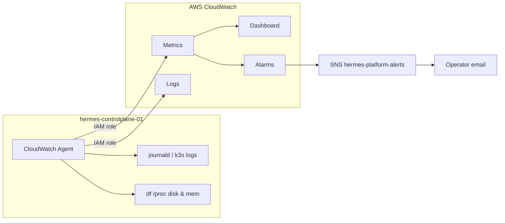

# Chapter 15: Observing the Hermes Platform

> How do I see what my platform is doing right now?

---

`kubectl get pods` tells you whether workloads are **Running**. It does not tell you whether the node is out of disk, whether inference is swapping, or whether the host ran out of memory three hours ago while you were asleep.

This chapter adds **AWS-level visibility** into `hermes-controlplane-01`—the machine underneath Kubernetes. You will use CloudWatch for host metrics, disk usage on `/models` and `/data`, and centralized logs. This is optional polish you can complete anytime after [Chapter 13](13-the-first-control-plane.md); it does not introduce a new mental model. It answers one operational question:

> **What is the EC2 instance doing, and will it fail silently?**

:::note[Why this matters for Hermes]

Hermes depends on large model files on `/models` and database state on `/data`. A full disk there does not always crash Pods immediately—it corrupts writes, stalls inference, or prevents PostgreSQL from checkpointing. CloudWatch alarms on **disk free space** and **CPU** give you early warning before agent conversations fail. In-cluster Prometheus and Loki ([Chapters 32](../part-v-infrastructure/33-monitoring.md) and [33](../part-v-infrastructure/34-logging.md)) cover workload behavior; this chapter covers the **host and account layer** they run on.

:::

**Execution only** — no ontology shift. Return here when you want account-level dashboards and paging, or before you expose HTTPS and need confidence the node is healthy.

---

## Learning Objectives

After completing this chapter, you will be able to:

- [ ] Distinguish **infrastructure observability** (CloudWatch on EC2) from **in-cluster observability** (Prometheus, Loki)
- [ ] Explain which EC2 metrics AWS provides automatically and which require the CloudWatch Agent
- [ ] Attach an **IAM instance profile** so the agent publishes metrics without access keys on disk
- [ ] Configure disk metrics for `/`, `/models`, and `/data`
- [ ] Ship `journald` logs to a CloudWatch Logs group
- [ ] Build a CloudWatch dashboard for `hermes-controlplane-01`
- [ ] Create alarms for high CPU, low disk space, and instance status check failure

---

## Prerequisites

- [Chapter 13: The First Control Plane](13-the-first-control-plane.md) — k3s running on `hermes-controlplane-01`
- [Chapter 7: Provisioning Your AWS Account](07-provisioning-aws-account.md) — billing alarm and SNS topic (reuse or create `hermes-platform-alerts`)
- `~/hermes-platform/notes/controlplane.env` sourced

```bash
export AWS_PROFILE=hermes
export AWS_REGION=us-west-2
source ~/hermes-platform/notes/controlplane.env
KEY=~/.ssh/${HERMES_KEY_NAME}.pem
```

---

## Estimated Time

**75 minutes** — 25 minutes concept and design, 50 minutes implementation.

---

## Background

### Concept — The Blind Spot

After Chapter 13, you can SSH in and run:

```bash
kubectl get nodes
df -h /models /data
top
```

That works when **you** are watching. Production—and serious personal platforms—need **continuous** signals:

| Question | SSH answer | CloudWatch answer |
|----------|------------|-------------------|
| Is CPU pegged? | Run `top` now | Graph + alarm anytime |
| Is `/data` 95% full? | Run `df` now | Metric every 60s + alarm |
| Did the instance reboot overnight? | Check `uptime` | Status check alarm |
| What did `k3s` log at 03:14? | `journalctl` scrollback | Searchable log group |

CloudWatch is AWS's built-in **metrics, logs, and alarms** service. You already created a **billing alarm** in Chapter 7. This chapter extends the same pattern to the Hermes server.

### Two Observability Layers

```text
┌─────────────────────────────────────────────────────────┐
│  Chapter 15 (this chapter) — AWS / host layer           │
│  EC2 metrics, EBS, status checks, journald → CloudWatch │
└───────────────────────────┬─────────────────────────────┘
                            │ runs on
┌───────────────────────────▼─────────────────────────────┐
│  Chapters 33–34 — Kubernetes / workload layer             │
│  Prometheus, Grafana, Loki, Pod logs, HPA metrics         │
└─────────────────────────────────────────────────────────┘
```

Both layers matter. Host disk full kills every Pod regardless of Grafana dashboards. Workload latency requires in-cluster metrics Hermes exposes later. Do not skip this chapter because Part V covers monitoring—you will want **both**.

---

## Theory

### Metrics — What AWS Gives You Free

Every EC2 instance publishes **basic monitoring** metrics to CloudWatch at five-minute intervals:

- `CPUUtilization`
- `NetworkIn` / `NetworkOut`
- `DiskReadBytes` / `DiskWriteBytes` (aggregate—not per-mount)
- Status checks (`StatusCheckFailed`, `StatusCheckFailed_Instance`, `StatusCheckFailed_System`)

These require **no agent**. They are enough for coarse CPU alarms and "is the instance alive?" paging.

They are **not** enough for:

- **Free disk space per filesystem** (`/models`, `/data`)
- **Memory utilization** (RAM pressure before OOM)
- **Per-process or container metrics**

For those, install the **CloudWatch Agent** on the instance. The agent reads `/proc`, `df`, and log files, then publishes custom metrics and log events using an **IAM role** attached to the instance—never long-lived access keys in `/opt`.

### Logs — Centralized vs SSH

Linux services—including `k3s`, `docker`, and `sshd`—write to **journald**. Without shipping, logs exist only on the instance. Terminate the instance without snapshots and the logs are gone.

CloudWatch **Logs** stores log streams in **log groups**. You query with **Logs Insights** from the console or CLI. For Hermes, start with:

- `journald` (system and k3s service logs)
- Optional: `/var/log/hermes-bootstrap.log` from cloud-init

Full structured application logging for Hermes Pods belongs in [Chapter 34](../part-v-infrastructure/34-logging.md). This chapter establishes the **host baseline**.

### Alarms — From Graph to Action

An alarm watches a metric, compares it to a threshold over N periods, and triggers an **SNS notification**—the same mechanism as your billing alarm.

| Alarm | Metric | Typical threshold |
|-------|--------|-------------------|
| `hermes-cpu-high` | `CPUUtilization` | > 80% for 15 minutes |
| `hermes-data-disk-low` | `disk_used_percent` mount `/data` | > 85% |
| `hermes-models-disk-low` | `disk_used_percent` mount `/models` | > 90% |
| `hermes-status-failed` | `StatusCheckFailed` | ≥ 1 for 2 periods |

Tune thresholds for your instance size and model library. The goal is **signal without noise**—not paging on every brief CPU spike during `kubectl apply`.

### IAM Instance Profile — Credentials Without Keys

The CloudWatch Agent must call AWS APIs to publish metrics and logs. The correct pattern:

```text
EC2 instance → instance profile → IAM role → CloudWatch + Logs APIs
```

**Never** embed `AWS_ACCESS_KEY_ID` in agent config on the server. If the instance is compromised, static keys exfiltrate your account. Instance profiles rotate automatically and scope permissions to what that role allows.

---

## Architecture

### Observability Flow



### Resource Naming

| Resource | Name | Purpose |
|----------|------|---------|
| IAM role | `hermes-controlplane-cloudwatch-role` | Agent publish permissions |
| Instance profile | `hermes-controlplane-cloudwatch-profile` | Attaches role to EC2 |
| Log group | `/hermes/controlplane` | Host and journald logs |
| Dashboard | `hermes-controlplane` | CPU, disk, network at a glance |
| SNS topic | `hermes-platform-alerts` | Alarm notifications (may reuse billing topic) |

### What This Chapter Does Not Cover

| Topic | Where |
|-------|-------|
| Pod CPU/memory dashboards | [Chapter 33](../part-v-infrastructure/33-monitoring.md) |
| Hermes API latency and traces | [Chapters 33–34](../part-v-infrastructure/34-logging.md) |
| Cost optimization dashboards | [Chapter 16](16-managing-platform-costs.md) |
| Public HTTPS health checks | [Chapter 14](14-routing-traffic-to-hermes.md) |

---

## Walkthrough

Follow **Concept → Design → Implementation**. Steps assume `us-west-2` and `HERMES_INSTANCE_ID` in `controlplane.env`.

### Step 1 — Create IAM Role and Instance Profile

From your laptop:

```bash
ROLE_NAME=hermes-controlplane-cloudwatch-role
PROFILE_NAME=hermes-controlplane-cloudwatch-profile

aws iam create-role --role-name "$ROLE_NAME" \
  --assume-role-policy-document '{
    "Version": "2012-10-17",
    "Statement": [{
      "Effect": "Allow",
      "Principal": {"Service": "ec2.amazonaws.com"},
      "Action": "sts:AssumeRole"
    }]
  }' 2>/dev/null || true

aws iam attach-role-policy --role-name "$ROLE_NAME" \
  --policy-arn arn:aws:iam::aws:policy/CloudWatchAgentServerPolicy

aws iam create-instance-profile --instance-profile-name "$PROFILE_NAME" 2>/dev/null || true
aws iam add-role-to-instance-profile \
  --instance-profile-name "$PROFILE_NAME" \
  --role-name "$ROLE_NAME" 2>/dev/null || true

aws ec2 associate-iam-instance-profile \
  --instance-id "$HERMES_INSTANCE_ID" \
  --iam-instance-profile Name="$PROFILE_NAME"
```

Wait ~30 seconds, then on the server verify:

```bash
ssh -i "$KEY" ubuntu@"$HERMES_PUBLIC_IP" \
  'curl -s http://169.254.169.254/latest/meta-data/iam/security-credentials/'
```

You should see the role name—not empty.

### Step 2 — Install CloudWatch Agent on the Server

SSH to `hermes-controlplane-01`:

```bash
ssh -i "$KEY" ubuntu@"$HERMES_PUBLIC_IP"
```

Install the agent (Ubuntu):

```bash
wget -q https://s3.amazonaws.com/amazoncloudwatch-agent/ubuntu/amd64/latest/amazon-cloudwatch-agent.deb
sudo dpkg -i amazon-cloudwatch-agent.deb
```

Create `/opt/aws/amazon-cloudwatch-agent/etc/amazon-cloudwatch-agent.json`:

```json
{
  "agent": {
    "metrics_collection_interval": 60,
    "run_as_user": "cwagent"
  },
  "metrics": {
    "namespace": "Hermes/ControlPlane",
    "append_dimensions": {
      "InstanceId": "${aws:InstanceId}"
    },
    "metrics_collected": {
      "disk": {
        "measurement": ["used_percent", "free"],
        "metrics_collection_interval": 60,
        "resources": ["/", "/models", "/data"]
      },
      "mem": {
        "measurement": ["mem_used_percent"]
      }
    }
  },
  "logs": {
    "logs_collected": {
      "files": {
        "collect_list": [
          {
            "file_path": "/var/log/hermes-bootstrap.log",
            "log_group_name": "/hermes/controlplane",
            "log_stream_name": "{instance_id}/bootstrap",
            "retention_in_days": 14
          }
        ]
      }
    }
  }
}
```

Enable journald collection (agent built-in):

```bash
sudo tee /opt/aws/amazon-cloudwatch-agent/etc/amazon-cloudwatch-agent.d/journald.json <<'EOF'
{
  "logs": {
    "logs_collected": {
      "journald": {
        "collect_list": [
          {
            "types": ["system", "service"],
            "log_group_name": "/hermes/controlplane",
            "log_stream_name": "{instance_id}/journald"
          }
        ]
      }
    }
  }
}
EOF
```

Start the agent:

```bash
sudo /opt/aws/amazon-cloudwatch-agent/bin/amazon-cloudwatch-agent-ctl \
  -a fetch-config -m ec2 \
  -c file:/opt/aws/amazon-cloudwatch-agent/etc/amazon-cloudwatch-agent.json \
  -s
sudo systemctl enable amazon-cloudwatch-agent
sudo systemctl status amazon-cloudwatch-agent --no-pager
```

Within two minutes, open **CloudWatch → Metrics → Hermes/ControlPlane** and confirm `disk_used_percent` for `/data`.

### Step 3 — Create SNS Topic for Platform Alerts

If you already have `hermes-billing-alerts` from Chapter 7, you may reuse it. For clarity, create a dedicated topic:

```bash
aws sns create-topic --name hermes-platform-alerts
aws sns subscribe --topic-arn arn:aws:sns:${AWS_REGION}:$(aws sts get-caller-identity --query Account --output text):hermes-platform-alerts \
  --protocol email --notification-endpoint your-email@example.com
```

Confirm the subscription email before alarms can notify you.

### Step 4 — Create Alarms

```bash
ACCOUNT=$(aws sts get-caller-identity --query Account --output text)
SNS_ARN="arn:aws:sns:${AWS_REGION}:${ACCOUNT}:hermes-platform-alerts"

aws cloudwatch put-metric-alarm \
  --alarm-name hermes-cpu-high \
  --alarm-description "Control plane CPU sustained high" \
  --namespace AWS/EC2 \
  --metric-name CPUUtilization \
  --dimensions Name=InstanceId,Value="$HERMES_INSTANCE_ID" \
  --statistic Average --period 300 --evaluation-periods 3 \
  --threshold 80 --comparison-operator GreaterThanThreshold \
  --alarm-actions "$SNS_ARN"

aws cloudwatch put-metric-alarm \
  --alarm-name hermes-data-disk-low \
  --alarm-description "Less than 15% free on /data" \
  --namespace Hermes/ControlPlane \
  --metric-name disk_used_percent \
  --dimensions Name=InstanceId,Value="$HERMES_INSTANCE_ID",Name=path,Value=/data \
  --statistic Average --period 300 --evaluation-periods 2 \
  --threshold 85 --comparison-operator GreaterThanThreshold \
  --alarm-actions "$SNS_ARN"

aws cloudwatch put-metric-alarm \
  --alarm-name hermes-status-failed \
  --alarm-description "EC2 status check failed" \
  --namespace AWS/EC2 \
  --metric-name StatusCheckFailed \
  --dimensions Name=InstanceId,Value="$HERMES_INSTANCE_ID" \
  --statistic Maximum --period 60 --evaluation-periods 2 \
  --threshold 1 --comparison-operator GreaterThanOrEqualToThreshold \
  --alarm-actions "$SNS_ARN"
```

### Step 5 — Build a Dashboard

In the console: **CloudWatch → Dashboards → Create dashboard** → name `hermes-controlplane`.

Add widgets:

1. **Line** — `AWS/EC2` → `CPUUtilization` → instance `hermes-controlplane-01`
2. **Line** — `Hermes/ControlPlane` → `disk_used_percent` → paths `/`, `/models`, `/data`
3. **Line** — `Hermes/ControlPlane` → `mem_used_percent`
4. **Number** — `StatusCheckFailed` (should stay 0)
5. **Logs table** — log group `/hermes/controlplane` — last 20 events

Save. Bookmark it—you will open this before debugging Hermes deploy issues.

### Step 6 — Record Observability Notes

Append to `~/hermes-platform/notes/observability.env`:

```bash
cat >> ~/hermes-platform/notes/observability.env <<EOF
HERMES_LOG_GROUP=/hermes/controlplane
HERMES_DASHBOARD=hermes-controlplane
HERMES_ALERTS_TOPIC=hermes-platform-alerts
CLOUDWATCH_NAMESPACE=Hermes/ControlPlane
EOF
```

Or run the chapter script:

```bash
bash code/infrastructure/aws/cli/ch15-cloudwatch-baseline.sh
```

(Script creates IAM profile, alarms, and prints server-side agent install commands.)

---

## Hands-on Lab

### Lab 15: Host Observability Baseline

**Estimated Time:** 50 minutes

**Goal:** CloudWatch Agent publishing disk and memory metrics; log group receiving journald events; at least three alarms; dashboard saved.

**Steps:**

1. Create IAM role `hermes-controlplane-cloudwatch-role` and attach `CloudWatchAgentServerPolicy`
2. Associate instance profile with `HERMES_INSTANCE_ID`
3. Install and start CloudWatch Agent with config for `/`, `/models`, `/data`
4. Verify metrics appear under `Hermes/ControlPlane` within 5 minutes
5. Create SNS topic `hermes-platform-alerts` and confirm email subscription
6. Create alarms: `hermes-cpu-high`, `hermes-data-disk-low`, `hermes-status-failed`
7. Build dashboard `hermes-controlplane` with CPU and disk widgets
8. Run Logs Insights query: `fields @timestamp, @message | filter @message like /k3s/ | sort @timestamp desc | limit 20`
9. Read [EDR-0007](https://github.com/crudnicky/agent-to-aws-guide/blob/main/code/infrastructure/edr/EDR-0007-aws-cloudwatch-baseline.md)

**Verification:**

- Agent status: `sudo systemctl is-active amazon-cloudwatch-agent` → `active`
- Console shows non-zero `disk_used_percent` for `/models`
- Test alarm: temporarily lower `hermes-data-disk-low` threshold to 1% and confirm SNS email (then restore threshold)

**Cleanup:** Restore alarm thresholds after the test. Do not disable the agent.

---

## Verification

- [ ] IAM instance profile attached; no AWS access keys on the instance for CloudWatch
- [ ] CloudWatch Agent running and enabled on boot
- [ ] Metrics in `Hermes/ControlPlane` for disk (`/`, `/models`, `/data`) and memory
- [ ] Log group `/hermes/controlplane` receiving journald or bootstrap log events
- [ ] Alarms `hermes-cpu-high`, `hermes-data-disk-low`, `hermes-status-failed` in OK or INSUFFICIENT_DATA (not stuck misconfigured)
- [ ] SNS subscription confirmed
- [ ] Dashboard `hermes-controlplane` saved
- [ ] `observability.env` documents log group and dashboard names

---

## Troubleshooting

| Problem | Cause | Fix |
|---------|-------|-----|
| No custom metrics after 10 min | Agent not running or missing IAM role | `sudo systemctl restart amazon-cloudwatch-agent`; verify instance profile |
| `AccessDenied` in agent logs | Role missing `CloudWatchAgentServerPolicy` | Attach policy; wait 60s; restart agent |
| Disk metrics missing for `/models` | Mount not present at agent start | `df -h` on server; restart agent after mounts up |
| Alarms stuck `INSUFFICIENT_DATA` | New metric or wrong dimension | Wait 15 min; verify dimension `path` matches agent config |
| No journald logs | journald collection not enabled | Add `journald.json` in agent `.d` directory; restart agent |
| SNS never emails | Subscription unconfirmed | Click confirm link in email |
| High costs from logs | Verbose shipping, long retention | Set `retention_in_days: 14`; filter in Ch 34 for workloads |

---

## Review Questions

1. What is the difference between EC2 basic monitoring and CloudWatch Agent metrics?
2. Why use an instance profile instead of access keys on the server?
3. Which mount points matter most for Hermes, and why?
4. How does Chapter 15 observability differ from Chapter 33 monitoring?
5. What does a `StatusCheckFailed` alarm tell you that CPU alone does not?
6. When would you page on disk usage vs CPU usage for a model-serving node?
7. What log group would you search first if k3s failed to start after reboot?

---

## Key Takeaways

- **Two layers** — CloudWatch covers the host; Prometheus/Loki cover workloads ([Chapters 33–34](../part-v-infrastructure/33-monitoring.md))
- **Disk matters** — `/models` and `/data` fullness is a leading cause of silent platform failure
- **IAM roles, not keys** — instance profiles are the credential pattern for agents on EC2
- **Alarms turn graphs into action** — reuse SNS from billing alarms or dedicate `hermes-platform-alerts`
- **Optional but valuable** — complete anytime after k3s; do not block Part IV on this chapter

---

## Glossary Additions

| Term | Definition |
|------|------------|
| **CloudWatch** | AWS service for metrics, logs, dashboards, and alarms. |
| **CloudWatch Agent** | Daemon on EC2 that publishes custom host metrics and log files to CloudWatch. |
| **Log group** | Container for log streams in CloudWatch Logs (e.g., `/hermes/controlplane`). |
| **Instance profile** | Wrapper attaching an IAM role to an EC2 instance for API access without static keys. |
| **Status check** | EC2 health signal—instance-level or system-level hardware/network failure. |
| **Metrics namespace** | Logical grouping for custom metrics (this chapter uses `Hermes/ControlPlane`). |

---

## Further Reading

- [CloudWatch Agent configuration](https://docs.aws.amazon.com/AmazonCloudWatch/latest/monitoring/Install-CloudWatch-Agent.html)
- [Using instance profiles](https://docs.aws.amazon.com/IAM/latest/UserGuide/id_roles_use_switch-role-ec2_instance-profiles.html)
- [CloudWatch Logs Insights query syntax](https://docs.aws.amazon.com/AmazonCloudWatch/latest/logs/CWL_QuerySyntax.html)
- [Chapter 33: Monitoring](../part-v-infrastructure/33-monitoring.md) — in-cluster metrics

---

## Engineering Decision Record

**[EDR-0007: AWS CloudWatch baseline for the control plane host](https://github.com/crudnicky/agent-to-aws-guide/blob/main/code/infrastructure/edr/EDR-0007-aws-cloudwatch-baseline.md)**

---

## Hermes Platform Status

```text
───────────────────────────────────────────────
        HERMES PLATFORM STATUS

AWS Account            ✓
Network                ✓
EC2                    ✓
Trust                  ✓
Persistent Storage     ✓
Docker Engine          ✓
Kubernetes (k3s)       ✓

CloudWatch Metrics     ✓
Host Logs              ✓
Platform Alarms        ✓

Hermes                 ✗
llama.cpp              ✗

Overall Progress

█████████████░░░░░░░░░ 67%
───────────────────────────────────────────────
```

The host is visible from the AWS console—not only from SSH. Optional polish continues in [Chapter 16](16-managing-platform-costs.md); core platform learning continues in [Part IV](../part-iv-kubernetes/21-pods.md).

---

## What's Next

- **Core path:** [Chapter 21: Pods](../part-iv-kubernetes/21-pods.md) — exercise the scheduler with a simple workload.
- **Optional:** [Chapter 16 — Managing Platform Costs](16-managing-platform-costs.md) — budgets, Cost Explorer, and tuning spend.
- **Later:** [Chapter 33 — Monitoring](../part-v-infrastructure/33-monitoring.md) — Prometheus and Grafana for in-cluster health.

---

[← Chapter 14: Routing Traffic to Hermes](14-routing-traffic-to-hermes.md) | [Next: Chapter 16 — Managing Platform Costs →](16-managing-platform-costs.md)
