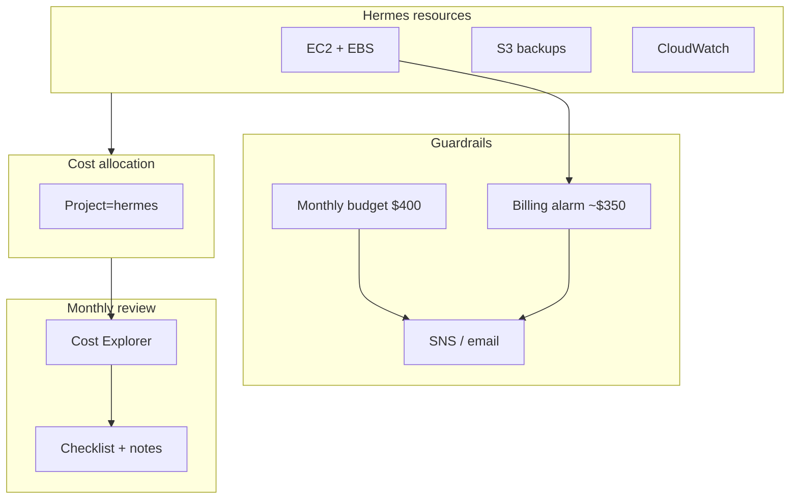

# Chapter 16: Managing Platform Costs

> How do you keep the platform affordable month after month?

---

In [Chapter 7](07-provisioning-aws-account.md), you set a **$50 billing alarm** before any EC2 instance existed. That threshold was a tripwire for a empty account—not a budget for a running Hermes platform.

By now you have an `m7i.2xlarge`, three EBS volumes, S3 backups, CloudWatch logs, and possibly GPU hours from later labs. Monthly spend is **real and recurring**. This chapter teaches **cost governance**: knowing where money goes, setting guardrails that match your platform, and building habits that prevent surprise invoices.

:::note[Why this matters for Hermes]

Hermes is not a weekend script you tear down. It is a continuous platform—compute runs 24/7, model storage grows, snapshots accumulate, and GPU inference bills by the hour. Cost discipline is an **operational requirement**, not accounting trivia. The same operator who pages on disk alarms ([Chapter 15](15-observing-hermes-platform.md)) should review spend monthly and stop GPU instances when labs end.

:::

**Execution only** — optional polish after [Chapter 13](13-the-first-control-plane.md). Complete when your platform is running continuously or before enabling GPU inference ([Chapter 38](../part-vi-ai/38-gpu-instances.md)).

---

## Learning Objectives

After completing this chapter, you will be able to:

- [ ] Break down Hermes platform spend by **service** (EC2, EBS, S3, CloudWatch, data transfer)
- [ ] Explain why the Chapter 7 billing alarm threshold should change as resources grow
- [ ] Activate **cost allocation tags** and filter Cost Explorer by `Project=hermes`
- [ ] Create an **AWS Budget** with email alerts at forecasted and actual thresholds
- [ ] Apply lab cost controls: stop EC2 when idle, manage snapshots, avoid orphaned EIPs
- [ ] Run a monthly **cost review checklist** tied to platform decisions
- [ ] Describe when Reserved Instances or Savings Plans matter—and when they do not yet

---

## Prerequisites

- [Chapter 7: Provisioning Your AWS Account](07-provisioning-aws-account.md) — billing alarm and IAM billing access
- [Chapter 9: Provisioning the Hermes Server](09-provisioning-hermes-server.md) — `hermes-controlplane-01` running
- [Chapter 15: Observing the Hermes Platform](15-observing-hermes-platform.md) (optional) — SNS topic for alerts
- `~/hermes-platform/notes/controlplane.env` sourced

```bash
export AWS_PROFILE=hermes
export AWS_REGION=us-west-2
source ~/hermes-platform/notes/controlplane.env
```

---

## Estimated Time

**60 minutes** — 20 minutes concept, 25 minutes console and CLI setup, 15 minutes first cost review.

---

## Background

### Concept — Recurring Spend Is a Design Constraint

[Chapter 6](../part-i-foundations/06-designing-the-hermes-platform.md) estimated **~$290–340/month** for a single-node lab: mostly EC2 compute and EBS. That number is not a ceiling—it is a **baseline** you chose when you picked `m7i.2xlarge` and 500 GB of gp3 across three volumes.

Costs accrue whether or not you SSH in today:

| Resource | Bills when idle? | Typical share |
|----------|------------------|---------------|
| EC2 instance (running) | Yes — per second | ~75–85% |
| EBS volumes | Yes — attached or not | ~10–15% |
| EBS snapshots | Yes — per GB-month | Grows with retention |
| S3 objects | Yes — per GB-month | Small unless large dumps |
| Elastic IP (unattached) | Yes — hourly penalty | Avoid |
| CloudWatch Logs | Yes — ingestion + storage | Grows with verbosity |
| GPU instance ([Ch 38](../part-vi-ai/38-gpu-instances.md)) | Yes — per second while running | Can dominate a day |

**Stopping** the EC2 instance stops compute charges but **not** EBS, snapshots, or S3. That is the main lever for a learning schedule: stop when you are not labbing; accept ~$40/month storage while paused.

### From Tripwire to Governance

Chapter 7 gave you one signal: estimated charges > $50. After provisioning, you need layered guardrails:

```text
Layer 1 — Billing alarm (CloudWatch)     → "Something changed—look now"
Layer 2 — AWS Budget (monthly)           → "We are on track for $X this month"
Layer 3 — Cost Explorer (tags + review)  → "EC2 vs EBS vs S3—what drove it?"
Layer 4 — Operator habits                → Stop GPU, prune snapshots, right-size
```

This chapter implements layers 2–4 and **raises** layer 1 to match your platform.

---

## Theory

### Where Hermes Money Goes

For the standard single-node design:

```text
Monthly ~$300 (order of magnitude)
├── EC2 m7i.2xlarge on-demand .............. ~$250–290
├── EBS gp3 (100 + 300 + 100 GB) .......... ~$40
├── S3 backups ............................ ~$1–5
├── CloudWatch (metrics + logs) ........... ~$1–10
├── Secrets Manager / minor API ........... &lt; $5
└── Data transfer (light lab) ............. ~$1–5
```

Verify with [AWS Pricing Calculator](https://calculator.aws/) and your region. Numbers drift with AWS price changes—**Cost Explorer** is the source of truth for *your* account.

### Cost Allocation Tags

AWS can report spend grouped by **tags**—but only after you:

1. **Tag resources** (`Project=hermes`, `Environment=lab`, `Role=controlplane`)
2. **Activate** those tag keys in **Billing → Cost allocation tags**

Chapter 9 tagged the instance with `Project=hermes`. Network resources from Chapter 8 have `Name` tags but may lack `Project`. Consistent tagging turns Cost Explorer from a blob of "EC2" into **Hermes vs everything else**—essential if this AWS account hosts non-Hermes experiments.

### On-Demand vs Commitment Pricing

| Model | When it fits Hermes |
|-------|---------------------|
| **On-demand** | Learning, intermittent labs, unknown duration — **default for this book** |
| **Reserved Instances / Savings Plans** | 24/7 production for 1–3 years after instance type is stable |
| **Spot** | Fault-tolerant batch jobs—not the control plane node |

Do not buy a Savings Plan on day one. Run the platform for months, confirm instance family and region, then commit ([Chapter 44](../part-vii-hermes/44-from-development-to-production.md) revisits this).

### Stop vs Terminate

| Action | Compute | EBS data | Public IP | k3s cluster |
|--------|---------|----------|-----------|-------------|
| **Stop** instance | Stops billing | Retained, still billed | EIP stays (free while attached) | Survives on disk |
| **Terminate** instance | Gone | Root volume deleted unless configured otherwise | Released | Gone unless rebuilt |

For cost savings during a break: **stop**, do not terminate—unless you have snapshots and IaC to reprovision ([Chapter 30](../part-v-infrastructure/30-terraform.md)).

---

## Architecture

### Cost Governance Flow



### Target Guardrails (lab defaults)

| Control | Suggested value | Rationale |
|---------|-----------------|-----------|
| Billing alarm | **$350** estimated charges | Above ~$300 baseline; catches GPU surprise or duplicate instances |
| Monthly budget | **$400** with 80% alert | Headroom for snapshot growth and log ingestion |
| Review cadence | **Monthly** + after GPU labs | Habit beats dashboards you never open |
| Tags | `Project=hermes`, `Environment=lab` | Cost Explorer filtering |

Adjust for your budget. A $50 alarm after provisioning generates false positives every day.

---

## Walkthrough

### Step 1 — Raise the Billing Alarm

Switch the console to **`us-east-1`** (EstimatedCharges lives only there), then open **CloudWatch** → **Alarms** → edit `hermes-estimated-charges-50usd` (or create `hermes-estimated-charges-350usd`):

- Metric: `AWS/Billing` → `EstimatedCharges` → currency `USD`
- Threshold: **Greater than $350** (or your monthly target + 15%)
- Action: SNS topic `hermes-billing-alerts` or `hermes-platform-alerts` (create/subscribe in `us-east-1` if needed)

Keep the old alarm disabled or delete it—two alarms on the same metric with different thresholds is fine if you want early + late warnings. Return the console to **`us-west-2`** when finished.

### Step 2 — Activate Cost Allocation Tags

As **root** or a user with billing permissions:

1. **Billing and Cost Management** → **Cost allocation tags**
2. Activate user-defined keys: **`Project`**, **`Environment`**, **`Role`** (if present on resources)
3. Wait up to 24 hours for tags to appear in Cost Explorer

Backfill tags on resources created before Chapter 9:

```bash
# Instance (already tagged in Ch 9 — verify)
aws ec2 describe-tags --filters "Name=resource-id,Values=$HERMES_INSTANCE_ID"

# Example: tag VPC if missing Project
aws ec2 create-tags --resources "$HERMES_VPC_ID" \
  --tags Key=Project,Value=hermes Key=Environment,Value=lab
```

Volume IDs from `controlplane.env` or:

```bash
aws ec2 describe-instances --instance-ids "$HERMES_INSTANCE_ID" \
  --query 'Reservations[0].Instances[0].BlockDeviceMappings[*].Ebs.VolumeId' --output text
```

Tag each volume: `Key=Project,Value=hermes`.

### Step 3 — Create a Monthly AWS Budget

**Billing** → **Budgets** → **Create budget** → **Cost budget** → **Monthly**:

- Name: `hermes-monthly-lab`
- Budget amount: **$400** fixed
- Scope: all services (or filter tag `Project=hermes` once tags propagate)
- Alerts: **Actual** at 80% and 100%; **Forecasted** at 100%
- Email: your operator address

CLI equivalent (after confirming account ID):

```bash
ACCOUNT=$(aws sts get-caller-identity --query Account --output text)

aws budgets create-budget --account-id "$ACCOUNT" --budget '{
  "BudgetName": "hermes-monthly-lab",
  "BudgetLimit": {"Amount": "400", "Unit": "USD"},
  "TimeUnit": "MONTHLY",
  "BudgetType": "COST"
}'
```

Add notifications per [AWS Budgets API docs](https://docs.aws.amazon.com/aws-cost-management/latest/APIReference/API_budgets_Budget.html)—console setup is faster for first-time readers.

### Step 4 — Explore Cost Explorer

**Cost Explorer** → **Cost and usage** → Last 30 days:

1. **Group by** → **Service** — expect EC2-Instances and EC2-Other (EBS) at top
2. **Group by** → **Tag** → `Project:hermes` (after tag activation propagates)
3. Save a report: `hermes-monthly-by-service`

Record baseline in `~/hermes-platform/notes/cost.env`:

```bash
cat >> ~/hermes-platform/notes/cost.env <<EOF
HERMES_MONTHLY_BUDGET_USD=400
HERMES_BILLING_ALARM_USD=350
HERMES_COST_REPORT=hermes-monthly-by-service
HERMES_LAST_REVIEW=$(date +%F)
EOF
```

Or run:

```bash
bash infrastructure/aws/cli/ch16-cost-baseline.sh
```

### Step 5 — Lab Cost Controls

**Stop instance when not learning** (from laptop):

```bash
aws ec2 stop-instances --instance-ids "$HERMES_INSTANCE_ID"
# Start again:
aws ec2 start-instances --instance-ids "$HERMES_INSTANCE_ID"
# Refresh public IP if not using Elastic IP — check controlplane.env
```

**Snapshot hygiene** — after restore drills ([Chapter 11](11-persistent-storage.md)), delete test snapshots:

```bash
aws ec2 describe-snapshots --owner-ids self \
  --filters "Name=tag:Project,Values=hermes" \
  --query 'Snapshots[*].[SnapshotId,StartTime,VolumeSize,Description]' --output table
```

**GPU labs** — terminate or stop GPU instances same day; set a calendar reminder.

**CloudWatch Logs** — keep 14-day retention on `/hermes/controlplane` ([Chapter 15](15-observing-hermes-platform.md)); workload logs get tighter filters in [Chapter 34](../part-v-infrastructure/34-logging.md).

### Step 6 — Monthly Review Checklist

On the first of each month (15 minutes):

1. Open **Cost Explorer** — compare to last month; note top three services
2. Check **Budgets** — any forecast overrun?
3. List **running EC2** — anything forgotten? (`aws ec2 describe-instances --filters Name=instance-state-name,Values=running`)
4. Sum **snapshot storage** — delete obsolete restore-test snapshots
5. Confirm **billing alarm** and **budget** emails still subscribed
6. Update `HERMES_LAST_REVIEW` in `cost.env`
7. If spend > 20% over baseline, decide: stop idle resources, resize instance, or accept cost for production use

---

## Hands-on Lab

### Lab 16: Cost Baseline and First Review

**Estimated Time:** 40 minutes

**Goal:** Tags activated, budget created, billing alarm raised, first Cost Explorer report saved, checklist completed once.

**Steps:**

1. Verify `Project=hermes` on instance, volumes, and VPC; add tags where missing
2. Activate `Project` and `Environment` in Cost allocation tags
3. Raise billing alarm to **$350** (or your target)
4. Create budget `hermes-monthly-lab` at **$400** with 80% and 100% alerts
5. In Cost Explorer, group last 30 days by service; screenshot or note top three line items
6. Run `aws ec2 describe-instances` — confirm only expected instances are running
7. Append baseline to `~/hermes-platform/notes/cost.env`
8. Read [EDR-0008](https://github.com/crudnicky/agent-to-aws-guide/blob/main/infrastructure/edr/EDR-0008-cost-governance-baseline.md)

**Verification:**

- Budget shows in Billing console with green status (under limit) or documented overrun
- At least one resource appears under `Project:hermes` in Cost Explorer (may take 24h)
- Billing alarm threshold matches your documented monthly target

---

## Verification

- [ ] Billing alarm threshold updated from $50 to platform-appropriate value
- [ ] AWS Budget `hermes-monthly-lab` exists with email notifications
- [ ] Cost allocation tags `Project` (and `Environment` if used) activated
- [ ] Hermes instance, volumes, and VPC tagged `Project=hermes`
- [ ] Cost Explorer report saved or baseline amounts recorded in `cost.env`
- [ ] Monthly review checklist executed at least once
- [ ] Operator knows stop vs terminate tradeoff for `hermes-controlplane-01`

---

## Troubleshooting

| Problem | Cause | Fix |
|---------|-------|-----|
| Cost Explorer shows no tag breakdown | Tags not activated or &lt; 24h | Activate in Billing; wait; ensure resources tagged |
| Budget emails never arrive | Unconfirmed subscription or spam | Check SNS/budget subscriber; confirm email |
| Alarm fires daily after Ch 9 | $50 threshold too low | Raise to ~$350 or disable old alarm |
| "EC2-Other" dominates | EBS, EIP, snapshots | Drill into EC2-Other; review volumes and snapshots |
| Stopped instance still costs money | EBS bills while attached | Expected; terminate only if data is snapshotted |
| GPU bill shock | Instance left running | Stop/terminate; add budget alert at 50% mid-month |
| Cannot access Billing console as `hermes-admin` | IAM billing access disabled | Root enables in Billing preferences (Ch 7) |

---

## Review Questions

1. Why is the Chapter 7 $50 alarm insufficient after provisioning EC2?
2. What continues to bill when you **stop** `hermes-controlplane-01`?
3. How do cost allocation tags change Cost Explorer usefulness?
4. What is the difference between a billing alarm and an AWS Budget?
5. When would you consider Reserved Instances for Hermes?
6. Why should GPU instances trigger extra operator discipline?
7. What three services do you expect at the top of a Hermes monthly report?

---

## Key Takeaways

- **Recurring cost is architectural** — instance type and volume sizes from Chapters 6 and 9 dominate the bill
- **Layer guardrails** — billing alarm + budget + tags + monthly review
- **Stop, don't terminate** — for learning breaks; EBS still costs but compute stops
- **Tags enable accountability** — `Project=hermes` separates platform spend from experiments
- **Measure before committing** — Savings Plans come after months of stable usage, not day one
- **Details in appendix** — [Cost Estimates](../appendices/cost-estimates.md) for planning scenarios

---

## Glossary Additions

| Term | Definition |
|------|------------|
| **AWS Budget** | Billing tool that tracks spend against a monthly or daily limit with configurable alerts. |
| **Cost Explorer** | AWS console for analyzing historical spend by service, tag, account, or time range. |
| **Cost allocation tag** | User-defined tag activated in Billing to appear in cost reports. |
| **EstimatedCharges** | CloudWatch billing metric for month-to-date account charges (used in alarms). |
| **On-demand pricing** | Pay-per-use with no commitment—the default EC2 pricing model in this book. |
| **Savings Plan** | Commitment to consistent $/hour spend for 1–3 years in exchange for lower rates. |

---

## Further Reading

- [AWS Cost Explorer](https://docs.aws.amazon.com/cost-management/latest/userguide/ce-what-is.html)
- [AWS Budgets](https://docs.aws.amazon.com/cost-management/latest/userguide/budgets-managing-costs.html)
- [Appendix: Cost Estimates](../appendices/cost-estimates.md)
- [Chapter 41: Operating Hermes in Production](../part-vii-hermes/41-operating-hermes-in-production.md) — production cost levers
- [Chapter 44: From Development to Production](../part-vii-hermes/44-from-development-to-production.md) — optimize from measurements

---

## Engineering Decision Record

**[EDR-0008: Tag-based cost governance baseline for the Hermes lab](https://github.com/crudnicky/agent-to-aws-guide/blob/main/infrastructure/edr/EDR-0008-cost-governance-baseline.md)**

---

## Hermes Platform Status

```text
───────────────────────────────────────────────
        HERMES PLATFORM STATUS

AWS Account            ✓
Network                ✓
EC2                    ✓
Trust                  ✓
Persistent Storage     ✓
Docker Engine          ✓
Kubernetes (k3s)       ✓

Cost Tags              ✓
Monthly Budget         ✓
Billing Guardrails     ✓

Hermes                 ✗
llama.cpp              ✗

Overall Progress

██████████████░░░░░░░░ 68%
───────────────────────────────────────────────
```

Part II optional AWS polish is complete. The core learning path continues in **Part IV — Kubernetes** with hands-on control plane exercises.

---

## What's Next

- **Core path:** [Chapter 21: Pods](../part-iv-kubernetes/21-pods.md) — schedule your first workload on the live k3s cluster.
- **Depth path:** [Part III — Docker](../part-iii-containers/17-docker.md) — container internals (complements Part IV; does not block it).
- **Reference:** [Appendix: Cost Estimates](../appendices/cost-estimates.md) — development, staging, and production scenarios.

---

[← Chapter 15: Observing the Hermes Platform](15-observing-hermes-platform.md) | [Next: Part III — Docker →](../part-iii-containers/17-docker.md)
