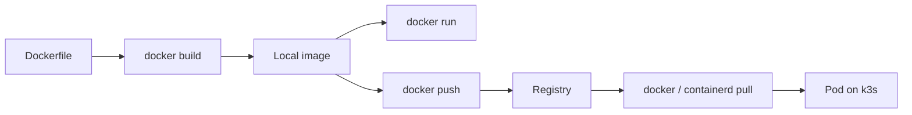

# Chapter 17: Docker

> You installed Docker. What is actually running when you say `docker run`?

---

[Chapter 12](../part-ii-aws/12-building-the-application-platform.md) made `hermes-controlplane-01` a **container platform**. This chapter is the **depth path**: how images are built, how containers isolate processes, and how registries deliver the bits Kubernetes will later schedule.

Part III does **not** block [Part IV](../part-iv-kubernetes/21-pods.md). If you already have k3s and want Pods next, go there. Return here when you need to debug a pull, write a Dockerfile, or understand why Docker and containerd both run the same Hermes image.

:::note[Why this matters for Hermes]

Hermes, llama.cpp, PostgreSQL, and Redis ship as **images**. Operators who only know `kubectl apply` struggle when a Pod is `ImagePullBackOff` or a layer is corrupt. This chapter teaches the container unit those Pods wrap—so when Part VI deploys Hermes, the packaging model is already in your hands.

:::

---

## Learning Objectives

After completing this chapter, you will be able to:

- [ ] Explain image → container → process as a single pipeline
- [ ] Describe how namespaces and cgroups isolate containers on Linux
- [ ] Inspect layers, digests, and history for an image
- [ ] Build a small image with a Dockerfile and run it on `hermes-controlplane-01`
- [ ] Distinguish bind mounts, named volumes, and image layers for Hermes data paths
- [ ] Map Docker Engine concepts to what k3s/containerd will use later

---

## Prerequisites

- [Chapter 12: Building the Application Platform](../part-ii-aws/12-building-the-application-platform.md) — Docker Engine installed, `Docker Root Dir` = `/data/docker`
- SSH as `ubuntu` on `hermes-controlplane-01` (or any host with Docker Engine)

```bash
export AWS_PROFILE=hermes
source ~/hermes-platform/notes/controlplane.env
KEY=~/.ssh/${HERMES_KEY_NAME}.pem

ssh -i "$KEY" ubuntu@${HERMES_PUBLIC_IP} 'docker info | grep -E "Server Version|Docker Root Dir"'
```

Optional: k3s from [Chapter 13](../part-ii-aws/13-the-first-control-plane.md) may already be installed—Docker Engine still works for learning labs alongside it.

---

## Estimated Time

**90 minutes** — 40 minutes reading, 50 minutes hands-on.

---

## Background

### Concept — Packaging, Not Orchestration

Docker answers one question: **how do I ship a process with its filesystem dependencies?**

Kubernetes answers a different one: **how do I keep many of those processes desired and healthy?**

Chapter 12 established the unit of deployment. Here you deepen the unit itself:

| Idea | Meaning |
|------|---------|
| **Image** | Immutable layered filesystem + config (entrypoint, env, ports) |
| **Container** | Running (or stopped) instance of an image—a process with isolation |
| **Registry** | Remote store of images (Docker Hub, GHCR, ECR, private) |

You already pulled `hello-world` in Chapter 12. Production Hermes pulls tagged or digest-pinned images the same way—whether via `docker pull` or via the kubelet talking to containerd.

### Relation to the Control Plane

If you installed k3s:

```text
You / Dockerfile / registry
        │
        ▼
   OCI image (standard)
        │
   ┌────┴────┐
   │         │
Docker    containerd (k3s)
Engine      │
   │         ▼
   │      Pod / kubelet
   ▼
docker run (learning)
```

Same image bytes. Different clients. That is why Part III exists beside Part IV—not instead of it.

---

## Theory

### Namespaces and cgroups

A container is not a tiny VM. It is a **Linux process** with:

| Mechanism | Isolates |
|-----------|----------|
| **Namespaces** | What the process can *see* (PID, mount, network, UTS, IPC, user) |
| **cgroups** | What the process can *consume* (CPU, memory, I/O) |

From [Chapter 3](../part-i-foundations/03-linux.md): the kernel runs processes. Containers ask the kernel for a private view of the world and a budget. There is **one kernel**—the host's. That is why containers start fast and why a privileged container can still threaten the host.

### Image layers

Images are stacked read-only layers. Starting a container adds a thin writable layer on top:

```text
Writable layer (container)     ← docker run creates this
─────────────────────────────
App layer                      ← COPY / ADD in Dockerfile
Dependency layer               ← apt / pip / npm
Base OS layer                  ← FROM ubuntu:24.04
```

Layers are content-addressed. Rebuilds that leave a layer unchanged reuse cache—faster builds, smaller pulls. Digests (`sha256:…`) identify exact content; tags (`latest`, `v1.2.3`) are movable pointers. Pin digests in production; use tags for humans.

### Dockerfile as a build recipe

A Dockerfile is a **reproducible recipe**, not a running server:

```dockerfile
FROM python:3.12-slim
WORKDIR /app
COPY requirements.txt .
RUN pip install --no-cache-dir -r requirements.txt
COPY . .
EXPOSE 8080
CMD ["python", "main.py"]
```

Each instruction tends to create a layer. Order matters for cache hits: put slowly changing deps before rapidly changing app code.

### Registries and trust

`docker pull nginx:1.27` resolves a tag to a manifest, then downloads layers. Registries are network dependencies—same failure mode as a failed model download. Treat public tags as convenience for labs; pin and prefer private or mirrored registries for Hermes production images later.

---

## Architecture

### Where Docker sits on hermes-controlplane-01

```text
hermes-controlplane-01 (EC2, Ubuntu)
├── / (root EBS)           — OS, packages
├── /data (hermes-data)    — Docker Root Dir: /data/docker
│   └── images, layers, volumes
└── /models (optional)     — GGUF weights (Part VI)—not Docker layers
```

Hermes application **code and deps** live in images. Large **model weights** stay on `/models` (hostPath / bind)—images must not balloon with multi-gigabyte GGUF files.



---

## Walkthrough

Work on `hermes-controlplane-01` (or equivalent Docker host).

### Step 1 — Inspect what you already have

```bash
docker version
docker info | grep -E 'Server Version|Docker Root Dir|Storage Driver|Cgroup'
docker images
```

Confirm **Docker Root Dir** is still `/data/docker` from Chapter 12.

### Step 2 — Run and inspect a container

```bash
docker run -d --name ch17-nginx -p 8080:80 nginx:1.27-alpine
docker ps
docker inspect ch17-nginx --format '{{.State.Status}} {{.NetworkSettings.IPAddress}}'
curl -sI http://127.0.0.1:8080 | head -5
```

From your laptop (optional), use the instance public IP and security group / UFW rules only if you intentionally open 8080—prefer curl on the host for this lab.

### Step 3 — Image digests and history

```bash
docker image inspect nginx:1.27-alpine --format '{{.Id}} {{.RepoDigests}}'
docker history nginx:1.27-alpine --no-trunc | head -20
```

Note the difference between an image ID and a **RepoDigest** (registry content address).

### Step 4 — Build a tiny Hermes-flavored image

On the host:

```bash
mkdir -p ~/labs/ch17 && cd ~/labs/ch17
cat > Dockerfile <<'EOF'
FROM python:3.12-slim
WORKDIR /app
RUN printf 'print("hermes-ch17-ok")\n' > main.py
CMD ["python", "main.py"]
EOF

docker build -t hermes-ch17:local .
docker run --rm hermes-ch17:local
```

Expected: `hermes-ch17-ok`.

### Step 5 — Volume vs layer (critical for Hermes data)

```bash
docker run --rm -v /data:/data:ro alpine:3.20 ls /data | head
docker volume create ch17-demo
docker run --rm -v ch17-demo:/out alpine:3.20 sh -c 'echo persist > /out/note.txt'
docker run --rm -v ch17-demo:/out alpine:3.20 cat /out/note.txt
```

Named volumes and bind mounts **outlive** the container. Anything written only in the writable layer dies with `docker rm`. Hermes memory databases and model files belong on intentional mounts—not ephemeral layers.

### Step 6 — Cleanup learning containers

```bash
docker rm -f ch17-nginx 2>/dev/null || true
docker volume rm ch17-demo 2>/dev/null || true
# Keep hermes-ch17:local if you want it for Chapter 18; else:
# docker rmi hermes-ch17:local
```

---

## Hands-on Lab

### Lab 17: Image → Container → Inspect

**Estimated Time:** 50 minutes

**Goal:** Build `hermes-ch17:local`, run nginx with inspectable config, prove a named volume survives container delete, and record digests.

**Steps:**

1. Complete Walkthrough Steps 1–6
2. Save outputs to `~/hermes-platform/notes/ch17-docker.md`:
   - `docker info` Root Dir
   - `RepoDigests` for `nginx:1.27-alpine`
   - Build command and successful run of `hermes-ch17:local`
3. Worksheet: [labs/ch17/docker-notes.md](https://github.com/crudnicky/agent-to-aws-guide/blob/main/labs/ch17/docker-notes.md)

---

## Verification

- [ ] `docker run --rm hermes-ch17:local` prints `hermes-ch17-ok`
- [ ] You can explain namespaces vs cgroups in one sentence each
- [ ] You inspected an image digest (`RepoDigests` or image ID)
- [ ] You demonstrated data surviving via a named volume or bind mount
- [ ] You did **not** copy model weights into a Dockerfile `COPY`

---

## Troubleshooting

| Problem | Cause | Fix |
|---------|-------|-----|
| `permission denied` on docker.sock | Not in `docker` group | Re-login after `usermod -aG docker ubuntu` |
| Build can't reach registry | Outbound HTTPS blocked | Check SG, UFW, VPC route ([Ch 8](../part-ii-aws/08-creating-network-for-hermes.md), [Ch 10](../part-ii-aws/10-establishing-trust.md)) |
| Disk filling under `/data/docker` | Unused images/layers | `docker system df`; `docker image prune` (careful) |
| Port already allocated | Previous container or Traefik | `docker ps -a`; choose another host port |
| Confusion with k3s images | Separate stores | Docker Engine ≠ k3s containerd store—list with each tool |

---

## Review Questions

1. What is the difference between an image and a container?
2. Why are containers faster to start than VMs?
3. Why pin digests in production?
4. Why keep GGUF models on `/models` instead of inside the Hermes image?
5. How does this chapter relate to Pods in [Chapter 21](../part-iv-kubernetes/21-pods.md)?

---

## Key Takeaways

- **Docker packages processes** — Kubernetes will schedule them; this chapter owns the package
- **Namespaces + cgroups** — visibility and resource limits on a shared kernel
- **Layers and digests** — immutability and cache; tags are aliases
- **Mounts hold state** — writable layers are ephemeral
- **Depth path** — optional relative to Part IV, mandatory when you debug images

---

## Glossary Additions

| Term | Definition |
|------|------------|
| **Layer** | Content-addressed filesystem diff stacked to form an image. |
| **Digest** | Cryptographic hash identifying exact image/manifest content. |
| **Namespace (Linux)** | Kernel isolation of process visibility (PID, net, mount, …). |
| **cgroup** | Kernel control group limiting resource consumption. |
| **Dockerfile** | Recipe of instructions to build an image reproducibly. |
| **Bind mount** | Host path mounted into a container filesystem. |
| **Named volume** | Docker-managed persistent storage mounted into containers. |

---

## Further Reading

- [Docker Engine — Get started](https://docs.docker.com/get-started/)
- [Best practices for writing Dockerfiles](https://docs.docker.com/build/building/best-practices/)
- [Chapter 12: Building the Application Platform](../part-ii-aws/12-building-the-application-platform.md)
- [Chapter 19: OCI](19-oci.md) — the standards behind images and runtimes

---

## Hermes Platform Status

```text
───────────────────────────────────────────────
        HERMES PLATFORM STATUS

AWS Account            ✓
Network                ✓
EC2 / Trust / Storage  ✓
Docker Engine          ✓
Docker depth (images)  ✓
Kubernetes (k3s)       ✓ (if completed Ch 13)

Compose multi-service  ✗
OCI standards fluency  ✗

Hermes                 ✗
llama.cpp              ✗

Overall Progress

██████████████░░░░░░░░ 70%
───────────────────────────────────────────────
```

Container packaging depth complete. Next: multi-container declaration with Compose—or skip to Kubernetes objects if that is your current path.

---

## What's Next

- **Depth path:** [Chapter 18: Docker Compose](18-docker-compose.md) — declare Hermes-like multi-service stacks locally
- **Core path:** [Chapter 21: Pods](../part-iv-kubernetes/21-pods.md) — schedule workloads on k3s
- **Standards:** [Chapter 19: OCI](19-oci.md) — why Docker and containerd share images

---

[← Chapter 16: Managing Platform Costs](../part-ii-aws/16-managing-platform-costs.md) | [Next: Chapter 18 — Docker Compose →](18-docker-compose.md)
