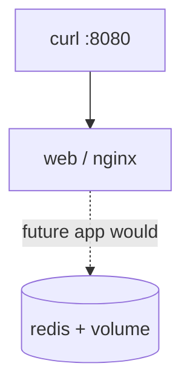

# Chapter 18: Docker Compose

> How do I run several containers as one application before the cluster owns them?

---

Hermes is not one process. It is an **application stack**: API, workers, model server, PostgreSQL, Redis (exact topology in Part VI–VII). [Chapter 17](17-docker.md) taught single-container packaging. **Docker Compose** teaches **multi-container declaration**—the mental bridge from `docker run` to Kubernetes Deployments and Services.

Compose is a **development and lab tool** on this book’s path. Production Hermes runs on **k3s**. Compose still earns its place: you learn service names, ports, volumes, and dependencies in a file you can read in one screen.

:::note[Why this matters for Hermes]

When you later write Helm values for Hermes, the ideas feel familiar: named services, internal DNS (`redis`, `postgres`), shared networks, and volume mounts for durable state. Compose is rehearsal—not the production control plane.

:::

---

## Learning Objectives

After completing this chapter, you will be able to:

- [ ] Explain what Compose adds on top of Docker Engine
- [ ] Write a `compose.yaml` with multiple services, ports, and volumes
- [ ] Use Compose networking (service DNS names) between containers
- [ ] Start, inspect, and tear down a multi-service stack
- [ ] Map Compose concepts to Deployments, Services, and PVCs in Part IV–VI

---

## Prerequisites

- [Chapter 17: Docker](17-docker.md) — or solid comfort with `docker run` / images from [Chapter 12](../part-ii-aws/12-building-the-application-platform.md)
- Docker Compose plugin (`docker compose` v2)

```bash
docker compose version
```

If missing on Ubuntu (Docker Engine from the official repo usually includes the plugin):

```bash
sudo apt-get update
sudo apt-get install -y docker-compose-plugin
```

---

## Estimated Time

**75 minutes** — 30 minutes reading, 45 minutes lab.

---

## Background

### Concept — One file, many processes

Without Compose:

```bash
docker network create hermes-lab
docker run -d --name redis --network hermes-lab redis:7-alpine
docker run -d --name api --network hermes-lab -p 8080:8080 ...
# remember every flag, every recreate, every dependency order
```

With Compose: **declare the desired stack**; the CLI creates networks, starts services, and tears them down together.

```text
compose.yaml  →  docker compose up  →  network + containers
compose.yaml  →  docker compose down →  stop + remove (volumes optional)
```

### Why not skip straight to Kubernetes?

You can. Many readers will. Compose remains useful when:

- You validate an image and env wiring **before** writing manifests
- You work offline or on a laptop without k3s
- You need a **temporary** sidecar (cache, DB) for a Dockerfile experiment

Once the stack is correct in Compose, translating to Pods/Deployments is mostly renaming primitives—not reinventing the application.

---

## Theory

### Compose file structure

Modern Compose uses `compose.yaml` (or `docker-compose.yml`):

```yaml
services:
  web:
    image: nginx:1.27-alpine
    ports:
      - "8080:80"
    depends_on:
      - redis
  redis:
    image: redis:7-alpine
    volumes:
      - redis-data:/data

volumes:
  redis-data:
```

| Key | Role |
|-----|------|
| `services` | Named containers (roughly Deployment + container) |
| `ports` | Host ↔ container publish (roughly NodePort / Ingress later) |
| `volumes` | Durable storage (roughly PVC) |
| `networks` | Isolation groups (default bridge network is created for you) |
| `depends_on` | Start order hint—**not** a readiness probe |

### DNS between services

On the project network, **service name = hostname**. A container named `api` reaches Redis at `redis:6379`—no hard-coded IPs. Kubernetes ClusterIP Services give you the same idea at cluster DNS (`redis.default.svc.cluster.local`).

### Profiles and environments

Compose supports `.env` files and `environment:` blocks. Treat secrets carefully: lab passwords in Compose files are for learning only. Production Hermes will pull secrets via Kubernetes Secrets / external stores ([Chapter 32](../part-v-infrastructure/32-secrets-management.md)).

### Compose vs Kubernetes (map once)

| Compose | Kubernetes |
|---------|------------|
| Service | Deployment (+ Pod template) |
| Service DNS name | Service (ClusterIP) |
| `ports` publish | Service / Ingress |
| Named volume | PersistentVolumeClaim |
| `docker compose up` | `kubectl apply` + controllers reconcile |
| `depends_on` | Startup order via probes / init containers |

Do not force a 1:1 syntax translation—carry the **topology**.

---

## Architecture

Lab stack for this chapter: a stand-in “agent edge” — nginx fronting Redis. Not Hermes itself—just enough services to practice multi-container wiring.

```text
Laptop / SSH session
        │
        ▼
docker compose up
        │
   ┌────┴─────────────────┐
   │  compose project net │
   │                      │
   │  web (nginx:8080)    │
   │       │              │
   │       └──► redis     │
   │            volume    │
   └──────────────────────┘
```



Part VI will replace this stand-in with Hermes API, workers, PostgreSQL, Redis, and llama-server—same composition idea, orchestrated by k3s.

---

## Walkthrough

### Step 1 — Project directory

```bash
mkdir -p ~/labs/ch18 && cd ~/labs/ch18
```

### Step 2 — Write `compose.yaml`

```bash
cat > compose.yaml <<'EOF'
name: hermes-ch18

services:
  web:
    image: nginx:1.27-alpine
    ports:
      - "8080:80"
    volumes:
      - ./html:/usr/share/nginx/html:ro
    depends_on:
      - redis

  redis:
    image: redis:7-alpine
    command: ["redis-server", "--save", "60", "1"]
    volumes:
      - redis-data:/data

volumes:
  redis-data:
EOF

mkdir -p html
cat > html/index.html <<'EOF'
<!DOCTYPE html>
<html><body>
<h1>Hermes lab — Compose</h1>
<p>Multi-container stack is up.</p>
</body></html>
EOF
```

### Step 3 — Start and verify

```bash
docker compose up -d
docker compose ps
curl -s http://127.0.0.1:8080 | head
docker compose exec redis redis-cli PING
```

Expected: HTML body with “Compose”; Redis replies `PONG`.

### Step 4 — Service DNS

```bash
docker compose exec web ping -c 2 redis
# alpine nginx image may lack ping — use:
docker compose run --rm --entrypoint wget web -qO- http://web/ | head
```

From another temporary alpine on the same project network:

```bash
docker compose run --rm --entrypoint sh redis -c 'getent hosts web || true'
```

### Step 5 — Logs and teardown

```bash
docker compose logs --tail=20
docker compose down          # keeps named volume by default
docker compose down -v       # removes redis-data too — use when finished
```

---

## Hands-on Lab

### Lab 18: Multi-service Compose stack

**Estimated Time:** 45 minutes

**Goal:** Bring up `web` + `redis`, prove HTTP and Redis health, document the Compose→Kubernetes mapping table in your notes.

**Steps:**

1. Complete Walkthrough Steps 1–5
2. Add a third service of your choice (e.g. `adminer` or a second alpine “worker” that only sleeps)—keep it educational
3. Record answers in [resources/labs/ch18/compose-notes.md](https://github.com/crudnicky/agent-to-aws-guide/blob/main/resources/labs/ch18/compose-notes.md)
4. Tear down with `docker compose down -v` when done

---

## Verification

- [ ] `docker compose ps` shows `web` and `redis` running
- [ ] `curl http://127.0.0.1:8080` returns your HTML
- [ ] `redis-cli PING` returns `PONG` via `compose exec`
- [ ] You can explain why Compose is lab/dev and k3s is production for Hermes
- [ ] You wrote at least three Compose → Kubernetes mappings in your notes

---

## Troubleshooting

| Problem | Cause | Fix |
|---------|-------|-----|
| `docker: 'compose' is not a command` | Plugin missing | Install `docker-compose-plugin` |
| Port 8080 in use | Another container or Traefik | Change host port `"8081:80"` |
| Permission on `./html` | Host directory mode | `chmod -R a+rX html` |
| Redis data “lost” | Used `down -v` or anonymous volume | Use named volume; avoid `-v` until cleanup |
| Can't resolve `redis` | Wrong network / one-off without project | Use `docker compose exec` / `run` in project dir |

---

## Review Questions

1. What problem does Compose solve that raw `docker run` does not?
2. Why is `depends_on` not a readiness guarantee?
3. How does Compose service DNS relate to Kubernetes Services?
4. Why does this book still send Hermes to k3s rather than Compose for production?
5. Where should secrets live in a real Hermes deploy vs a Compose lab?

---

## Key Takeaways

- **Compose declares stacks** — networks, services, volumes in one file
- **Service names are DNS** — practice for cluster-internal naming
- **Map concepts, not YAML** — Deployments/Services/PVCs are next
- **Lab tool ≠ production platform** — Hermes production path remains k3s
- **Rehearse topology early** — fewer surprises in Part VI Helm charts

---

## Glossary Additions

| Term | Definition |
|------|------------|
| **Compose file** | YAML declaring multi-container applications for Docker Compose. |
| **Service (Compose)** | Named long-running container definition in a Compose project. |
| **Project network** | User-defined bridge network Compose creates for service DNS. |
| **depends_on** | Start-order dependency; does not wait for application readiness. |

---

## Further Reading

- [Compose specification](https://docs.docker.com/compose/compose-file/)
- [Chapter 17: Docker](17-docker.md)
- [Chapter 22: Deployments](../part-iv-kubernetes/22-deployments.md) / [Chapter 23: Services](../part-iv-kubernetes/23-services.md)
- [Chapter 35: Running Hermes](../part-vi-ai/35-running-hermes.md) — stack on k3s

---

## Hermes Platform Status

```text
───────────────────────────────────────────────
        HERMES PLATFORM STATUS

AWS / EC2 / Storage    ✓
Docker Engine          ✓
Docker depth           ✓
Compose (lab stacks)   ✓
Kubernetes (k3s)       ✓ (if completed Ch 13)

OCI standards fluency  ✗

Hermes                 ✗
llama.cpp              ✗

Overall Progress

██████████████░░░░░░░░ 72%
───────────────────────────────────────────────
```

You can declare multi-service apps for labs. Production composition still lands on the control plane.

---

## What's Next

- [Chapter 19: OCI](19-oci.md) — why these images work under Docker *and* containerd
- Or resume core path: [Chapter 21: Pods](../part-iv-kubernetes/21-pods.md)

---

[← Chapter 17: Docker](17-docker.md) | [Next: Chapter 19 — OCI →](19-oci.md)
