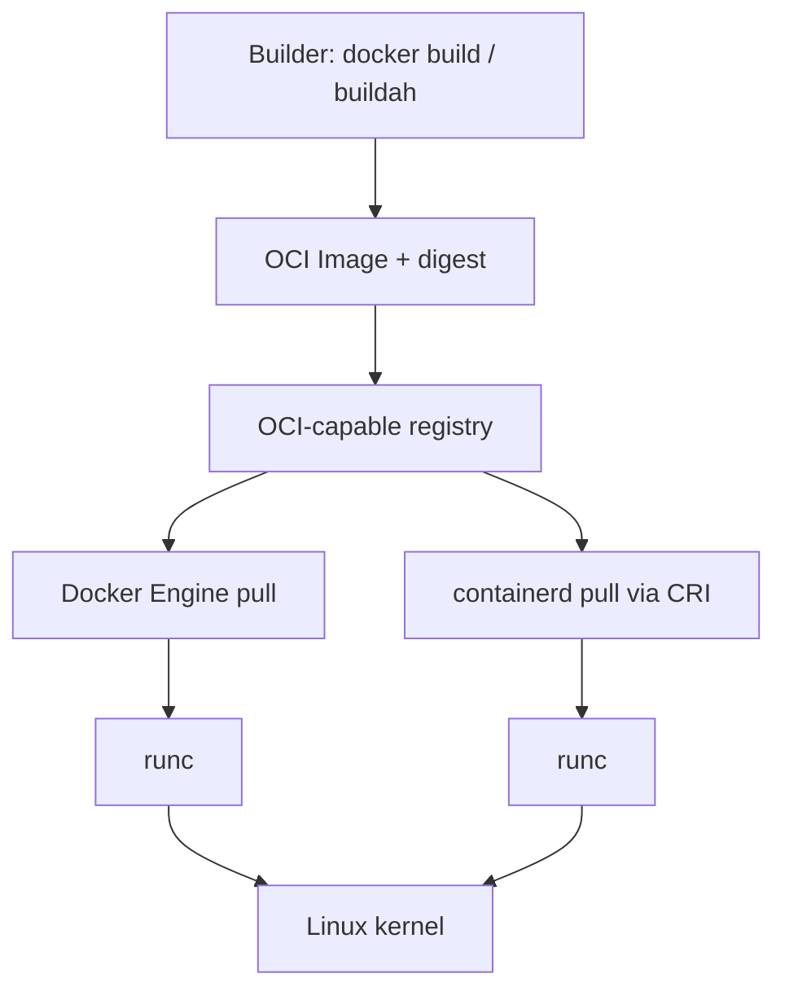

# Chapter 19: OCI

> Why can the same Hermes image run under Docker Engine and under k3s containerd?

---

[Chapter 12](../part-ii-aws/12-building-the-application-platform.md) installed Docker. [Chapter 13](../part-ii-aws/13-the-first-control-plane.md) brought k3s, which runs workloads with **containerd**, not the Docker daemon. They share images because of the **Open Container Initiative (OCI)**—industry standards for image format and runtime behavior.

This chapter is short and conceptual. Labs prove portability with digests and optional `nerdctl`/`crictl` inspection—not a second Docker install.

:::note[Why this matters for Hermes]

When Part VI pulls `hermes` and `llama-server` images into Pods, the kubelet asks containerd to pull **OCI images**. Vendors, build tools, and registries all speak OCI. Understanding the standard prevents vendor lock-in myths (“only Docker can run this”) and clarifies digests, manifests, and runtimes in incident response.

:::

---

## Learning Objectives

After completing this chapter, you will be able to:

- [ ] Name the two primary OCI specifications (image and runtime) and what each governs
- [ ] Explain why Docker and containerd are interchangeable at the *image* layer
- [ ] Relate image digests and manifests to safe deploys
- [ ] Describe where runc (or equivalent) fits under both Docker and containerd
- [ ] Use this model when debugging `ImagePullBackOff` on k3s

---

## Prerequisites

- [Chapter 17: Docker](17-docker.md) recommended (images, digests, layers)
- Optional: k3s from [Chapter 13](../part-ii-aws/13-the-first-control-plane.md) for containerd side of the lab

---

## Estimated Time

**60 minutes** — 35 minutes reading, 25 minutes verification lab.

---

## Background

### Concept — Standards beat product names

Early container tooling was docker-the-product and docker-the-format. Platforms needed a neutral contract so:

- Builders (Docker, Buildah, Kaniko, …) produce the same artifact type
- Runtimes (containerd, CRI-O, …) consume it
- Registries distribute it without proprietary lock-in

**OCI** is that contract. Saying “OCI image” means: compliant with the image-spec—not “must be built by Docker.”

### Why this book cares now

You have (or will have) **two runtimes** on the learning node:

| Client | Typical daemon | Used for |
|--------|----------------|----------|
| `docker` | Docker Engine (dockerd → containerd often nested) | Part III labs, debugging |
| kubelet | k3s embedded **containerd** | Part IV–VII workloads |

Hermes production path is the second column. OCI is why your Chapter 17 builds are not stranded on Docker forever.

---

## Theory

### Image spec

The **OCI Image Specification** defines:

- **Manifest** — points at config + layers (and platform variants in an index)
- **Config** — architecture, env, entrypoint, labels
- **Layers** — tar-based filesystem diffs (content-addressed)

A tag like `nginx:1.27-alpine` is registry UX. The **digest** (`sha256:…`) identifies the resolved manifest content. Pin digests when you need bit-for-bit reproducibility.

### Runtime spec

The **OCI Runtime Specification** defines the on-host lifecycle for creating a container from an unpacked rootfs + config (namespaces, mounts, process args). Low-level runtimes such as **runc** implement this. Higher-level tools (containerd, CRI-O) prepare bundles and call the runtime.

### Distribution

Registries speak distribution APIs (pull/push manifests and blobs). Docker Hub, GHCR, ECR, and Harbor all serve OCI artifacts. Distribution failures look the same whether Docker or containerd is the client: auth, TLS, rate limits, wrong arch.

### CRI — Kubernetes’ contract

Kubernetes does not talk Docker’s old API. It talks the **Container Runtime Interface (CRI)** to containerd or CRI-O. k3s ships containerd and satisfies CRI. Your `docker` CLI is optional for the cluster; OCI images are not.

```text
kubectl / kubelet
       │  CRI
       ▼
   containerd
       │  OCI runtime
       ▼
     runc → Linux namespaces/cgroups
```

---

## Architecture



On `hermes-controlplane-01`:

```text
Same OCI image digest
        │
   ┌────┴─────┐
   │          │
docker     k3s containerd
 pull         pull (kubelet)
   │          │
   └── runc ──┘
         │
    Linux kernel
```

---

## Walkthrough

### Step 1 — Digest from Docker

```bash
docker pull nginx:1.27-alpine
DIGEST=$(docker image inspect nginx:1.27-alpine --format '{{index .RepoDigests 0}}')
echo "$DIGEST"
```

Save this string—platform + digest identify the artifact.

### Step 2 — Confirm arch and config

```bash
docker image inspect nginx:1.27-alpine --format 'Arch={{.Architecture}} Os={{.Os}} Entrypoint={{.Config.Entrypoint}} Cmd={{.Config.Cmd}}'
```

Wrong architecture (e.g. arm64 image on amd64 node without emulation) fails at pull or start—OCI config declares these fields.

### Step 3 — containerd side (if k3s installed)

```bash
sudo k3s crictl version
# List images known to k3s containerd (separate store from Docker):
sudo k3s crictl images | head
```

Pull the **same** reference into the cluster by running a short-lived Pod (execution-only):

```bash
kubectl run oci-check --image=nginx:1.27-alpine --restart=Never -- sleep 30
kubectl wait --for=condition=Ready pod/oci-check --timeout=60s
kubectl get pod oci-check -o jsonpath='{.status.containerStatuses[0].imageID}{"\n"}'
kubectl delete pod oci-check
```

Compare conceptually: Docker `RepoDigests` vs Pod `imageID`. Both are content-addressed identifiers of OCI artifacts—different stores, same standard.

### Step 4 — Mental model check

Answer aloud:

1. Does deleting Docker Engine delete images already pulled into k3s containerd? (**No**—separate stores.)
2. Can a Pod run an image you only `docker build`’d locally without a registry? (**Only if** you import into containerd or push/pull via a registry.)

That second answer drives the Part V/VI habit: **push to a registry** the cluster can reach.

---

## Hands-on Lab

### Lab 19: Prove OCI portability

**Estimated Time:** 25 minutes

**Goal:** Record one image digest from Docker and one `imageID` from a Pod using the same tag; write three sentences on image-spec vs runtime-spec vs CRI.

**Steps:**

1. Complete Walkthrough Steps 1–4 (skip Step 3 if k3s is not installed; note that in your lab sheet)
2. Fill [labs/ch19/oci-notes.md](https://github.com/crudnicky/agent-to-aws-guide/blob/main/labs/ch19/oci-notes.md)
3. Optional reading: skim the OCI image-spec intro linked in Further Reading

---

## Verification

- [ ] You can define OCI in one sentence without saying “Docker”
- [ ] You captured a digest for `nginx:1.27-alpine` (or equivalent)
- [ ] You explained why Docker and k3s images lists can differ on the same host
- [ ] You know CRI is Kubernetes↔runtime, OCI is image/runtime artifact standards

---

## Troubleshooting

| Problem | Cause | Fix |
|---------|-------|-----|
| Pod `ErrImagePull` | Registry/auth/network | Same diagnostics as `docker pull` on the node |
| Digest mismatch across tools | Tag moved; different platforms in index | Pin digest; confirm `amd64` vs `arm64` |
| Image in Docker, not in Pod | Never pulled into containerd | Push to registry or import; do not assume shared store |
| `crictl` not found | Not using k3s path | Use `sudo k3s crictl` |

---

## Review Questions

1. What does the OCI image specification standardize?
2. What does the OCI runtime specification standardize?
3. How does CRI relate to OCI?
4. Why does this book install Docker in Chapter 12 if k3s uses containerd?
5. Why push Hermes images to a registry before cluster deploys?

---

## Key Takeaways

- **OCI = portable contract** — images and runtimes, not a single vendor CLI
- **Docker teaches; containerd runs** — same artifacts on the Hermes platform path
- **Digests > floating tags** for reproducible Hermes deploys
- **Separate image stores** — Engine vs k3s containerd until you push/pull deliberately
- **CRI bridges Kubernetes to runtimes** that speak OCI

---

## Glossary Additions

| Term | Definition |
|------|------------|
| **OCI** | Open Container Initiative — standards body for container image and runtime specs. |
| **Image spec** | OCI standard for image manifests, configs, and layers. |
| **Runtime spec** | OCI standard for running a container from a rootfs + config. |
| **CRI** | Container Runtime Interface — Kubernetes API to container runtimes. |
| **runc** | Common low-level OCI runtime spawning containers via Linux kernel features. |
| **Manifest** | Metadata document listing image config and layers (and platform indexes). |

---

## Further Reading

- [Open Container Initiative](https://opencontainers.org/)
- [OCI Image Spec](https://github.com/opencontainers/image-spec)
- [OCI Runtime Spec](https://github.com/opencontainers/runtime-spec)
- [Kubernetes container runtimes](https://kubernetes.io/docs/setup/production-environment/container-runtimes/)
- [Chapter 13: The First Control Plane](../part-ii-aws/13-the-first-control-plane.md)

---

## Hermes Platform Status

```text
───────────────────────────────────────────────
        HERMES PLATFORM STATUS

AWS / EC2 / Storage    ✓
Docker Engine          ✓
Docker + Compose depth ✓
OCI standards          ✓
Kubernetes (k3s)       ✓ (if completed Ch 13)

Hermes                 ✗
llama.cpp              ✗
PostgreSQL             ✗
Redis                  ✗

Overall Progress

███████████████░░░░░░░ 74%
───────────────────────────────────────────────
```

Part III depth path complete. The packaging contract for Hermes images is clear—schedule them next (or continue if you already have).

---

## What's Next

**Core learning path:** [Chapter 20: Why Kubernetes Exists](../part-iv-kubernetes/20-why-kubernetes-exists.md) (theory) or [Chapter 21: Pods](../part-iv-kubernetes/21-pods.md) (execution).

Part III was optional depth after the Chapter 12 runtime. You do not re-justify containers again in Part IV—you **use** them inside Pods.

---

[← Chapter 18: Docker Compose](18-docker-compose.md) | [Next: Chapter 20 — Why Kubernetes Exists →](../part-iv-kubernetes/20-why-kubernetes-exists.md)
