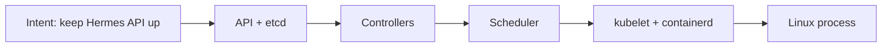

# Chapter 20: Why Kubernetes Exists

> You already have a scheduler. This chapter names the failures that made it necessary.

---

In [Chapter 13](../part-ii-aws/13-the-first-control-plane.md) you installed **k3s**. The machine became a **control plane**—API, scheduler, desired state.

This chapter does **not** re-ignite that moment. It answers a quieter question: *what went wrong with containers alone that forced orchestration into existence?*

You can read it before [Chapter 21: Pods](21-pods.md) as orientation, or after as theory depth. Either way, [Chapter 21](21-pods.md) is where you **use** the scheduler. This chapter only **names problems** and maps them to the **State Layers** you already know.

:::note[Why this matters for Hermes]

Hermes is not one process. It is API, workers, llama.cpp, PostgreSQL, and Redis—plus future tools—that must stay up, find each other, restart when they die, and upgrade without SSH surgery. Docker packages each piece. Kubernetes is how you **operate the multi-service agent platform** without becoming the human control plane.

:::

---

## Learning Objectives

After completing this chapter, you will be able to:

- [ ] List the operational failures Docker alone cannot solve for a multi-service platform
- [ ] Map restart, placement, discovery, and desired state onto **State Layers**
- [ ] Relate Pods, Deployments, Services, and Ingress to those failures—without deploying them yet
- [ ] Contrast imperative `docker run` with declarative reconcile on your live k3s cluster
- [ ] Explain why this book installs the control plane (Ch 13) before teaching object types (Ch 21+)
- [ ] State why later Hermes deploys reuse this stack instead of inventing a new mental model

---

## Prerequisites

- [Chapter 12: Building the Application Platform](../part-ii-aws/12-building-the-application-platform.md) — Docker runtime on the node
- [Chapter 13: The First Control Plane](../part-ii-aws/13-the-first-control-plane.md) — k3s installed; node **Ready**
- Optional: skim [Chapter 6](../part-i-foundations/06-designing-the-hermes-platform.md) for the multi-service Hermes design

```bash
export AWS_PROFILE=hermes
source ~/hermes-platform/notes/controlplane.env
export KUBECONFIG=~/.kube/hermes-k3s.yaml

kubectl get nodes   # must show Ready
```

No new AWS resources. You inspect the cluster you already built.

---

## Estimated Time

**45 minutes** — 30 minutes reading, 15 minutes inspection lab.

---

## Background

### Containers Solved Packaging—Not Operations

[Chapter 12](../part-ii-aws/12-building-the-application-platform.md) gave you a runtime: build an image, run a container, repeat. That solves **packaging**—“ship the same binary stack everywhere.”

Hermes needs more than packaging. From [Chapter 6](../part-i-foundations/06-designing-the-hermes-platform.md):

| Service | If it dies… |
|---------|-------------|
| Hermes API | No agent; sessions stall |
| llama.cpp | Inference fails; Hermes may hang waiting |
| PostgreSQL | Session/state loss or write failures |
| Redis | Cache/queues degrade |

On one node with only `docker run` / Compose, **you** are the orchestrator: restart the right container, remember ports, order startup, and hope upgrades do not leave half the stack on an old image.

That human-in-the-loop ops model fails as soon as you want production habits: self-healing, rolling updates, stable names for callers, and an external entry path.

### Four Failures Containers Alone Do Not Own

| Failure | What you feel with raw containers | What you need |
|---------|-----------------------------------|---------------|
| **Death** | Process exits; nothing brings it back | Restart / reconcile desired count |
| **Placement** | You pick the host and hope capacity exists | Schedule onto a Ready node |
| **Discovery** | Hard-coded IPs and host ports | Stable name → current backends |
| **Exposure** | Ad-hoc port publishing and TLS glue | Controlled ingress to the right Service |

Kubernetes exists because these four keep recurring across every multi-service platform—not because Google needed a buzzword.

### Sequencing: Control Plane First, Objects Second

Most books teach Kubernetes vocabulary, then maybe install a cluster. This book inverted that:

```text
Ch 13   Install something that schedules   ← already done
Ch 20   Name why that thing had to exist   ← this chapter (optional depth)
Ch 21+  Exercise Pods, Deployments, …      ← operate the API
```

Without a live control plane, Part IV is vocabulary. With k3s running, every later object has consequences you can see.

---

## Theory

### Desired State vs Imperative Commands

Docker (and SSH) encourage **imperative** thinking:

```bash
docker run -d --name hermes-api …
docker restart hermes-api
```

Meaning: *do this now.*

Kubernetes encourages **declarative** thinking—the model you already touched in Chapter 13:

```yaml
spec:
  replicas: 2
```

Meaning: *the system should keep two of these running.* Controllers compare desired vs actual and act until they match. That loop is **reconciliation**.

You are not learning a second philosophy here. You are naming the loop Chapter 13 already turned on.

### State Layers (Reuse, Do Not Replace)

From Chapter 13 onward, every new object maps here:

```text
Human Intent
    ↓
Kubernetes API (desired state in etcd)
    ↓
Scheduler / controllers
    ↓
Containers (runtime)
    ↓
Linux Kernel
```

| Failure from Background | Where it lives |
|-------------------------|----------------|
| Death → restart | Controllers watch API; kubelet restarts containers |
| Placement | Scheduler assigns Pods to nodes |
| Discovery | Service objects + DNS at the API / networking layers |
| Exposure | Ingress (or equivalent) routes external traffic to Services |

Later chapters add primitives. They do **not** add parallel mental models.

### Object Preview (Names Only)

Part IV teaches these by *using* them—starting in Chapter 21. For orientation only:

| Object | Answers |
|--------|---------|
| **Pod** | What runs? (one or more containers sharing context) |
| **Deployment** | How many should stay running? How do I roll out? |
| **Service** | How do others reach current Pods by stable name? |
| **Ingress** | How does HTTP(S) from outside reach a Service? |
| **PVC / storage** | What survives Pod death? |
| **Helm** | How do I package the whole system? |

This table is a map, not a lesson. Do not memorize CRUD yet.

### Why Not Stay on Docker Compose Forever?

Compose is excellent for laptop stacks and early experiments. For the Hermes platform goals in this book it falls short because:

1. **No cluster API** — state lives in files and `docker` on one host; there is no single declarative API other tools and CI can drive the same way
2. **Weak self-heal semantics** — restart policies help processes; they are not a full desired-state control plane for many cooperating units
3. **Upgrade and discovery** grow ad-hoc — host ports, networks, and scripts accumulate until they resemble a poor Kubernetes

k3s gives you the real API on one node so Part IV skills transfer to larger clusters later without rewriting the mental model.

---

## Architecture

### Where k3s Sits in the Hermes Stack

```text
Laptop / Internet
        │
        ▼
   EC2 (Ch 9)  hermes-controlplane-01
        │
   Docker (Ch 12) — build/test images
        │
   k3s (Ch 13) — schedule and reconcile workloads
        │
   ┌────┴────┬──────────┬──────────┐
   ▼         ▼          ▼          ▼
 Pods    Deployments  Services   Ingress   ← Ch 21–24
   │
   └──► Hermes + llama.cpp + DBs (Part VI+)
```

### Failure → Control Plane Path



When a container dies, the path is not “SSH and `docker start`.” Controllers notice actual ≠ desired and drive the stack until reality matches intent again—at the layers above the kernel.

### Single-Node Truth

On `hermes-controlplane-01`, the scheduler always picks **this** node. That is correct for a personal platform. Multi-node placement becomes a later scaling concern ([Chapter 29](29-scaling.md)), not a new ontology.

---

## Walkthrough

Confirm the control plane is already solving “something is always running”—without creating application Pods yet.

### Step 1 — Cluster identity

```bash
export KUBECONFIG=~/.kube/hermes-k3s.yaml
kubectl cluster-info
kubectl get nodes -o wide
```

Expect the API server reachable and your node **Ready**.

### Step 2 — System workloads already under reconcile

```bash
kubectl get pods -A
```

You should see k3s system Pods (Traefik, CoreDNS, local-path provisioner, and similar). Those are not Hermes. They prove controllers already keep platform components alive on your behalf.

### Step 3 — API objects you can query

```bash
kubectl api-resources --namespaced=true | head
kubectl get deploy,svc -A
```

You are looking at the **API layer**: Deployments and Services that describe desired networking and replica behavior for system components.

### Step 4 — Tie one Pod to State Layers (notes only)

Pick any Running system Pod:

```bash
kubectl get pods -A
kubectl describe pod -n <namespace> <pod-name> | head -40
```

In your notes, write one line each for Intent, API, Scheduler, Container, Kernel for that Pod. You will repeat this pattern for every Part IV object.

---

## Hands-on Lab

### Lab 20: Failures → Layers on Your Cluster

**Estimated Time:** 15 minutes

**Goal:** Connect the four operational failures to evidence on the live control plane—without deploying Hermes.

**Steps:**

1. Confirm `kubectl get nodes` → **Ready**
2. List Pods cluster-wide; note which namespaces belong to the platform (kube-system, etc.)
3. Pick one system Deployment: record desired replicas vs available (`kubectl get deploy -A`)
4. Pick one Service: record ClusterIP / type—stable name independent of Pod IPs
5. In `~/hermes-platform/notes/`, write a table:

| Failure | Evidence on this cluster | State Layer |
|---------|--------------------------|-------------|
| Death | … | … |
| Placement | … | … |
| Discovery | … | … |
| Exposure | … (Traefik/Ingress or LoadBalancer if present) | … |

6. Do **not** create application Pods or deploy Hermes in this lab—that is [Chapter 21](21-pods.md)

**Worksheet:** [`resources/labs/ch20/orchestration-failures.md`](https://github.com/crudnicky/agent-to-aws-guide/blob/main/resources/labs/ch20/orchestration-failures.md)

---

## Verification

- [ ] Node is **Ready** under your `KUBECONFIG`
- [ ] You can list Pods across namespaces
- [ ] You can state the four failures containers alone do not own
- [ ] You mapped each failure to a State Layer in one sentence
- [ ] You understand Ch 21+ as **manipulation**, not a second “why Kubernetes” revelation

---

## Troubleshooting

| Problem | Likely cause | Fix |
|---------|--------------|-----|
| `Unable to connect to the server` | Wrong kubeconfig | `export KUBECONFIG=~/.kube/hermes-k3s.yaml`; revisit Ch 13 |
| No pods in `kubectl get pods -A` | k3s not fully up | `sudo systemctl status k3s`; Ch 13 verification |
| Node NotReady | Agent or CNI issue | `kubectl describe node`; check Ch 13 troubleshooting |
| Feeling lost in object names | Skipping ahead | Stay with failure→layer table; details start in Ch 21 |

---

## Review Questions

1. What problem does packaging (Docker) solve that orchestration does not?
2. Name the four operational failures this chapter centers on.
3. In one sentence, what is reconciliation?
4. Which State Layer does `kubectl get` primarily read?
5. Why did Chapter 13 come before Chapter 21 in this book?
6. Why will Hermes eventually need Deployments and Services, not only images?

---

## Key Takeaways

- Containers package; **orchestration operates** multi-service systems
- Death, placement, discovery, and exposure are the recurring failures—Kubernetes exists to own them
- **State Layers** remain the only mental model: Intent → API → Scheduler/controllers → Containers → Kernel
- Chapter 13 installed the control plane; this chapter **names the why**; Chapter 21+ **exercises** objects
- No second ignition—Part IV is controlled expansion of one stack

---

## Glossary Additions

| Term | Definition |
|------|------------|
| **Orchestration** | Automated placement, restart, discovery, and lifecycle of containers according to desired state. |
| **Reconciliation** | Control-loop process: compare desired vs actual cluster state and act until they match. |
| **Desired state** | Declared configuration (replicas, images, routes) stored in the API that controllers enforce. |
| **Self-healing** | Controllers recreating or restarting failed workloads to restore desired state. |

---

## Further Reading

- [Kubernetes Concepts — Overview](https://kubernetes.io/docs/concepts/overview/)
- [Chapter 13: The First Control Plane](../part-ii-aws/13-the-first-control-plane.md) — where the scheduler became real
- [Chapter 21: Pods](21-pods.md) — place the first workload
- [Chapter 6: Designing the Hermes Platform](../part-i-foundations/06-designing-the-hermes-platform.md) — multi-service design this stack serves

---

## Hermes Platform Status

```text
───────────────────────────────────────────────
        HERMES PLATFORM STATUS

AWS Account            ✓
Network                ✓
EC2                    ✓
Trust                  ✓
Persistent Storage     ✓
Docker Engine          ✓

Kubernetes (k3s)       ✓
Control Plane          ✓
Node Ready             ✓

First Pod scheduled    ✗
Deployments            ✗
Services               ✗
Ingress                ✗

Hermes                 ✗
llama.cpp              ✗
PostgreSQL             ✗
Redis                  ✗

Overall Progress

████████████░░░░░░░░░░ 65%
───────────────────────────────────────────────
```

You understand **why** the scheduler exists. Next: schedule something.

---

## What's Next

[Chapter 21: Pods](21-pods.md) — use the control plane. Create a simple Pod (not Hermes); map Intent → API → Scheduler → container → kernel.

---

[← Chapter 13: The First Control Plane](../part-ii-aws/13-the-first-control-plane.md) | [Next: Chapter 21 — Pods →](21-pods.md)
